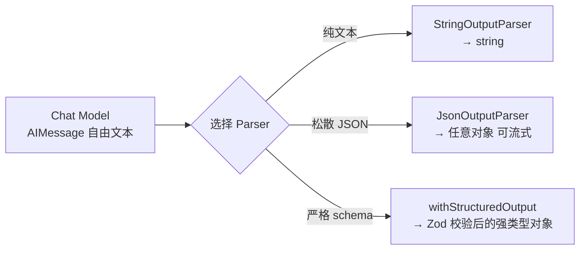
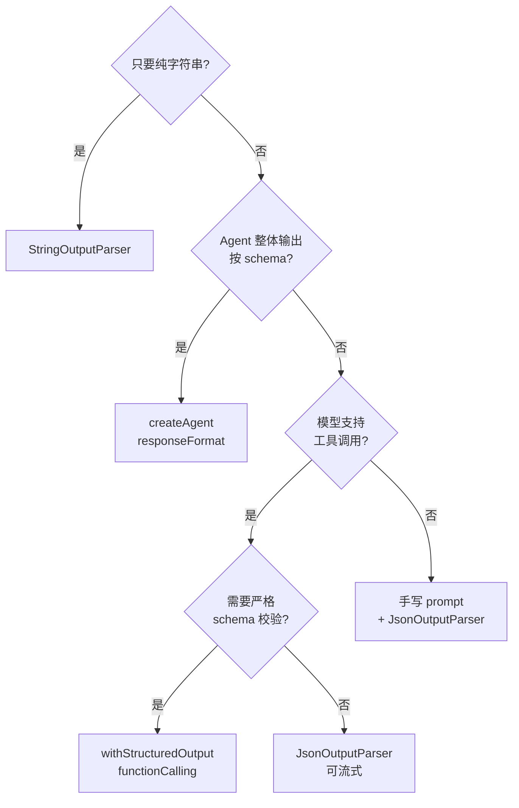

> 模块 01 - 核心抽象 | 前置：[Prompt Templates](./04-prompt-templates.md)

模型吐自由文本，应用要结构化数据。这道鸿沟靠 Output Parser 填平。

这一节我把 LangChain.js 当前推荐的结构化输出方案讲清楚：纯文本提取用 `StringOutputParser`、流式 JSON 用 `JsonOutputParser`、严格类型校验用 `withStructuredOutput` 配 [Zod](https://zod.dev/)。最后给一个新闻分析器的完整例子。

读完这节你会知道：什么时候该用什么 parser，怎么写 Zod schema，模型输出格式不稳定时怎么办。

## 1. 为什么要结构化输出

考虑这条 prompt：

```
请分析这条评论的情感倾向和关键词：
"这家餐厅的牛排非常好吃，但服务态度有待改善。"
```

模型可能回答：

```
情感倾向：混合（正面+负面）
关键词：牛排、好吃、服务态度、改善
```

人能读，程序读不了。后端需要的是这样：

```typescript
{
  sentiment: "mixed",
  keywords: ["牛排", "好吃", "服务态度", "改善"],
  positiveAspects: ["食物质量"],
  negativeAspects: ["服务态度"]
}
```

Output Parser 把"自由文本"和"结构化数据"两端缝合起来，如下图所示：



图 5-1：模型原始输出经 Parser 转成结构化数据。三条路对应三种严格程度，按下游需要的类型安全级别选。

## 2. StringOutputParser：最常用的

`StringOutputParser` 把 `AIMessage` 转成 `string`。看起来没什么，但几乎每条 LCEL 链都需要它：

```typescript
import { StringOutputParser } from "@langchain/core/output_parsers";
import { ChatOpenAI } from "@langchain/openai";
import { ChatPromptTemplate } from "@langchain/core/prompts";

const model = new ChatOpenAI({ model: "gpt-4o-mini" });
const prompt = ChatPromptTemplate.fromMessages([
  ["human", "用一句话解释 {concept}"],
]);

const chain = prompt.pipe(model).pipe(new StringOutputParser());

const result = await chain.invoke({ concept: "量子计算" });
console.log(typeof result); // "string"
```

为什么需要它？直接读 `response.text` 也能拿字符串。区别在于：

- `StringOutputParser` 在 `.stream()` 时会把每个 chunk 都转成 string 增量，对应"打字机"效果。
- 直接读 `.text` 是属性，不参与流式管线。

也就是说，写"非流式只取字符串"的代码两种都行，写流式管线必须用 `StringOutputParser`。

## 3. JsonOutputParser：流式 JSON

让模型返回 JSON，用 `JsonOutputParser`：

```typescript
import { JsonOutputParser } from "@langchain/core/output_parsers";

const parser = new JsonOutputParser();

const prompt = ChatPromptTemplate.fromMessages([
  ["system", "你是数据提取助手，以 JSON 输出，字段：name / age / skills。"],
  ["human", "{input}"],
]);

const chain = prompt.pipe(model).pipe(parser);

const result = await chain.invoke({
  input: "张三，28 岁，擅长 TypeScript 和 React",
});

console.log(result);
// { name: "张三", age: 28, skills: ["TypeScript", "React"] }
```

`JsonOutputParser` 的杀手锏是流式：模型边吐边解析，前端能看到字段一个个出现，不用等完整 JSON 才能渲染。前端实时展示 AI 生成的 dashboard / 表单时特别好用。

但 `JsonOutputParser` 本身不做 schema 校验，模型乱编字段它也接。需要严格校验请往下看。

## 4. withStructuredOutput：首选方案

`.withStructuredOutput()` 是结构化输出的首选。它不是靠提示词描述 JSON 格式，而是直接利用 Provider 的原生 Tool Calling 接口或 JSON Schema 模式让模型"必须"按 schema 输出。

```typescript
import { ChatOpenAI } from "@langchain/openai";
import { z } from "zod";

const model = new ChatOpenAI({ model: "gpt-4o-mini", temperature: 0 });

const extractionSchema = z.object({
  name: z.string().describe("人物姓名"),
  age: z.number().describe("年龄"),
  occupation: z.string().describe("职业"),
  skills: z.array(z.string()).describe("技能列表"),
});

// 显式声明用 functionCalling 方法
const structuredModel = model.withStructuredOutput(extractionSchema, {
  method: "functionCalling",
});

const result = await structuredModel.invoke(
  "我叫李华，今年 32 岁，是一名全栈工程师，精通 TypeScript、Go 和 Rust。"
);

console.log(result);
// {
//   name: "李华",
//   age: 32,
//   occupation: "全栈工程师",
//   skills: ["TypeScript", "Go", "Rust"]
// }
```

### method 参数

`method` 决定模型怎么被约束：

| 值 | 机制 | 适用 |
|----|------|------|
| `"functionCalling"` | 把 schema 包成一个 tool，强制调用 | **默认推荐**，所有支持工具调用的模型 |
| `"jsonSchema"` | 用 Provider 的 JSON Schema 模式 | OpenAI 的 `response_format: { type: "json_schema", ... }` |
| `"jsonMode"` | 用 Provider 的 JSON 模式 | 想精细控制时 |

绝大多数场景用 `"functionCalling"` 就够了。

### Zod schema 的描述字段

`.describe()` 写得好不好直接影响模型输出质量。我的经验：

- 字段名用英文（模型对英文字段更熟）
- `.describe()` 用中文，说清楚字段含义、单位、约束
- 枚举用 `z.enum([...])`，比 `z.string()` 更准

例子：

```typescript
const reviewSchema = z.object({
  sentiment: z
    .enum(["positive", "negative", "mixed"])
    .describe("整体情感倾向"),
  confidence: z
    .number()
    .min(0)
    .max(1)
    .describe("置信度，0 到 1 之间"),
  keywords: z.array(z.string()).describe("提取的关键词列表"),
  summary: z.string().describe("一句话总结"),
});
```

### 配置选项

```typescript
const structuredModel = model.withStructuredOutput(extractionSchema, {
  method: "functionCalling",
  name: "extract_person_info",      // tool 的名字（method 为 "functionCalling" 时）
  includeRaw: true,                 // 同时返回模型原始输出，便于调试
});

// includeRaw: true 时输出结构变成：
// { raw: AIMessage, parsed: { name: "李华", ... } }
```

`includeRaw: true` 在生产里我建议默认开。模型出错时你能看到原始输出，调试快得多。

### 与 LCEL 配合

`withStructuredOutput` 返回的是标准 Runnable，能直接接进 LCEL：

```typescript
const chain = ChatPromptTemplate
  .fromMessages([
    ["system", "从用户描述中提取结构化信息。"],
    ["human", "{input}"],
  ])
  .pipe(structuredModel);

const result = await chain.invoke({
  input: "小王是 25 岁的前端开发者，会 Vue 和 React。",
});
```

### 在 Agent 里的等价用法

[`createAgent`](../05-agent-architecture/01-create-agent.md) 的 `responseFormat` 参数让 Agent 在结束时按 schema 返回最终答案。这一段的内部机制和 `withStructuredOutput` 同源：

```typescript
import { createAgent, toolStrategy } from "langchain";

const agent = createAgent({
  model,
  tools,
  responseFormat: toolStrategy(reviewSchema),
});
```

详细用法在 [createAgent 入门](../05-agent-architecture/01-create-agent.md) 展开。

## 5. 没有 Tool Calling 的模型怎么办

如果模型不支持原生 Tool Calling（一些本地小模型、老旧 Provider），退回到"prompt 注入 + JSON 解析"模式。基本思路是手工把 schema 描述塞进 system prompt，让模型尽力按 JSON 输出，再用 `JsonOutputParser` 解析。

```typescript
import { JsonOutputParser } from "@langchain/core/output_parsers";

const parser = new JsonOutputParser<{
  sentiment: "positive" | "negative" | "mixed";
  keywords: string[];
}>();

const prompt = ChatPromptTemplate.fromMessages([
  [
    "system",
    `请按以下 JSON 格式输出，不要带任何额外文字：
{{
  "sentiment": "positive" | "negative" | "mixed",
  "keywords": ["关键词1", "关键词2"]
}}`,
  ],
  ["human", "{review}"],
]);

const chain = prompt.pipe(model).pipe(parser);
const result = await chain.invoke({ review: "..." });
```

可靠性比 `withStructuredOutput` 差一档，但能用。

## 6. 综合示例：新闻分析器

把这一节的所有件凑一个能跑的实战——给一段新闻文本，提取结构化的分析结果：

```typescript
import { ChatOpenAI } from "@langchain/openai";
import { ChatPromptTemplate } from "@langchain/core/prompts";
import { z } from "zod";

// 1. 定义 schema
const articleAnalysisSchema = z.object({
  title: z.string().describe("文章标题"),
  category: z
    .enum(["technology", "business", "science", "politics", "sports", "other"])
    .describe("文章分类"),
  keyPoints: z
    .array(z.string())
    .min(1)
    .max(5)
    .describe("核心要点，1-5 条"),
  entities: z
    .array(
      z.object({
        name: z.string().describe("实体名称"),
        type: z
          .enum(["person", "organization", "location", "product"])
          .describe("实体类型"),
      })
    )
    .describe("提到的关键实体"),
  sentiment: z
    .enum(["positive", "negative", "neutral"])
    .describe("文章整体基调"),
  readingTimeMinutes: z.number().describe("预估阅读时间（分钟）"),
});

type ArticleAnalysis = z.infer<typeof articleAnalysisSchema>;

// 2. 构建链
const model = new ChatOpenAI({ model: "gpt-4o-mini", temperature: 0 });
const structuredModel = model.withStructuredOutput(articleAnalysisSchema, {
  method: "functionCalling",
  includeRaw: false,
});

const prompt = ChatPromptTemplate.fromMessages([
  ["system", "你是新闻分析助手，请仔细阅读文章并提取结构化信息。"],
  ["human", "请分析以下文章：\n\n{article}"],
]);

const analysisChain = prompt.pipe(structuredModel);

// 3. 调用
const analysis: ArticleAnalysis = await analysisChain.invoke({
  article: `
    苹果公司今日在加州库比蒂诺总部举行发布会，正式推出搭载 M4 芯片的
    新一代 MacBook Pro。CEO 蒂姆·库克表示，新款笔记本在 AI 推理性能上
    相比上一代提升了 3 倍。新品起售价 1599 美元，将于下周五正式发售。
    分析师认为这将进一步巩固苹果在高端笔记本市场的领先地位。
  `,
});

console.log(JSON.stringify(analysis, null, 2));
// {
//   "title": "苹果发布搭载 M4 芯片的新一代 MacBook Pro",
//   "category": "technology",
//   "keyPoints": [
//     "苹果推出搭载 M4 芯片的新 MacBook Pro",
//     "AI 推理性能提升 3 倍",
//     "起售价 1599 美元，下周五发售"
//   ],
//   "entities": [
//     { "name": "苹果公司", "type": "organization" },
//     { "name": "蒂姆·库克", "type": "person" },
//     { "name": "库比蒂诺", "type": "location" },
//     { "name": "MacBook Pro", "type": "product" },
//     { "name": "M4 芯片", "type": "product" }
//   ],
//   "sentiment": "positive",
//   "readingTimeMinutes": 1
// }
```

### 批量处理

`analysisChain` 是 Runnable，自动支持批量：

```typescript
const articles = [article1, article2, article3];

const results = await analysisChain.batch(
  articles.map((article) => ({ article })),
  { maxConcurrency: 3 }
);
```

三个请求并发跑，外加并发上限保护，比手写 `Promise.all` 安全。

## 7. 常见踩坑

**模型返回的字段类型对不上 schema**

`withStructuredOutput` 内部已经做了 Zod 校验。如果模型确实没按要求输出（极少见），会抛 ZodError。处理方式：

- 检查 `.describe()` 是不是写得太模糊
- 换更强的模型（Haiku → Sonnet → Opus）
- 把 `includeRaw: true` 打开，看原始输出找原因

**枚举字段被模型乱编**

模型偶尔会"创造"枚举里没有的值。`withStructuredOutput` 会拒收。预防方法：

- 在 `.describe()` 里强调"只能是 X / Y / Z 之一"
- 字段名取得明确，比如 `sentiment` 比 `mood` 让模型更稳定

**多字段长 schema 模型容易遗漏字段**

字段超过 10 个时，模型容易"忘"。建议：

- 把 schema 拆成多个 step，每步只提取一部分
- 用 Optional 标记非必填字段：`z.string().optional()`
- 字段数量真的多就换 Sonnet / GPT-5

## 8. 选型建议

我自己的判断流程如下图所示：



图 5-2：Output Parser 选型决策树。从「要不要字符串」一路问到「模型支不支持工具调用」，落到具体方案。

对照文字版：

1. 链最后只要字符串？→ `StringOutputParser`
2. 要 JSON、要流式渲染、字段松散？→ `JsonOutputParser`
3. 要严格 schema 校验、强类型？→ `withStructuredOutput(schema, { method: "functionCalling" })`
4. Agent 整体输出按 schema？→ `createAgent` 的 `responseFormat: toolStrategy(schema)`
5. 模型不支持工具调用？→ 退回手写 system prompt + `JsonOutputParser`

## 小结

| 方案 | 适用 | 推荐度 |
|------|------|--------|
| `StringOutputParser` | 只取纯文本 | 常用 |
| `JsonOutputParser` | 需要 JSON、需要流式 | 常用 |
| `withStructuredOutput` | 严格 schema、强类型 | **首选** |
| `createAgent` + `responseFormat` | Agent 最终输出按 schema | **首选** |

至此模块 01 完结。你已经掌握了 LangChain.js 的五大核心抽象：Runnable 接口、LCEL 表达式语言、Model I/O、Prompt Templates、Output Parsers。后续模块 02 [Chain 组合](../02-chain-composition/01-runnable-sequence.md) 会把这些抽象组合成更复杂的管线，模块 05 [Agent 架构](../05-agent-architecture/01-create-agent.md) 用 `createAgent` 把它们抬到 Agent 层。

---

> 本文摘自[《LangChain.js Agent 开发权威指南》](https://github.com/diguike/book-langchain-agent)，作者[递归客](https://inferloop.dev)。
