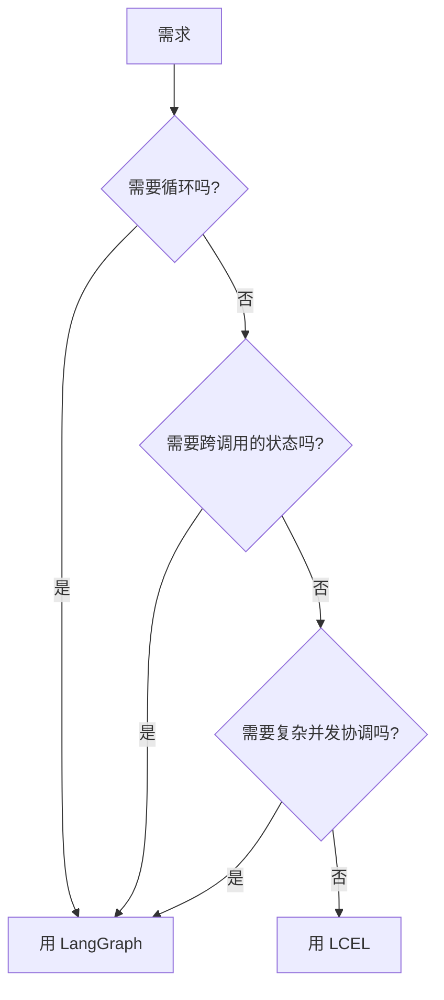

> 模块 02 - Chain 组合 | 前置知识：[RunnableSequence](./01-runnable-sequence.md)、[Streaming 流式输出](./04-streaming.md)

## 一个常见的混淆

学完 LCEL (LangChain Expression Language) 之后，大多数人都会问同一个问题：**既然 LCEL 能组合 Runnable，那 LangGraph 还有什么用？**

答案的核心区别只有一句：**LCEL 是数据流，LangGraph 是状态机**。

数据流的拓扑是固定的——从 A 流向 B 流向 C，每个节点处理一次输入。状态机的拓扑是动态的——节点之间根据当前状态决定下一步去哪儿，可以回头、可以分叉、可以暂停。

这一节给你一套判断标准，让你拿到一个需求时能 30 秒决定用哪个。

## 三个判断维度

### 维度 1：是否需要循环？

LCEL 不能循环。RunnableSequence 是单向链表，从头流到尾。

LangGraph 可以循环。一个节点的输出可以路由回前面任何一个节点。

**典型循环场景**：

- ReAct（思考 → 行动 → 观察 → 思考 → ...）
- Self-Reflection（生成 → 评估 → 修正 → 评估 → ...）
- Plan-and-Execute（计划 → 执行步骤 1 → 检查 → 执行步骤 2 → ...）

只要任务里出现"重复直到满足某个条件"，就是 LangGraph 的场景。

### 维度 2：是否需要状态？

LCEL 是无状态的。每次 `invoke` 都从零开始，函数式纯粹。

LangGraph 有显式 state。state 在节点之间传递、累积，可以持久化（checkpointer）让会话跨进程恢复。

**典型有状态场景**：

- 多轮对话（要记住用户之前说了什么）
- 长任务的进度跟踪（已经做了第几步、还剩几步）
- 多用户隔离（每个用户一个独立的 thread）
- Human-in-the-Loop（暂停后能从断点恢复）

如果你需要"会话级记忆"或"任务进度持久化"，用 LangGraph。

### 维度 3：是否需要并发分支收敛？

LCEL 的 `RunnableParallel` 能并发跑多个分支，但分支之间相互独立、最后简单合并。

LangGraph 能做更复杂的并发：分支可以读其他分支的中间状态、可以条件性地启动子分支、可以等待某个特定子集完成后再走下一步（barrier）。

**典型复杂并发场景**：

- 多 Agent 协作（一个 supervisor 派活给 N 个 worker agent，等所有 worker 完成）
- 多源 RAG（同时查多个向量库 + 多个 API，按置信度融合结果）
- 分层规划（先粗规划再细规划，细规划的子任务并发执行）

简单的"并发请求两个 API 然后合并"用 LCEL 的 RunnableParallel 就够，复杂的协调用 LangGraph。

## 决策流程图



三个问题任一个 yes → LangGraph。三个都 no → LCEL。

## 真实场景对照表

| 场景 | 用什么 | 理由 |
|------|--------|------|
| 翻译 → 摘要 → 格式化的内容生成流水线 | LCEL | 固定拓扑，单向数据流 |
| 多语言并发翻译 + 合并报告 | LCEL（RunnableParallel） | 简单并发，无依赖 |
| 把同一个 prompt 同时丢给 3 个模型对比输出 | LCEL（RunnableParallel） | 简单并发 |
| 输入路由：根据语言选不同的处理链 | LCEL（RunnableBranch） | 一次性分支，无循环 |
| 链中带重试和 Fallback | LCEL（withRetry / withFallbacks） | 仍是数据流，重试是数据流的属性 |
| ChatBot（多轮对话 + 记忆） | LangGraph（带 checkpointer） | 跨调用状态 |
| 工具调用 Agent（任意 LLM + 任意 tools） | LangGraph（用 createAgent） | 模型 ↔ 工具循环 |
| Plan-and-Execute Agent | LangGraph | 循环 + 状态 |
| 文档批处理：100 篇文档各自跑 RAG | LCEL（batch） | 无依赖并发，无状态 |
| 长任务有断点续传需求 | LangGraph（checkpointer） | 持久化状态 |
| Human-in-the-Loop 审批流 | LangGraph（interrupt） | 暂停-恢复 |
| 多 Agent 协作（Supervisor 派活） | LangGraph | 复杂并发协调 |
| 自适应 RAG（先粗检索，置信度低则扩展查询） | LangGraph | 循环 + 状态 |
| RAG 一次性问答 | LCEL | 固定 retrieve → generate 拓扑 |

## 反模式

### 反模式 1：用 LCEL 硬实现 Agent 循环

有些人为了"避免引入 LangGraph"，会用 `while` 循环 + LCEL 自己拼 Agent：

```typescript
// [bad] 反模式
let messages = [{ role: "user", content: input }];
const chain = promptTemplate.pipe(model);
for (let i = 0; i < 10; i++) {
  const response = await chain.invoke({ messages });
  if (!response.tool_calls?.length) break;
  // 手动执行工具、追加结果...
  messages = [...messages, response, ...toolResults];
}
```

这相当于自己实现了 LangGraph 的循环、状态合并、断点等所有概念，但 quality 远不如 `createAgent`。**直接用 LangGraph 的 `createAgent`**：

```typescript
// [ok] 正常做法
import { createAgent } from "langchain";

const agent = createAgent({ model, tools, systemPrompt });
const result = await agent.invoke({ messages: [{ role: "user", content: input }] });
```

### 反模式 2：用 LangGraph 写简单数据流

反过来，有些人学完 LangGraph 之后什么都用 StateGraph 画图，连最简单的"prompt → model → parser"也画三个节点：

```typescript
// [bad] 反模式：用 StateGraph 画一条直线
const graph = new StateGraph(MyState)
  .addNode("prompt", promptNode)
  .addNode("model", modelNode)
  .addNode("parse", parseNode)
  .addEdge("__start__", "prompt")
  .addEdge("prompt", "model")
  .addEdge("model", "parse")
  .addEdge("parse", "__end__")
  .compile();
```

这是过度工程化。等价的 LCEL 写法只有一行：

```typescript
// [ok] 简单数据流就用 LCEL
const chain = promptTemplate.pipe(model).pipe(parser);
```

### 反模式 3：两个一起用，但乱用

有人在 LangGraph 节点里塞 LCEL 链，这本身没问题。但要注意：**LangGraph 节点的输入输出是 state，LCEL 链的输入输出是普通对象**。中间要做转换：

```typescript
// [ok] 正确：节点里用 LCEL，但注意输入输出转换
const chain = promptTemplate.pipe(model).pipe(parser);

const myNode = async (state: MyState) => {
  const result = await chain.invoke({ input: state.userQuery });
  return { result };  // 返回 state 的部分更新
};
```

不要直接把 LCEL chain 当成节点传给 `addNode`。

## 混合使用的标准模式

实际生产项目里两者经常混用：

```typescript
// 顶层：用 LangGraph 编排 Agent 主循环
const agent = createAgent({
  model,
  tools: [
    // 单个 tool 里用 LCEL 实现内部数据流
    tool(
      async ({ query }) => {
        const ragChain = retrieveStep.pipe(rerankStep).pipe(generateStep);
        return await ragChain.invoke({ query });
      },
      { name: "search_docs", description: "...", schema: /* ... */ }
    ),
  ],
  middleware: [
    // Middleware 里也可以用 LCEL
  ],
});
```

**心智模型**：LangGraph 管"流程编排"，LCEL 管"数据处理"。

## 一句话总结

- 有循环 / 有跨调用状态 / 有复杂并发协调 → **LangGraph**
- 其他情况（固定拓扑数据流）→ **LCEL**
- 实际项目两者一起用：LangGraph 编排顶层流程，LCEL 实现节点内的数据处理

下一个模块 [03 记忆系统](../03-memory/01-memory-overview.md) 引入"状态"概念，从这里开始 LangGraph 的影子越来越重。到了 [05 Agent 架构](../05-agent-architecture/01-create-agent.md) 完全进入 LangGraph 的领地。

---

> 本文摘自[《LangChain.js Agent 开发权威指南》](https://github.com/diguike/book-langchain-agent)，作者[递归客](https://inferloop.dev)。
