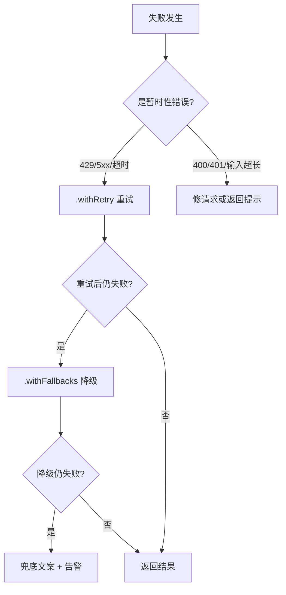

> 模块 02 - Chain 组合 | 前置知识：[RunnableSequence](./runnable-sequence.md)、[Streaming 流式输出](./streaming.md)

## 容错是生产环境的硬指标

开发环境里 LLM 偶尔失败我重跑一次就行。生产环境完全是另一回事——一次失败意味着用户看到错误页、流程中断、转化率下跌。我做客服 Agent 时统计过：

- **429 Rate Limit**：流量高峰每小时大概 0.3-1% 的请求会撞限速
- **5xx**：OpenAI / Anthropic 月均能撞上 2-3 次 30 分钟以上的不可用窗口
- **超时**：长 prompt + 复杂推理偶尔会卡在模型侧 60 秒以上

要让 SLA 守在 99.9% 以上，没有 fallback 和 retry 是不可能的。LangChain.js 1.x 在 Runnable 基类上提供两个核心方法：

- `.withRetry({ stopAfterAttempt: 3 })`：暂时性故障自动重试
- `.withFallbacks([...])`：失败时降级到备用 Runnable

这一节把它们讲透，再演示怎么组合出生产可用的容错链。

## `.withRetry()`：自动重试

所有 Runnable 都有这个方法，包装一层之后失败自动重试。

### 最小用法

```typescript
import { ChatOpenAI } from "@langchain/openai";

const model = new ChatOpenAI({ model: "gpt-4o" });

// 最多重试 3 次（首次 + 2 次重试）
const resilient = model.withRetry({ stopAfterAttempt: 3 });
```

### 完整配置

```typescript
const resilient = model.withRetry({
  // 最大尝试次数（含首次）
  stopAfterAttempt: 3,

  // 每次失败的回调，用来打日志 / 告警
  onFailedAttempt: (error, attemptNumber) => {
    console.warn(`第 ${attemptNumber} 次失败：${error.message}`);
    if (attemptNumber >= 2) {
      alertOps(`模型连续失败 ${attemptNumber} 次`);
    }
  },
});
```

### 哪些错误会重试

LangChain 内部默认只对这些错误重试：

| 错误 | 重试？ | 原因 |
|------|--------|------|
| 429 Rate Limit | ✓ | 暂时性，等一下就好 |
| 500 / 502 / 503 / 504 | ✓ | 服务端瞬时过载 |
| 网络超时、连接失败 | ✓ | 暂时性网络抖动 |
| 400 Bad Request | ✗ | 请求本身有问题，重试无意义 |
| 401 / 403 | ✗ | 认证问题 |
| 上下文超长 | ✗ | 输入不变重试也没用 |

### 指数退避

`withRetry` 默认就是指数退避（exponential backoff），避免在服务端过载时雪上加霜：

```
第 1 次重试：~200ms 后
第 2 次重试：~400ms 后
第 3 次重试：~800ms 后
```

## `.withFallbacks([...])`：降级到备用 Runnable

重试搞不定的情况——比如某个模型真的挂了 30 分钟——必须切到备用。1.x 的写法：`.withFallbacks([fallback1, fallback2, ...])`，参数直接传 Runnable 数组。

```typescript
import { ChatOpenAI } from "@langchain/openai";
import { ChatAnthropic } from "@langchain/anthropic";

// 主：OpenAI 旗舰
const primary = new ChatOpenAI({ model: "gpt-5" });
// 备：Anthropic 平衡档（跨厂商，避免同源故障）
const fallback = new ChatAnthropic({ model: "claude-sonnet-4-6" });

const resilient = primary.withFallbacks([fallback]);
```

多级降级直接在数组里排序：

```typescript
const multiLevel = primary.withFallbacks([
  new ChatOpenAI({ model: "gpt-4o" }),         // 一级降级：同厂便宜版
  new ChatAnthropic({ model: "claude-sonnet-4-6" }), // 二级降级：换厂商
  new ChatAnthropic({ model: "claude-haiku-4-5" }),  // 三级降级：速度档兜底
]);
```

### 执行流程

```
主 → 成功 → 返回
   ↘ 失败 → fallback1 → 成功 → 返回
                     ↘ 失败 → fallback2 → 成功 → 返回
                                       ↘ 失败 → 抛最后一个异常
```

注意：默认情况下 `.withFallbacks([...])` 对**所有异常**都触发降级。要限制只在特定异常时降级，传第二参数：

```typescript
const resilient = primary.withFallbacks([fallback], {
  // 只在这些异常类型上降级，其他直接抛
  exceptionsToHandle: ["RateLimitError", "APIConnectionError"],
});
```

### 不只是模型

`withFallbacks` 是 Runnable 基类的能力，不限于模型。我用得最多的另一种场景是 parser 降级——严格 JSON parser 失败时，降级到宽松版：

```typescript
import { RunnableLambda } from "@langchain/core/runnables";

const strictParser = new RunnableLambda<string, unknown>({
  func: (text) => JSON.parse(text),
});

const lenientParser = new RunnableLambda<string, unknown>({
  func: (text) => {
    // 兜底修一下常见的格式问题
    const cleaned = text
      .replace(/```json\n?/g, "")
      .replace(/```\n?/g, "")
      .replace(/,\s*}/g, "}")
      .replace(/,\s*]/g, "]");
    return JSON.parse(cleaned);
  },
});

const robustParser = strictParser.withFallbacks([lenientParser]);
```

## 组合：先重试，再降级

生产里最常用的模式：每个候选模型自己先重试几次，全失败了再换下一个。链式写就行：

```typescript
import { ChatOpenAI } from "@langchain/openai";
import { ChatAnthropic } from "@langchain/anthropic";

const primary = new ChatOpenAI({ model: "gpt-5" }).withRetry({
  stopAfterAttempt: 3,
  onFailedAttempt: (e, n) => console.warn(`[primary] #${n}: ${e.message}`),
});

const secondary = new ChatAnthropic({ model: "claude-sonnet-4-6" }).withRetry({
  stopAfterAttempt: 2,
  onFailedAttempt: (e, n) => console.warn(`[secondary] #${n}: ${e.message}`),
});

const productionModel = primary.withFallbacks([secondary]);
// 最多尝试：3（主）+ 2（备）= 5 次
```

执行流程：

```
primary (1) → 失败
primary (2) → 失败
primary (3) → 失败
secondary (1) → 失败
secondary (2) → 失败
→ 抛异常
```

## 超时控制

LLM 偶尔不是失败而是卡住，没响应也没异常。超时控制要单独做，用 `AbortController`：

```typescript
async function invokeWithTimeout<I, O>(
  chain: { invoke: (input: I, opts?: { signal?: AbortSignal }) => Promise<O> },
  input: I,
  timeoutMs: number,
): Promise<O> {
  const ac = new AbortController();
  const timer = setTimeout(() => ac.abort(), timeoutMs);

  try {
    return await chain.invoke(input, { signal: ac.signal });
  } catch (err) {
    if ((err as Error).name === "AbortError") {
      throw new Error(`请求超时 (${timeoutMs}ms)`);
    }
    throw err;
  } finally {
    clearTimeout(timer);
  }
}

const result = await invokeWithTimeout(chain, { question: "..." }, 10_000);
```

也可以封装成可复用的 Runnable 包装器：

```typescript
import { RunnableLambda, type Runnable } from "@langchain/core/runnables";

function withTimeout<I, O>(runnable: Runnable<I, O>, timeoutMs: number) {
  return new RunnableLambda<I, O>({
    func: async (input, options) => {
      const ac = new AbortController();
      const timer = setTimeout(() => ac.abort(), timeoutMs);

      // 合并外部传入的 signal，谁先 abort 谁触发
      if (options?.signal) {
        options.signal.addEventListener("abort", () => ac.abort());
      }

      try {
        return await runnable.invoke(input, { ...options, signal: ac.signal });
      } finally {
        clearTimeout(timer);
      }
    },
  });
}

// 把超时、重试、降级叠起来
const productionModel = withTimeout(
  new ChatOpenAI({ model: "gpt-5" }),
  15_000,
)
  .withRetry({ stopAfterAttempt: 2 })
  .withFallbacks([
    withTimeout(new ChatOpenAI({ model: "gpt-4o" }), 10_000),
  ]);
```

## 完整示例：生产级容错链

把所有要点拼成一个可运行的完整链——缓存 + 重试 + 多级降级 + 兜底文案。

```typescript
// production-chain.ts
import { ChatOpenAI } from "@langchain/openai";
import { ChatAnthropic } from "@langchain/anthropic";
import { ChatPromptTemplate } from "@langchain/core/prompts";
import { StringOutputParser } from "@langchain/core/output_parsers";
import { RunnableLambda } from "@langchain/core/runnables";

const responseCache = new Map<string, string>();

// 缓存层（命中就直接返回，未命中抛异常触发 fallback）
const cacheLayer = new RunnableLambda<{ question: string }, string>({
  func: (input) => {
    const hit = responseCache.get(input.question);
    if (hit) {
      console.log("[cache] hit");
      return hit;
    }
    throw new Error("cache miss");
  },
});

const prompt = ChatPromptTemplate.fromTemplate(
  "你是一位智能助手。请回答：{question}",
);
const parser = new StringOutputParser();

// 主链：GPT-5 + 重试 3 次
const primaryChain = prompt
  .pipe(
    new ChatOpenAI({ model: "gpt-5" }).withRetry({
      stopAfterAttempt: 3,
      onFailedAttempt: (e, n) => console.warn(`[gpt-5] #${n}: ${e.message}`),
    }),
  )
  .pipe(parser);

// 降级 1：GPT-4o + 重试 2 次
const fallbackChain1 = prompt
  .pipe(
    new ChatOpenAI({ model: "gpt-4o" }).withRetry({
      stopAfterAttempt: 2,
      onFailedAttempt: (e, n) => console.warn(`[gpt-4o] #${n}: ${e.message}`),
    }),
  )
  .pipe(parser);

// 降级 2：跨厂商，Claude Sonnet 4.6 + 重试 2 次
const fallbackChain2 = prompt
  .pipe(
    new ChatAnthropic({ model: "claude-sonnet-4-6" }).withRetry({
      stopAfterAttempt: 2,
      onFailedAttempt: (e, n) => console.warn(`[claude] #${n}: ${e.message}`),
    }),
  )
  .pipe(parser);

// 组合：缓存 → 主 → 降级 1 → 降级 2
const productionChain = cacheLayer.withFallbacks([
  primaryChain,
  fallbackChain1,
  fallbackChain2,
]);

// 顶层包装：所有方案都失败时返回兜底文案，不让用户看到 500
async function ask(question: string): Promise<string> {
  try {
    const answer = await productionChain.invoke({ question });
    responseCache.set(question, answer); // 成功后写缓存
    return answer;
  } catch (err) {
    console.error("[critical] 所有模型不可用", err);
    return "非常抱歉，服务暂时遇到问题，请稍后再试或联系客服。";
  }
}

// 第一次调用：穿过缓存，走主链
console.log(await ask("什么是 LangChain？"));
// 第二次调用：缓存命中，毫秒级返回
console.log(await ask("什么是 LangChain？"));
```

## 何时重试 vs 何时降级

我的决策表，照着抄就行：

| 场景 | 重试还是降级 | 推荐配置 |
|------|-------------|---------|
| 429 Rate Limit | 重试为主 | `stopAfterAttempt: 3`，搭配指数退避 |
| 5xx 服务端错误 | 重试 + 降级 | 重试 2-3 次，仍失败降级到别的模型 |
| 网络超时 | 重试 | `stopAfterAttempt: 2`，外加超时控制 |
| 单一厂商完全宕机 | 降级 | 跨厂商 fallback（OpenAI ↔ Anthropic） |
| 模型解析格式不对 | 降级 | 严格 parser → 宽松 parser |
| 400 / 401 / 输入过长 | 都不行 | 改请求 / 返回错误提示 |

### 决策流程图



### 生产环境清单

我每次上线前会过一遍这个清单：

1. **所有外部 LLM 调用都有 `.withRetry()`** —— 至少 `stopAfterAttempt: 2`
2. **关键路径都有跨厂商 fallback** —— 至少一个 OpenAI + 一个 Anthropic
3. **所有调用都有超时** —— 默认 30 秒，复杂推理 60 秒
4. **`onFailedAttempt` 把失败事件吐到监控** —— Datadog / Grafana / LangSmith
5. **顶层 try/catch + 兜底文案** —— 用户永远不应该看到原始 500 错误
6. **热门请求命中缓存** —— 降低对模型的依赖，可用性顺带提升

## 小结

| 项 | 说明 |
|----|------|
| `.withRetry({ stopAfterAttempt })` | 暂时性故障自动重试，默认指数退避 |
| `.withFallbacks([...])` | 失败时降级到备用 Runnable，参数是数组 |
| 组合模式 | 每个候选先 `.withRetry()`，再用 `.withFallbacks()` 串起来 |
| 超时 | `AbortController + signal`，自己封 `withTimeout()` 包装器 |
| 不只是模型 | parser、tool、子链都能挂 fallback |
| 兜底 | 最外层 try/catch 返回友好文案，记得告警 |

至此模块 02 - Chain 组合的全部内容讲完了。我已经过了 LCEL 的五大原语：[顺序](./runnable-sequence.md)、[并行](./runnable-parallel.md)、[条件路由](./runnable-branch.md)、[流式](./streaming.md)、容错。下一个绕不过去的问题是：[LCEL vs LangGraph 决策指南](./lcel-vs-langgraph.md)——什么时候停在 LCEL，什么时候必须上 LangGraph。再之后进入 [03-记忆系统](../03-memory/)，开始处理"有状态"的对话。

官方相关文档：

- LangChain.js 总入口：[https://docs.langchain.com/oss/javascript/](https://docs.langchain.com/oss/javascript/)
- Runnables 概念页：[https://docs.langchain.com/oss/javascript/langchain/runnables](https://docs.langchain.com/oss/javascript/langchain/runnables)

---

> 本文摘自[《LangChain.js Agent 开发权威指南》](https://github.com/diguike/book-langchain-agent)，作者[递归客](https://inferloop.dev)。
