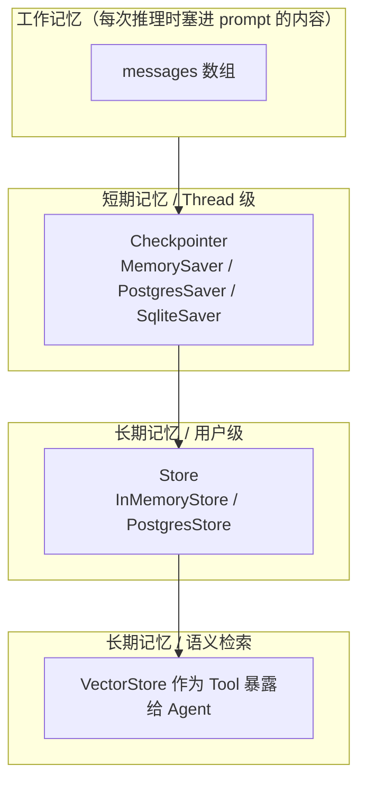

> 模块 03 - 记忆系统 | 前置知识：[createAgent 入门](../05-agent-architecture/01-create-agent.md)（如果你跳着读，先回去看一眼）

## v0.3 的 Memory 类有两个结构性问题

v0.3 有一组叫 `Memory` 的类——`ConversationBufferMemory`、`ConversationSummaryMemory`、`VectorStoreRetrieverMemory`——它们直接挂在 Chain 上，调用一次自动管理一轮历史。看上去很省心，但生产场景里**两个问题让人很痛苦**：

1. 记忆和具体的 Chain 绑死，换个 Agent 实现就得重写
2. 多用户、多会话的隔离要自己外挂一层 `sessionId`，老 API 没把这件事当成一等公民

1.x 用 checkpointer + store + tool 三件套整个掀翻了这套抽象。`Memory` 类被推到 `@langchain/classic`（兼容容身处），主推的概念变成两个：**checkpointer**（线程级短期记忆）和 **store**（跨会话长期记忆），再加上把 VectorStore 暴露成 **tool** 走语义检索。它们都长在 LangGraph 之上，由 `createAgent` 自动接管。

这一节先把这个新世界的地图画清楚。后面五节按"短期 → 摘要 → 向量 → 自定义后端 → 多用户隔离"的顺序展开。

## 为什么 Agent 必须有状态

LLM 本身是无状态的。每次调用 API，模型只看到你这一次塞给它的 prompt。下面这个例子你大概看过无数次：

```
用户：我叫张三，在北京做后端开发
Agent：你好张三！很高兴认识你
（5 分钟后）
用户：帮我推荐些适合我的技术书
Agent：请问你是做什么方向的？在哪个城市？  ← 全忘了
```

要让 Agent 记住"张三 / 北京 / 后端"，只能由我们应用层把上一轮的消息**重新喂回去**。这就是"记忆"在工程上的本质——**状态管理**。

记忆解决四类问题：

| 问题 | 例子 |
|------|------|
| 多轮上下文 | 「他刚才问的是哪个城市？」 |
| 用户画像 | 「张三的技术栈是 Go + Python」 |
| 任务进度 | 多步操作中断恢复 |
| 跨会话知识 | 「上周三我说过我对加班特别反感」 |

前两类是**短期**记忆（一次会话内），后两类多半是**长期**记忆（跨会话、跨天、跨设备）。1.x 把这两件事分得干干净净。

## 1.x 时代的记忆四层

我把 LangChain.js 1.x 里能放"状态"的位置画成四层。每层对应一类工具：



逐层说明：

### 1. 工作记忆：当前 prompt 里的 messages

这是 LLM 实际"看到"的东西。在 1.x 里就是你传给 `agent.invoke({ messages: [...] })` 的那个 `messages` 数组。它受 context window 限制，是个有上限的资源。

### 2. 短期记忆：thread-based checkpointer

一次"会话"在 LangGraph 里叫一个 **thread**，由 `thread_id` 标识。给 `createAgent` 配上 `checkpointer`，每次 `invoke` 都会把状态（包括完整 message 列表）按 `thread_id` 落盘，下次同 `thread_id` 再来时自动恢复。

```typescript
import { createAgent } from "langchain";
import { MemorySaver } from "@langchain/langgraph";

const agent = createAgent({
  model: "anthropic:claude-sonnet-4-6",
  tools: [],
  checkpointer: new MemorySaver(),
});

const config = { configurable: { thread_id: "user-001-conv-1" } };

await agent.invoke({ messages: [{ role: "user", content: "我叫张三" }] }, config);
await agent.invoke({ messages: [{ role: "user", content: "我叫什么？" }] }, config);
// → "你叫张三"
```

不用再手写 `messages.push(...)`，也不用自己维护 sessionId 到消息列表的映射。`MemorySaver` 是 in-process 的内存实现，生产环境换 `PostgresSaver` / `SqliteSaver` 即可，下一节会展开。

### 3. 长期记忆：跨会话的 store

`store` 是 1.x 新加的接口，专门放**跨 thread、跨会话**的信息——比如"张三的技术栈"、"用户偏好的回答风格"。它的 API 形态像一个有命名空间的 KV 存储：

```typescript
import { InMemoryStore } from "@langchain/langgraph";

const store = new InMemoryStore();

// 写：namespace 用来做隔离（这里按 user_id）
await store.put(["user-001", "profile"], "tech_stack", {
  languages: ["Go", "Python"],
  city: "北京",
});

// 读
const item = await store.get(["user-001", "profile"], "tech_stack");
console.log(item?.value);
// → { languages: ["Go", "Python"], city: "北京" }
```

把 `store` 一起传给 `createAgent`，Agent 内部就能在 middleware / tool 里通过 runtime 拿到它。

### 4. 语义记忆：把检索包装成 Tool

老版本的 `VectorStoreRetrieverMemory` 在 1.x 不存在了。新的做法是：**把"从历史中检索相关片段"做成一个普通的工具**，丢进 `tools` 数组，让 Agent 自己决定什么时候调用。

```typescript
import { tool } from "@langchain/core/tools";
import { z } from "zod";

const recallMemory = tool(
  async ({ query }) => {
    const docs = await vectorStore.similaritySearch(query, 3);
    return docs.map((d) => d.pageContent).join("\n---\n");
  },
  {
    name: "recall_memory",
    description: "在历史对话和用户画像里检索与当前问题最相关的片段",
    schema: z.object({ query: z.string() }),
  }
);
```

这个改动看着小，意义很大：Agent 不再被动接收"框架塞过来的历史"，而是**主动判断什么时候需要回忆**。前者像考试时被强行翻开笔记本，后者像考试时自己决定要不要查。第 4 节 [VectorStore 记忆作为工具](./04-vectorstore-memory.md) 会把这个模式讲透。

## 老 API 还能不能用

简短回答：能用，但**别用**。

`ConversationBufferMemory` / `ConversationSummaryMemory` / `VectorStoreRetrieverMemory` / `RunnableWithMessageHistory` 在 1.x 里被搬到了 `@langchain/classic`，从 `import { ... } from "langchain/memory"` 改成 `from "@langchain/classic/memory"` 还能跑。但这些 API 不再演进，并且和 `createAgent` 的 middleware / checkpointer 完全打不通。新写代码请按本模块后续章节的方式走。

## 这一模块怎么读

| 节 | 主题 | 关键 API |
|----|------|---------|
| 1 | 本节，建立全景 | — |
| 2 | [短期记忆：checkpointer](./02-buffer-memory.md) | `MemorySaver` / `PostgresSaver` |
| 3 | [Summary 策略：middleware](./03-summary-memory.md) | `createMiddleware({ beforeModel })` |
| 4 | [VectorStore 记忆作为工具](./04-vectorstore-memory.md) | `tool()` + retriever |
| 5 | [自定义后端：实现自己的 checkpointer / store](./05-custom-message-history.md) | `BaseCheckpointSaver` / `BaseStore` |
| 6 | [多用户隔离](./06-multi-user-isolation.md) | `thread_id` + `store.namespace` |

建议按顺序读。如果你只想搞清楚"怎么让 Agent 记得住"，看完第 2、6 两节就够用了；如果你在做企业级产品，第 5、6 节是重头戏。

## 一个完整的最小例子

把这一节讲到的四层在 30 行代码里串起来——一个能记住用户、能跨会话回忆的 Agent：

```typescript
// memory-demo.ts
import { createAgent } from "langchain";
import { MemorySaver, InMemoryStore } from "@langchain/langgraph";
import { tool } from "@langchain/core/tools";
import { z } from "zod";

const store = new InMemoryStore();

// 长期记忆工具：把用户信息持久化
const rememberFact = tool(
  async ({ fact }, runtime) => {
    const userId = runtime.context.user_id as string;
    await store.put([userId, "facts"], `fact-${Date.now()}`, { fact });
    return `已记住：${fact}`;
  },
  {
    name: "remember_fact",
    description: "把用户告诉你的、值得长期记住的事实保存下来",
    schema: z.object({ fact: z.string() }),
  }
);

const agent = createAgent({
  model: "anthropic:claude-sonnet-4-6",
  tools: [rememberFact],
  systemPrompt:
    "你是一个会主动记忆的助手。听到用户介绍自己的姓名、职业、城市、偏好时，调用 remember_fact 工具保存。",
  checkpointer: new MemorySaver(), // 短期：thread 内连续
  store,                            // 长期：跨 thread 共享
});

const config = {
  configurable: { thread_id: "conv-1" },
  context: { user_id: "user-001" },
};

await agent.invoke(
  { messages: [{ role: "user", content: "我叫张三，在北京做后端" }] },
  config
);

// 关掉 conv-1，开 conv-2，但同一个 user_id
const config2 = {
  configurable: { thread_id: "conv-2" },
  context: { user_id: "user-001" },
};

// 在新 thread 里读取长期记忆
const facts = await store.search(["user-001", "facts"]);
console.log("user-001 的长期记忆：", facts);
```

短期记忆走 `checkpointer`，按 `thread_id` 隔离；长期记忆走 `store`，按 `user_id` 隔离。两者各干各的，互不打架。这套模型就是后面所有章节的底层。

## 小结

1.x 把"记忆"从一组 `Memory` 类拆成了四个层次：工作记忆（messages）、短期记忆（checkpointer）、长期记忆（store）、语义记忆（tool + vector store）。`createAgent` 是它们的统一入口。

下一节 [短期记忆：thread-based checkpointer](./02-buffer-memory.md) 进入正题，把 `MemorySaver` 和 `PostgresSaver` 的实际用法讲透。

关于 checkpointer 和 store 的官方文档：[LangGraph Persistence](https://langchain-ai.github.io/langgraphjs/concepts/persistence/)。

---

> 本文摘自[《LangChain.js Agent 开发权威指南》](https://github.com/diguike/book-langchain-agent)，作者[递归客](https://inferloop.dev)。
