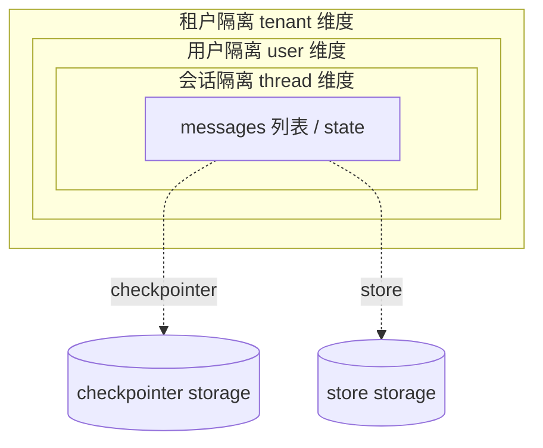

> 模块 03 - 记忆系统 | 第 6 节 | 前置：[自定义后端 - 实现自己的 checkpointer 与 store](./05-custom-message-history.md)

一个生产级 Agent 不可能只服务一个用户。当多个用户同时用同一个 Agent 时，张三的对话历史绝不能泄露给李四，企业 A 的数据也不能渗到企业 B。1.x 把这件事的工程模式定得很清楚：

- **会话级隔离** → `thread_id`（在 checkpointer 里区分）
- **用户级隔离** → `store.namespace` 的第一段
- **租户级隔离** → `namespace` 的更高层级 + 数据库级隔离（schema / DB）

这一节把这套模式从原理讲到落地。

## 三层隔离模型

下面这张图概括了 1.x 时代多用户 Agent 的隔离结构：



三层一一对应到 Agent 配置：

| 隔离粒度 | 1.x 机制 | 例子 |
|---------|---------|------|
| 会话 | `thread_id` | `"thread-conv-2026-05-25-001"` |
| 用户 | `store.namespace` 第一段 | `["user-001", "profile"]` |
| 租户 | namespace 更高层级 / 独立 DB | `["org-A", "user-001", "profile"]` |

老 LangChain 里这件事靠你自己拼 `sessionId`。1.x 把这两个维度拆开了：thread 给 checkpointer，namespace 给 store。各干各的，对应的物理存储也可以分开规划。

---

## thread_id 设计

`thread_id` 是 checkpointer 里的会话标识，每次 `invoke` 都得带。给它起名字有几种风格：

```typescript
// 推荐：层级式，方便日志查询
const threadId = `${userId}-${conversationId}`;
// 例如: "user-zhang-conv-20260525-abc"

// 朴素 UUID，需要外部维护 user → threads 映射
const threadId = crypto.randomUUID();

// 业务语义（IM 场景）
const threadId = `${platform}-${userId}-${topic}`;
// 例如: "lark-U001-tech-support"
```

我的偏好是 **层级式 thread_id + namespace 用纯结构化数组**。理由：

- `thread_id` 出现在日志、监控、错误堆栈里。层级式能一眼看出归属
- `namespace` 是 store 内部的，传程序友好的数组就好，比拼字符串更不容易出错

### 一个完整的多用户 Agent

```typescript
// multi-user-agent.ts
import { createAgent } from "langchain";
import { PostgresSaver } from "@langchain/langgraph-checkpoint-postgres";
import { InMemoryStore } from "@langchain/langgraph";
import { tool } from "@langchain/core/tools";
import { z } from "zod";

const checkpointer = PostgresSaver.fromConnString(process.env.DATABASE_URL!);
await checkpointer.setup();

const store = new InMemoryStore(); // 生产换 PostgresStore

const rememberFact = tool(
  async ({ fact }, runtime) => {
    const userId = runtime.context.user_id as string;
    if (!userId) throw new Error("缺少 user_id");
    await store.put([userId, "facts"], `fact-${Date.now()}`, { fact });
    return `已记住：${fact}`;
  },
  {
    name: "remember_fact",
    description: "记下用户的关键信息（身份、偏好、决定）",
    schema: z.object({ fact: z.string() }),
  }
);

const recallFacts = tool(
  async ({ query }, runtime) => {
    const userId = runtime.context.user_id as string;
    const items = await store.search([userId, "facts"], { limit: 5 });
    return items.map((i) => i.value.fact).join("\n") || "（没有相关记忆）";
  },
  {
    name: "recall_facts",
    description: "检索当前用户曾经透露过的关键事实",
    schema: z.object({ query: z.string() }),
  }
);

const agent = createAgent({
  model: "anthropic:claude-sonnet-4-6",
  tools: [rememberFact, recallFacts],
  systemPrompt:
    "你是一个会主动记忆和回忆的助手。不要凭印象，靠工具拿事实。",
  checkpointer,
  store,
});

// 用户 A 的会话
async function chatAs(userId: string, threadId: string, content: string) {
  return agent.invoke(
    { messages: [{ role: "user", content }] },
    {
      configurable: { thread_id: threadId },
      context: { user_id: userId },
    }
  );
}

await chatAs("alice", "alice-conv-1", "我是 Alice，iOS 开发者");
await chatAs("alice", "alice-conv-1", "我用 Swift 和 SwiftUI");

await chatAs("bob", "bob-conv-1", "我是 Bob，产品经理");
await chatAs("bob", "bob-conv-1", "你知道其他用户做什么吗？");
// → Agent 调 recall_facts(user_id="bob")，返回空，回答"不知道"
// 即便共用一个 store，namespace ["bob", "facts"] 也访问不到 ["alice", ...]

// Alice 换个 thread，但保留长期记忆
await chatAs("alice", "alice-conv-2", "总结一下我的技术背景");
// → recall_facts(user_id="alice") 命中之前的 iOS / Swift / SwiftUI
```

注意两点：

- **`thread_id` 不同**：alice-conv-1 和 alice-conv-2 是两个完全独立的 checkpoint thread，短期上下文不互通
- **`user_id` 相同**：长期记忆在 store 里按 namespace `["alice", "facts"]` 共享。换了 thread 也能拿到

这正是 1.x 时代多用户 Agent 的标准模式：thread 管会话，namespace 管用户。

## 在 store 检索里强制带 user_id

记忆隔离最容易出 bug 的地方是：**Agent 调用 `recall_facts` 时不知道 user_id**。要让模型记住每次都带 user_id 是不靠谱的——它会忘。

正确做法：**user_id 不应该出现在 tool 的 schema 里**，而是通过 `runtime.context` 注入，工具内部强制读取。上面的代码已经这么做了，关键这一行：

```typescript
const userId = runtime.context.user_id as string;
if (!userId) throw new Error("缺少 user_id");
```

调用方传 `context: { user_id: "alice" }`，模型永远没机会看到或修改 user_id。这是 1.x context 接口对多用户场景的最大价值。

### 用 middleware 兜底校验

更稳的做法是上一层 middleware 检查所有工具调用都被正确隔离：

```typescript
import { createMiddleware } from "langchain";

const tenantGuardMw = createMiddleware({
  name: "tenant-guard",
  beforeModel: async (state, runtime) => {
    if (!runtime.context.user_id || !runtime.context.tenant_id) {
      throw new Error("multi-tenant agent 必须传 user_id + tenant_id");
    }
  },
});
```

这种 middleware 应该放在配置的最前面，所有调用路径都会过它。

---

## 多租户：在 namespace 上再加一层

SaaS 场景下，每个企业（tenant）下面有多个用户，互相之间完全不能可见。1.x 的标准做法是给 namespace 再加一段：

```typescript
// 单租户写法
await store.put([userId, "facts"], key, value);

// 多租户写法
await store.put([tenantId, userId, "facts"], key, value);
```

工具里改一下：

```typescript
const rememberFact = tool(
  async ({ fact }, runtime) => {
    const { tenant_id, user_id } = runtime.context as {
      tenant_id: string;
      user_id: string;
    };
    await store.put([tenant_id, user_id, "facts"], `fact-${Date.now()}`, { fact });
    return `已记住：${fact}`;
  },
  // ...
);

// 调用
await agent.invoke(
  { messages: [...] },
  {
    configurable: { thread_id: `${tenantId}-${userId}-conv-1` },
    context: { tenant_id: tenantId, user_id: userId },
  }
);
```

`thread_id` 也建议带上 `tenant_id` 前缀，方便日志区分。

### Tenant 隔离的物理选项

按隔离强度从弱到强：

| 方案 | 实现 | 适用 |
|------|------|------|
| 逻辑隔离（namespace） | `[tenant_id, ...]` 作为前缀 | 多数 SaaS |
| Schema 隔离 | 每个 tenant 一个 PG schema | 中型企业，合规要求 |
| 数据库隔离 | 每个 tenant 一个独立 DB | 大客户、强合规 |
| 物理隔离 | 每个 tenant 一套独立部署 | 政府、金融 |

`store` 接口的逻辑隔离覆盖前两种。要做数据库或物理隔离，得在 Agent 工厂里按 tenant 拿不同的 store / checkpointer：

```typescript
function createAgentFor(tenantId: string) {
  return createAgent({
    model: "anthropic:claude-sonnet-4-6",
    tools: [...],
    checkpointer: PostgresSaver.fromConnString(getDbUrl(tenantId)),
    store: new PostgresStore({ connectionString: getDbUrl(tenantId) }),
  });
}

const agentCache = new Map<string, ReturnType<typeof createAgentFor>>();
function getAgent(tenantId: string) {
  if (!agentCache.has(tenantId)) agentCache.set(tenantId, createAgentFor(tenantId));
  return agentCache.get(tenantId)!;
}
```

按 tenant 缓存 Agent 实例，避免每次请求都重建连接池。

## 安全加固

记忆系统是 PII / 敏感数据的高危区。三个常见加固方向：

### 1. 写入前脱敏

```typescript
function sanitize(text: string): string {
  return text
    .replace(/1[3-9]\d{9}/g, "1**********") // 手机号
    .replace(/\d{17}[\dXx]/g, "****") // 身份证
    .replace(/\d{16,19}/g, (m) => m.slice(0, 4) + " **** **** " + m.slice(-4)); // 卡号
}
```

把脱敏放进 store 的 `put` 包装层或 middleware 的 `afterModel`，保证数据进存储前都过滤。

### 2. 存储层加密

```typescript
import crypto from "node:crypto";

const KEY = Buffer.from(process.env.MEMORY_KEY!, "hex");

function encrypt(text: string) {
  const iv = crypto.randomBytes(12);
  const cipher = crypto.createCipheriv("aes-256-gcm", KEY, iv);
  const enc = Buffer.concat([cipher.update(text, "utf8"), cipher.final()]);
  return `${iv.toString("hex")}:${cipher.getAuthTag().toString("hex")}:${enc.toString("hex")}`;
}
```

对极敏感字段（医疗、金融）用 AES-256-GCM 加密。注意 GCM 的 authTag 一定要存，不然解不出来。

### 3. 跨 tenant 调用拦截

写一个 store 装饰器，所有读写操作都校验 namespace 第一段必须等于当前 context 的 tenant_id：

```typescript
class TenantGuardStore extends BaseStore {
  constructor(private inner: BaseStore) { super(); }

  async put(ns: string[], key: string, value: any) {
    this.assertSameTenant(ns);
    return this.inner.put(ns, key, value);
  }
  // ... get / delete / search 同理

  private assertSameTenant(ns: string[]) {
    const currentTenant = asyncLocalStorage.getStore()?.tenant_id;
    if (ns[0] !== currentTenant) {
      throw new Error(`tenant 越权访问: 当前 ${currentTenant}，目标 ${ns[0]}`);
    }
  }
}
```

`AsyncLocalStorage` 在请求入口设置当前 tenant_id，store 装饰器在每次读写时校验。这样任何代码 bug 导致的越权都会立即抛错，不会静默泄露。

---

## 删除一个用户的全部数据（GDPR）

合规场景下，"删除我的全部数据"是个硬需求。在 1.x 模型下，这件事拆成两步：

```typescript
async function deleteUserData(tenantId: string, userId: string) {
  // 1. 删除 store 里这个用户的所有 namespace 数据
  const items = await store.search([tenantId, userId]);
  for (const item of items) {
    await store.delete(item.namespace, item.key);
  }

  // 2. 删除 checkpointer 里所有该用户的 thread
  // LangGraph 没提供"按 thread_id 删除"的标准 API，
  // 需要按 thread_id 命名规则在底层 DB 直接删
  const threadPrefix = `${tenantId}-${userId}-`;
  await pgPool.query(
    `DELETE FROM checkpoints WHERE thread_id LIKE $1`,
    [`${threadPrefix}%`]
  );
  await pgPool.query(
    `DELETE FROM checkpoint_writes WHERE thread_id LIKE $1`,
    [`${threadPrefix}%`]
  );
}
```

注意：

- `thread_id` 的命名规则一定要在项目里**强制统一**，否则 GDPR 删除时漏一些就违规
- 把 `tenantId-userId-` 前缀放在 `thread_id` 的最前面，最便于按前缀批量删
- 删除前最好导出一份给用户做归档（合规要求）

## 从单用户 Agent 升级到多用户

如果你手上已经有个单用户的 1.x Agent（只配了 `checkpointer`，没有 `store`），升级到多用户的 4 步：

**Step 1**：所有 `invoke` 调用强制带 `thread_id`，并把 `user_id` / `tenant_id` 通过 `context` 传入

```typescript
// Before
await agent.invoke({ messages: [...] }, { configurable: { thread_id: "single" } });

// After
await agent.invoke(
  { messages: [...] },
  {
    configurable: { thread_id: `${tenantId}-${userId}-${convId}` },
    context: { tenant_id: tenantId, user_id: userId },
  }
);
```

**Step 2**：加上 `store` 配置，让 Agent 能写长期记忆

```typescript
const agent = createAgent({
  // ...
  checkpointer,
  store: new InMemoryStore(),
});
```

**Step 3**：把工具改造成读 `runtime.context.user_id`，把 namespace 第一段固定为 user_id

**Step 4**：加上 `tenantGuard` middleware，保证所有调用都带租户信息

完成这四步后，原本的单用户代码就能服务任意多个 tenant × user × conversation 组合，互不干扰。

### 升级清单

- [ ] 所有 `thread_id` 包含 tenant_id + user_id 前缀
- [ ] 所有读 store 的工具都用 `runtime.context.user_id` 作为 namespace 第一段
- [ ] 入口 middleware 校验 `tenant_id` / `user_id` 必传
- [ ] 持久化 checkpointer（PG / 自定义 Redis）已就位
- [ ] PII 脱敏 / 加密策略已实现
- [ ] GDPR 删除路径已测过
- [ ] 跨 tenant 单元测试：A 调用永远拿不到 B 的数据

## 小结

1.x 时代的多用户隔离不再靠拼 `sessionId`，而是分两条线：

- `thread_id`：在 checkpointer 里隔离会话级状态
- `store.namespace`：在 store 里隔离用户级 / 租户级长期记忆

工具通过 `runtime.context` 拿到当前用户和租户，**模型完全没机会改这些字段**。多租户隔离按需选择逻辑隔离（namespace）、schema 隔离、独立数据库三种粒度。安全加固从脱敏、加密、tenantGuard 三个层面入手。

## 模块总结

至此，记忆系统模块（Module 03）全部完成。回顾六节：

1. [1.x 时代的记忆系统](./01-memory-overview.md) - 工作记忆 / checkpointer / store / tool 四层模型
2. [短期记忆 - thread-based checkpointer](./02-buffer-memory.md) - MemorySaver / PostgresSaver 与 trim middleware
3. [Summary 策略 - 用 middleware 压缩历史](./03-summary-memory.md) - `beforeModel` + `RemoveMessage`
4. [VectorStore 记忆作为工具](./04-vectorstore-memory.md) - 把"回忆"做成工具暴露给 Agent
5. [自定义后端 - 实现自己的 checkpointer 与 store](./05-custom-message-history.md) - Redis 版的两套接口
6. [多用户记忆隔离](./06-multi-user-isolation.md) - 本节

下一模块 [04-工具与函数调用](../04-tools/01-tool-interface.md) 引入 Agent 的"行动能力"。再下一模块 [05-Agent 架构](../05-agent-architecture/01-create-agent.md) 把记忆、工具、middleware 真正组装成完整的 Agent。

参考文档：[LangGraph Persistence](https://langchain-ai.github.io/langgraphjs/concepts/persistence/)。

---

> 本文摘自[《LangChain.js Agent 开发权威指南》](https://github.com/diguike/book-langchain-agent)，作者[递归客](https://inferloop.dev)。
