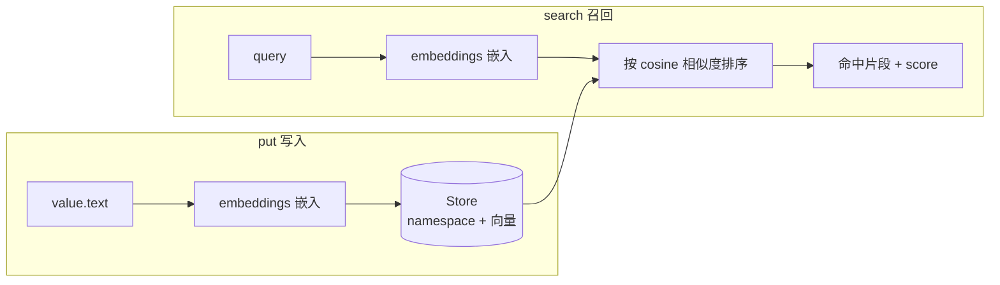

> 模块 03 - 记忆系统 | 前置知识：[1.x 时代的记忆系统](./01-memory-overview.md)、[VectorStore 记忆作为工具](./04-vectorstore-memory.md)、[多用户记忆隔离](./06-multi-user-isolation.md)

## checkpointer 记不住"跨会话的事"

[短期记忆](./02-buffer-memory.md) 用 checkpointer 把一次会话的消息历史存下来——同一个 `thread_id` 里，Agent 记得你三轮前说过什么。但换个 thread，全忘了。

真实产品需要的是另一种记忆：**跨会话、跟着用户走的长期记忆**。用户上个月说过"我对花生过敏"，这个月开新会话问"推荐个菜谱"，Agent 应该还记得这条。这不是 checkpointer 的活——checkpointer 按 thread 隔离，长期记忆要按**用户**沉淀。

LangGraph 用 **Store** 干这件事。[1.x 时代的记忆系统](./01-memory-overview.md) 提过 checkpointer 和 store 的分工，[多用户记忆隔离](./06-multi-user-isolation.md) 用 store 的 namespace 做过隔离。这一节讲它最有价值的能力：**语义召回**——存进去的记忆，能按"意思"而不是"关键词"检索回来。

## Store 配上 embeddings 就能语义检索

普通 store 是个带 namespace 的键值库，`search` 只能按前缀和元数据过滤。给它配一个 embeddings 模型，`search` 就升级成向量相似度检索。如图 3-6 所示，`put` 写入时自动算 embedding 入库，`search` 带 `query` 时把 query 也嵌入，按 cosine 相似度召回——这就是"用户对花生过敏"能被"饮食限制"召回的原理。



<small>图 3-6：Store 语义召回的数据流。写入和检索都经过同一个 embeddings 模型，按向量相似度匹配</small>

```typescript
import { InMemoryStore } from "@langchain/langgraph";
import { OpenAIEmbeddings } from "@langchain/openai";

const store = new InMemoryStore({
  index: {
    dims: 1536,
    embeddings: new OpenAIEmbeddings({ model: "text-embedding-3-small" }),
    fields: ["text"], // 只嵌入 value 的 text 字段，默认 ["$"] 嵌整个对象
  },
});
```

`index` 三个字段：`dims`（向量维度，跟 embeddings 模型对上）、`embeddings`（LangChain Embeddings 实例）、`fields`（从 value 的哪些字段取文本做嵌入）。配了 `index`，`put` 进去的数据会自动算 embedding，`search` 带 `query` 时就按语义相似度排序。

> 这里有个配置形态的坑要分清：**代码里**（`InMemoryStore`）传的是 `index.embeddings`（实例）+ `index.dims`；但 [LangGraph Platform 部署](../08-production/06-langgraph-platform.md) 的 `langgraph.json` 里写的是 `store.index.embed`——一个**字符串**模型标识（如 `"openai:text-embedding-3-small"`），字段名是 `embed` 不是 `embeddings`。两套形态别照搬。

## put / search：存记忆、按意思捞回来

namespace 是 `string[]` 层级路径，按用户隔离的惯例是 `["memories", userId]`：

```typescript
const userId = "u-123";
const namespace = ["memories", userId];

// 存一条记忆
await store.put(namespace, crypto.randomUUID(), { text: "用户对花生过敏" });
await store.put(namespace, crypto.randomUUID(), { text: "用户喜欢川菜" });
await store.put(namespace, crypto.randomUUID(), { text: "用户的回答偏好是简短" });

// 按语义检索——注意 query 才是触发向量检索的开关
const hits = await store.search(namespace, {
  query: "这个用户有什么饮食限制",
  limit: 3,
});

for (const item of hits) {
  console.log(item.value.text, "score:", item.score);
}
// → "用户对花生过敏" score: 0.82
//   "用户喜欢川菜"   score: 0.61
//   ...
```

关键点：

- `put(namespace, key, value, index?)`——第四参 `index` 传 `false` 可跳过这条的嵌入（纯存储不参与检索）。
- `search(namespacePrefix, { query, limit, offset, filter })`——**传 `query` 才走向量检索**并返回相似度 `score`；不传 `query` 就退化成按 namespace + filter 的普通分页列举（不排序）。`limit` 默认 10。
- 返回的每项带 `score`（cosine 相似度，仅 query 模式有）、`value`、`key`、`namespace`、时间戳。

"用户对花生过敏"能被"饮食限制"这个完全不同字面的 query 召回——这就是语义检索相对关键词匹配的价值。

## 接进 createAgent：让工具读写记忆

把 store 传给 `createAgent`，Agent 的工具和中间件就能在运行时拿到它。一个典型模式：一个工具负责"记住"，靠语义检索把相关记忆喂进上下文。

```typescript
import { createAgent, tool } from "langchain";
import { InMemoryStore } from "@langchain/langgraph";
import { OpenAIEmbeddings } from "@langchain/openai";
import { z } from "zod";

const store = new InMemoryStore({
  index: {
    dims: 1536,
    embeddings: new OpenAIEmbeddings({ model: "text-embedding-3-small" }),
    fields: ["text"],
  },
});

// 工具：记住一条用户信息
const saveMemory = tool(
  async ({ text }, config) => {
    const runtime = config.runtime; // 从 runtime 拿 store，不是引用外部闭包变量
    const userId = runtime.context.userId;
    await runtime.store?.put(["memories", userId], crypto.randomUUID(), { text });
    return "已记住";
  },
  {
    name: "save_memory",
    description: "当用户透露了值得长期记住的偏好/事实时调用",
    schema: z.object({ text: z.string().describe("要记住的一句话") }),
  }
);

// 工具：检索相关记忆
const recallMemory = tool(
  async ({ query }, config) => {
    const runtime = config.runtime;
    const userId = runtime.context.userId;
    const hits = await runtime.store?.search(["memories", userId], { query, limit: 3 });
    return (hits ?? []).map((h) => h.value.text).join("\n") || "（没有相关记忆）";
  },
  {
    name: "recall_memory",
    description: "回答前先检索这个用户的历史偏好/事实",
    schema: z.object({ query: z.string() }),
  }
);

const agent = createAgent({
  model: "openai:gpt-4o",
  tools: [saveMemory, recallMemory],
  systemPrompt: "回答前先用 recall_memory 查用户偏好；用户透露新信息时用 save_memory 记下。",
  store, // 注入后，工具里 runtime.store 可用
});

// 调用时通过 context 注入 userId
await agent.invoke(
  { messages: [{ role: "user", content: "推荐个菜谱" }] },
  { context: { userId: "u-123" } }
);
```

两个容易踩的点：

1. **工具里取 store 的入口是 `runtime.store`**（从工具第二参 `config.runtime`，中间件里是 `request.runtime.store`），不要去引用外部那个 `store` 变量。`runtime.store` 可能是 `undefined`（没注入时），调用要 `?.`。
2. `runtime.store` 拿到的其实是一个 `AsyncBatchedStore` 包装实例（它把多次读写批量化以提性能），不是你 `new` 的那个 `InMemoryStore` 原对象。功能完全一致，但 `instanceof InMemoryStore` 判断会失败——别依赖它。

`userId` 通过 `context` 注入、而不是放进工具 schema，是 [多用户记忆隔离](./06-multi-user-isolation.md) 强调过的关键：模型永远看不到也改不了 `userId`，记忆的隔离边界由代码守住，不交给模型。

## 从内存到生产

`InMemoryStore` 顾名思义存在进程内存里，进程一停就没。生产环境换成持久化后端——和 [自定义后端](./05-custom-message-history.md) 里 checkpointer 的思路一样，store 也有 Postgres 等实现，langgraph.json 部署时配 `store.index.embed` 即可让 [LangGraph Server](../08-production/06-langgraph-platform.md) 托管带语义检索的长期记忆。原型用 InMemoryStore，上线换持久化后端，namespace 和 search 的代码不用改。

## 小结

长期记忆（跨会话、按用户沉淀）用 Store，不是 checkpointer。给 `InMemoryStore` 配 `index`（`dims` + `embeddings` 实例 + `fields`），`search` 就从前缀过滤升级成语义检索——`put(namespace, key, value)` 存，`search(prefix, { query, limit })` 按意思捞回带 `score` 的结果。接进 `createAgent({ store })` 后，工具通过 `runtime.store`（注意是 `AsyncBatchedStore` 包装、可能 `undefined`）读写，`userId` 走 `context` 注入保证隔离。原型用 InMemoryStore，生产换持久化后端、代码不变。注意 `langgraph.json` 里是字符串 `store.index.embed`，和代码里的 `embeddings` 实例是两套形态。

到这里记忆系统的全貌就齐了：短期靠 checkpointer、长期靠 store、语义召回靠 store 的向量索引。下一模块 [工具与函数调用](../04-tools/01-tool-interface.md) 讲 Agent 怎么通过工具触达外部世界——包括把上面这种记忆读写封装成工具。

---

> 本文摘自[《LangChain.js Agent 开发权威指南》](https://github.com/diguike/book-langchain-agent)，作者[递归客](https://inferloop.dev)。
