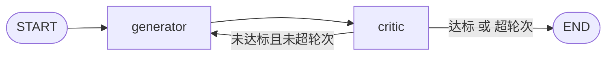

> 模块 05 - Agent 架构 | 前置知识：[LangGraph 入门](./03-langgraph-intro.md)

## 单次生成为什么不够

我写过一份长文，让 Sonnet 4.6 一次性生成 2000 字的技术分析。看一遍——还行，逻辑没问题。看两遍——发现少了一个关键论点。让模型自己再生成一遍——好了一些，但又多出一处事实错误。

这是单次 LLM 生成的本质问题：**模型在生成的时候没有"评审者视角"，它不会自己检查"我是不是漏了什么"**。质量呈现一个不可预测的分布，从惊喜到灾难都有可能。

Self-Reflection 是套在 Agent 外层的循环：生成 → 评审 → 改进 → 再评审，直到达标或者轮次用尽。我自己实测下来，长文场景加一轮反思能稳定提升 20% 以上的质量，加两轮接近"我自己改一遍"的水平。代价是 2-3 倍的 token 消耗。

## Generator + Critic 双角色



两个角色用不同的模型：

| 角色 | 职责 | 模型选择 |
|------|------|----------|
| Generator | 根据任务（或上轮反馈）生成内容 | Sonnet 4.6（标准创作） |
| Critic | 按 rubric 评估、给出可执行的改进建议 | Claude Opus 4.7（更挑剔，更细致） |

为什么 Critic 用更强的模型？因为它要在 Generator 已经"尽力了"的输出上挑出问题——能力上至少要不弱于 Generator，否则就是"瞎子给瞎子带路"。这个模型搭配是 Anthropic 在 Constitutional AI 系列论文里反复验证过的：批评者强于生成者，整体质量才会上升。

## 完整实现

下面是一个"长文写作 + 自评迭代"的完整 Agent，用 LangGraph 1.x 实现。

### State 设计

```typescript
// self-reflection.ts
import {
  StateGraph,
  START,
  END,
  Annotation,
} from "@langchain/langgraph";

const ReflectionState = Annotation.Root({
  // 用户的写作任务
  task: Annotation<string>,

  // 当前草稿（每轮覆盖）
  draft: Annotation<string>({
    reducer: (_, update) => update,
    default: () => "",
  }),

  // 评审结果（每轮覆盖）
  critique: Annotation<{
    scores: Record<string, number>;
    totalScore: number;
    passed: boolean;
    feedback: string;
    keyLesson: string;
  } | null>({
    reducer: (_, update) => update,
    default: () => null,
  }),

  // 累积的反思教训（追加）
  lessons: Annotation<string[]>({
    reducer: (current, update) => [...current, ...update],
    default: () => [],
  }),

  // 迭代轮次（累加）
  iteration: Annotation<number>({
    reducer: (current, update) => current + update,
    default: () => 0,
  }),
});
```

`lessons` 设计成累积追加，是为了实现 Reflexion 风格——每一轮的"教训"都保留下来，避免下一轮重复犯同样的错。

### Generator 节点

用 Sonnet 4.6，温度稍高鼓励文笔变化：

```typescript
import { ChatAnthropic } from "@langchain/anthropic";

const generatorModel = new ChatAnthropic({
  model: "claude-sonnet-4-6",
  temperature: 0.6,
});

async function generatorNode(state: typeof ReflectionState.State) {
  const isFirstDraft = state.iteration === 0;

  let prompt: string;
  if (isFirstDraft) {
    prompt = `请按以下任务写一篇高质量文章。

任务：${state.task}

要求：
- 800-1200 字
- 有清晰的论点和论据
- 包含具体的数据或案例（即使是虚构的也要具体到数字）
- 结构：引子 → 主体（3-4 个小节）→ 结论`;
  } else {
    const lessonsBlock = state.lessons.length
      ? `\n\n历次教训（避免再犯）：\n${state.lessons
          .map((l, i) => `${i + 1}. ${l}`)
          .join("\n")}`
      : "";

    prompt = `请根据评审反馈改进你的草稿。

原始任务：${state.task}

当前草稿：
${state.draft}

评审反馈：
${state.critique?.feedback}
（当前评分：${state.critique?.totalScore}/25）${lessonsBlock}

请输出修改后的**完整**文章。重点改进得分低的维度，不要保留原文有问题的句子。`;
  }

  const response = await generatorModel.invoke([
    {
      role: "system",
      content: "你是一位资深技术作者，擅长写有观点、有数据支撑的中长文。",
    },
    { role: "user", content: prompt },
  ]);

  return {
    draft: extractText(response),
    iteration: 1,
  };
}

function extractText(msg: unknown): string {
  if (!msg || typeof msg !== "object") return "";
  const m = msg as { content?: unknown; contentBlocks?: unknown };
  if (Array.isArray(m.contentBlocks)) {
    return (m.contentBlocks as Array<{ type?: string; text?: string }>)
      .filter((b) => b.type === "text")
      .map((b) => b.text ?? "")
      .join("");
  }
  return typeof m.content === "string" ? m.content : "";
}
```

### Critic 节点

Critic 用 Claude Opus 4.7，温度为 0，要求结构化输出确保打分稳定可解析：

```typescript
import { z } from "zod";

const PASS_THRESHOLD = 20;

const critiqueSchema = z.object({
  scores: z.object({
    accuracy: z.number().min(1).max(5).describe("事实准确性"),
    completeness: z.number().min(1).max(5).describe("覆盖完整性"),
    logic: z.number().min(1).max(5).describe("逻辑连贯性"),
    readability: z.number().min(1).max(5).describe("语言流畅度"),
    formatting: z.number().min(1).max(5).describe("结构与格式"),
  }),
  totalScore: z.number().describe("五项之和"),
  passed: z.boolean().describe(`总分 >= ${PASS_THRESHOLD} 视为通过`),
  feedback: z.string().describe("具体的、可执行的改进建议"),
  keyLesson: z
    .string()
    .describe("本轮最重要的一个教训，一句话，给下一轮生成参考"),
});

const criticModel = new ChatAnthropic({
  model: "claude-opus-4-7",
  temperature: 0,
}).withStructuredOutput(critiqueSchema);

async function criticNode(state: typeof ReflectionState.State) {
  const result = await criticModel.invoke([
    {
      role: "system",
      content: `你是一位严格但建设性的资深编辑。请从五个维度给文章打分（每项 1-5）：

1. accuracy 准确性：事实、数据、引用是否经得起推敲
2. completeness 完整性：核心问题有没有漏掉，论据够不够
3. logic 逻辑性：论点之间有没有清晰递进
4. readability 可读性：是不是有冗余、绕弯、晦涩的句子
5. formatting 格式：标题层级、段落、列表是否合理

总分 >= ${PASS_THRESHOLD} 通过。即使打了高分，也必须给出具体改进建议——不要写"很好，没有问题"这种废话。
keyLesson 字段总结本轮最重要的一个教训（不超过 30 字），用于指导下一轮重写。`,
    },
    {
      role: "user",
      content: `任务：${state.task}\n\n待评审文章：\n${state.draft}`,
    },
  ]);

  return {
    critique: {
      scores: result.scores,
      totalScore: result.totalScore,
      passed: result.passed,
      feedback: result.feedback,
      keyLesson: result.keyLesson,
    },
    lessons: [result.keyLesson],
  };
}
```

### 停止条件 + 组图

```typescript
const MAX_ITERATIONS = 3;

function shouldContinue(state: typeof ReflectionState.State) {
  if (state.critique?.passed) return END;
  if (state.iteration >= MAX_ITERATIONS) return END;
  return "generator";
}

const graph = new StateGraph(ReflectionState)
  .addNode("generator", generatorNode)
  .addNode("critic", criticNode)
  .addEdge(START, "generator")
  .addEdge("generator", "critic")
  .addConditionalEdges("critic", shouldContinue, {
    generator: "generator",
    [END]: END,
  });

const app = graph.compile();
```

### 跑一次完整流程

```typescript
const result = await app.invoke({
  task: "写一篇关于 WebAssembly 在 2026 年服务端应用现状的技术分析，要有具体的运行时（Wasmtime / WasmEdge / Spin）对比和真实落地场景",
});

console.log(`===== 经过 ${result.iteration} 轮迭代 =====`);
console.log(`最终评分：${result.critique?.totalScore} / 25`);
console.log(`是否通过：${result.critique?.passed ? "是" : "否（已达最大轮次）"}`);

console.log("\n反思轨迹：");
result.lessons.forEach((l, i) => {
  console.log(`  第 ${i + 1} 轮教训：${l}`);
});

console.log("\n最终文章：\n");
console.log(result.draft);
```

### 流式观察反思过程

写 demo 时强烈建议用 `streamMode: "updates"` 把每一轮的得分变化打出来：

```typescript
for await (const update of app.stream(
  { task: "..." },
  { streamMode: "updates" }
)) {
  for (const [node, payload] of Object.entries(update)) {
    if (node === "generator") {
      const draft = (payload as { draft?: string }).draft ?? "";
      console.log(`\n[generator] 草稿 ${draft.length} 字`);
    }
    if (node === "critic") {
      const c = (payload as { critique?: { totalScore: number; keyLesson: string; passed: boolean } })
        .critique;
      if (c) {
        console.log(
          `[critic] 评分 ${c.totalScore}/25 ${c.passed ? "[PASS]" : "[CONT]"}`
        );
        console.log(`         教训: ${c.keyLesson}`);
      }
    }
  }
}
```

跑下来会看到清晰的"评分逐轮上升"轨迹，典型的输出像这样：

```
[generator] 草稿 1024 字
[critic] 评分 16/25 [CONT]
         教训: 缺少对 Wasmtime 与 WasmEdge 的性能数据对比
[generator] 草稿 1187 字
[critic] 评分 19/25 [CONT]
         教训: 结论部分太空泛，没回到引子提出的问题
[generator] 草稿 1245 字
[critic] 评分 22/25 [PASS]
         教训: 落地场景从虚构改成 Fastly Compute@Edge 的真实案例后说服力大幅提升
```

## 停止条件设计

光"达标"和"超轮次"两条不够。生产环境我一般加第三条：**改进幅度低于阈值就停**。

```typescript
function shouldContinue(state: typeof ReflectionState.State) {
  if (state.critique?.passed) return END;
  if (state.iteration >= MAX_ITERATIONS) return END;

  // 边际收益太低也停
  if (state.lessons.length >= 2) {
    // 需要把历史分数也存进 state（这里省略实现）
    // const delta = state.scoreHistory.at(-1)! - state.scoreHistory.at(-2)!;
    // if (delta < 2) return END;
  }

  return "generator";
}
```

理由很简单：每多一轮就多 2 次 LLM 调用，如果分数只从 19 涨到 19.5，纯属浪费 token。

## 反思模式的几个变体

### 自验证（Self-Verification）

事实性任务里，Critic 不光打分，还要去搜证据：

```typescript
async function selfVerifyNode(state: typeof VerifyState.State) {
  const claim = state.draft;
  const searchResult = await webSearch.invoke({ query: claim });

  const judge = await criticModel.invoke([
    {
      role: "user",
      content: `原始声明：${claim}\n搜索证据：${searchResult}\n这条声明经得起证据检验吗？哪里需要修正？`,
    },
  ]);

  // ...
}
```

适合"生成医学/法律/历史信息"这类对准确性极敏感的场景。

### 多视角对抗

用两个不同 provider 的 Critic 投票，防止单个模型的盲区：

```typescript
const criticA = new ChatAnthropic({ model: "claude-opus-4-7", temperature: 0 });
const criticB = new ChatOpenAI({ model: "gpt-5", temperature: 0 });

async function dualCriticNode(state: typeof ReflectionState.State) {
  const [a, b] = await Promise.all([
    criticA.withStructuredOutput(critiqueSchema).invoke([...]),
    criticB.withStructuredOutput(critiqueSchema).invoke([...]),
  ]);
  // 取较低分（更保守）或加权平均
  const totalScore = Math.min(a.totalScore, b.totalScore);
  // ...
}
```

代价是评审 token 翻倍，只在最关键的场景用。

## 成本与延迟权衡

| 维度 | 建议 |
|------|------|
| Generator 模型 | Sonnet 4.6 / GPT-5.4 即可，不必上 Opus |
| Critic 模型 | 必须比 Generator 强一档：Opus 4.7 / GPT-5.5 |
| 最大轮次 | 默认 3 轮，对延迟敏感的场景降到 2 |
| Prompt 缓存 | rubric 和 system prompt 不变，开启 prompt cache 可省 60%+ token |
| 历史草稿 | 不要往 prompt 里塞所有历史草稿，只带"上一轮草稿 + 反馈" |

最后这条特别重要——见过有人把每一轮的草稿都塞进 Generator 的上下文，第 3 轮 prompt 就 1 万 token 了，纯属拉成本。

## 何时不该用 Self-Reflection

- **答案唯一且简单**：算个数、查个时间，没什么可反思的
- **延迟极敏感**：聊天 UI 一次回复要 30 秒，用户会跑掉
- **结构化输出**：直接走 `withStructuredOutput` + schema 校验，schema 已经做了"评审"

## 小结

Self-Reflection 把"生成"和"评审"拆成两个独立的 LangGraph 节点，Generator 用 Sonnet 4.6 生成，Critic 用 Claude Opus 4.7 按 rubric 打分并给出可执行反馈。带累积 lessons 是 Reflexion 风格——避免反复犯同样的错。停止条件用"达标 + 最大轮次 + 改进幅度"三条组合。生产场景下，对长文写作、报告生成、代码评审等质量敏感任务有明显增益。

下一节 [LangGraph 入门](./03-langgraph-intro.md) 系统讲 `StateGraph` 的核心抽象——前面 Plan-and-Execute 和 Self-Reflection 用到的所有东西都会展开。

---

> 本文摘自[《LangChain.js Agent 开发权威指南》](https://github.com/diguike/book-langchain-agent)，作者[递归客](https://inferloop.dev)。
