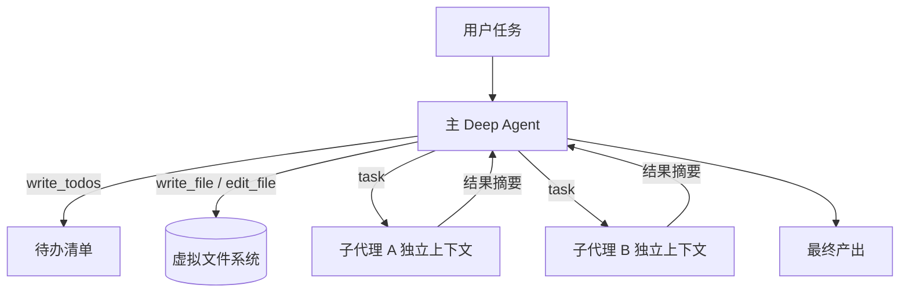

> 模块 05 - Agent 架构 | 前置知识：[createAgent 入门](./01-create-agent.md)、[Middleware 系统](./07-middleware.md)、[Multi-Agent 协作](./08-multi-agent.md)

## 普通 Agent 撑不住长任务

[createAgent 入门](./01-create-agent.md) 里那个 `model → tools → model` 的循环，处理"查天气再算个数"绰绰有余。但你让它干一件真正复杂的活——比如"调研一个技术选型，对比五个框架，写一份带引用的报告"——它会很快露怯：

- 上下文越滚越长，调到第 15 个工具时，最早的调研结论已经被挤出窗口，模型开始自相矛盾；
- 没有计划，模型走一步看一步，经常漏掉用户要求里的某一条；
- 所有中间结果都堆在对话历史里，几千行搜索结果原文反复占着 token。

这类"多步骤、长周期、要规划"的任务，社区给了一个专门的模式叫 **Deep Agent**（深度智能体）。它的灵感直接来自 Claude Code 和 Deep Research 这类产品：不是一个工具调用循环，而是一个**会规划、能拆活、有工作区**的智能体。LangChain 把这套模式固化成了独立的包 `deepagents`。

这一节讲清楚 Deep Agent 到底多了什么、什么时候该上、怎么用 `createDeepAgent` 把它跑起来。

## Deep Agent 的四大支柱

Deep Agent 不是一个新引擎。拆开看，它就是在你已经熟悉的 `createAgent` 之上，叠了一组固定顺序的内置 [middleware](./07-middleware.md)。它比普通 Agent 多了四样东西：

| 支柱 | 提供的能力 | 内置工具 |
|------|-----------|----------|
| **Planning（规划）** | 让模型先列待办清单，再逐项执行 | `write_todos` |
| **Filesystem（虚拟文件系统）** | 把中间产物写到"文件"里，而不是全堆在对话历史 | `ls` / `read_file` / `write_file` / `edit_file` / `glob` / `grep` / `execute` |
| **Sub-agents（子代理）** | 把独立的子任务派给拥有独立上下文的子代理 | `task` |
| **详细系统提示** | 一段内置的 `BASE_AGENT_PROMPT`，教模型怎么用上面这些能力 | — |

这四样能力对应解决前面三个痛点：规划解决"走一步看一步"，文件系统解决"上下文爆炸"，子代理解决"长任务里上下文互相污染"。



关键在子代理那条线：子代理跑完后，**只有它的最终结论回到主代理**，中间几千行搜索原文留在子代理自己的上下文里，不污染主线。主代理因此能在不爆窗口的前提下统筹几十步的长任务。

## 第一个 Deep Agent

先装包。`deepagents` 依赖 `langchain` 1.x：

```bash
npm install deepagents langchain @langchain/anthropic @langchain/core zod
```

最小例子：一个会规划、能写文件的调研助手。注意 `tool` 和 `createAgent` 一样从 `langchain` 顶层导出：

```typescript
// deep-agent.ts
import { z } from "zod";
import { tool } from "langchain";
import { ChatAnthropic } from "@langchain/anthropic";
import { createDeepAgent } from "deepagents";

// 一个模拟的联网搜索工具（真实场景换成 Tavily 等）
const internetSearch = tool(
  async ({ query }) => `关于"${query}"的搜索结果：……（此处省略）`,
  {
    name: "internet_search",
    description: "执行一次联网搜索，返回相关网页摘要",
    schema: z.object({ query: z.string().describe("搜索关键词") }),
  }
);

const agent = createDeepAgent({
  model: new ChatAnthropic({ model: "claude-sonnet-4-6", temperature: 0 }),
  tools: [internetSearch],
  // systemPrompt 会拼接到内置的 BASE_AGENT_PROMPT 之后，不是替换它
  systemPrompt:
    "你是一名资深技术调研员。先把调研问题写进 question.txt，调研完成后把报告写进 final_report.md。",
});

const result = await agent.invoke(
  { messages: [{ role: "user", content: "对比 LangGraph、CrewAI、AutoGen 三个 Agent 框架" }] },
  { recursionLimit: 1000 }
);

// 内置 middleware 会把规划和文件状态注入返回值
console.log("待办：", result.todos);
console.log("文件：", Object.keys(result.files ?? {}));
console.log(result.messages.at(-1)?.text);
```

跑起来：

```bash
ANTHROPIC_API_KEY=sk-ant-xxx npx tsx deep-agent.ts
```

执行过程大致是：模型先调 `write_todos` 列出"逐个框架调研 → 汇总对比 → 写报告"的计划，然后调 `write_file` 把问题记进 `question.txt`，接着多轮 `internet_search` + `edit_file` 逐步填充，最后把 `final_report.md` 写出来。这些 `todos` 和 `files` 不在你的数据库里——它们是 Deep Agent 维护在**图状态**里的虚拟产物，跟着 checkpointer 一起持久化。

注意两个和普通 `createAgent` 的差别：

1. `recursionLimit` 要给大。Deep Agent 一个任务跑几十上百步是常态，`createDeepAgent` 内部默认把上限设到了 10000，但你 invoke 时仍可按需覆盖。
2. **没有 `builtinTools` 这种开关**。四大支柱是固定挂载的内置 middleware，不能用一个布尔值裁掉某一项（要裁只能通过后端 backend、权限 permissions 这些更细的配置）。

## 用子代理拆解长任务

子代理是 Deep Agent 最值钱的能力。声明一个子代理，就是给主代理多一个"可以委派的专家"。子代理通过内置的 `task` 工具被调用，**拥有独立的上下文窗口**——它干活时翻的资料、调的工具、产生的中间消息，主代理一概看不到，只收到它的最终结论。

```typescript
import { createDeepAgent, type SubAgent } from "deepagents";

// 一个专注的调研子代理：每次只研究一个子问题
const researchSubAgent: SubAgent = {
  name: "research-agent",
  description: "用于深入调研单个子问题。一次只丢给它一个聚焦的问题。",
  systemPrompt:
    "你是一名专职调研员。针对给你的问题做彻底调研，回复一份详尽的最终结论。",
  tools: [internetSearch],
};

const agent = createDeepAgent({
  model: new ChatAnthropic({ model: "claude-sonnet-4-6", temperature: 0 }),
  tools: [internetSearch],
  subagents: [researchSubAgent],
  systemPrompt:
    "你是调研总控。把每个框架的调研用 task 工具派给 research-agent 子代理，自己负责汇总与写报告。",
});
```

`SubAgent` 的字段不多，但每一个都有用：

| 字段 | 作用 |
|------|------|
| `name` | `task` 工具按这个名字选子代理，必填 |
| `description` | 给模型看的"什么时候该派给它"，写清楚边界 |
| `systemPrompt` | 子代理自己的系统提示 |
| `tools` | 子代理能用的工具，不填则继承主代理默认工具 |
| `model` | 子代理用的模型，不填则继承主代理模型 |

为什么这样能扛长任务？设想"对比五个框架"：主代理调五次 `task`，每个子代理各自读几千行文档、得出一段三百字的结论。如果不用子代理，这五份原始文档全堆进主代理的上下文，几轮就爆窗口；用了子代理，主代理收到的只有五段结论，干干净净地做最后的对比。**这是"上下文工程"在 Agent 层的标准做法**：让脏活在隔离的上下文里发生，主线只留精炼结果。

子代理还可以给不同模型——调研这种重活给 Sonnet 4.6，格式整理这种轻活给 Haiku 4.5，按 `model` 字段分配即可，省钱又不掉质量。

## 虚拟文件系统：把上下文卸到"磁盘"

Deep Agent 的文件系统不是真磁盘（默认情况下），而是一个存在图状态里的键值结构，由内置的 `ls / read_file / write_file / edit_file / glob / grep / execute` 七个工具操作。它的意义不在"持久化文件"，而在**给模型一个可以暂存中间产物的地方**：

- 调研笔记写进 `notes.md`，需要时 `read_file` 取回来，而不是一直挂在对话里；
- 报告分章节写进 `final_report.md`，用 `edit_file` 增量改，而不是每次重发全文；
- 用 `grep` 在已经攒下的笔记里检索，而不是让模型凭记忆。

这套机制和子代理是一对：子代理把结论写进文件，主代理 `read_file` 取用，两者通过文件系统而不是对话历史交换数据。任务结束后，所有文件都在 `result.files` 里：

```typescript
const result = await agent.invoke(
  { messages: [{ role: "user", content: "……" }] },
  { recursionLimit: 1000 }
);

for (const [name, content] of Object.entries(result.files ?? {})) {
  console.log(`=== ${name} ===\n${content}\n`);
}
```

## 它和 createAgent / Multi-Agent 的关系

容易混的三个概念，一张表说清：

| 你的需求 | 该用 |
|----------|------|
| 一问一答、几个工具的循环 | [`createAgent`](./01-create-agent.md) |
| 多个领域专家，要中心化路由 | [Supervisor / Multi-Agent](./08-multi-agent.md) |
| **单个目标、多步骤、要规划 + 暂存 + 拆子任务** | **Deep Agent** |

Deep Agent 本质上是 `createAgent` + 一组确定顺序的内置 middleware（`todoListMiddleware`、文件系统 middleware、子代理 middleware、摘要 middleware……）。理解了这一点你就明白两件事：第一，[Middleware 系统](./07-middleware.md) 那一节学的钩子机制，正是 Deep Agent 的搭建方式，你完全可以往 `createDeepAgent` 的 `middleware` 数组里追加自己的中间件；第二，如果你只需要四大支柱里的某一两个（比如只要规划，不要文件系统），那直接用 `createAgent` 手动挂 `todoListMiddleware` 反而更轻——这正是下一节 [内置 Middleware 全景](./12-middleware-builtin.md) 要展开的。

## 踩坑提示

1. **任务要写清边界**。Deep Agent 因为能规划、能拆活，给个模糊任务它会自己脑补出一堆步骤，跑很久还跑偏。系统提示里把"产出什么、写到哪个文件、什么算完成"讲明白。
2. **`recursionLimit` 别用普通 Agent 的直觉**。Deep Agent 几十步起步，invoke 时给到几百上千，否则会撞上限报错。
3. **自定义工具名别和内置工具撞**。`write_todos`、`task`、`ls`、`read_file` 等都是占用的名字，重名 `createDeepAgent` 会直接抛 `TOOL_NAME_COLLISION`。
4. **子代理不是越多越好**。每个子代理一次 `task` 调用就是一轮完整的 Agent 循环，开销不小。只在"子任务确实独立、且会产生大量中间上下文"时才拆。
5. **要持久化就传 checkpointer**。`todos` 和 `files` 都在图状态里，配上 checkpointer 才能跨轮、跨进程恢复（机制见 [State 与 Checkpointer](./04-langgraph-state.md)）。

## 小结

Deep Agent 是为"多步骤、长周期、要规划"的任务设计的智能体模式，灵感来自 Claude Code、Deep Research 这类产品。它在 `createAgent` 之上叠了四大支柱：规划（`write_todos`）、虚拟文件系统（七个文件工具）、子代理（`task`）、详细系统提示。用 `deepagents` 包的 `createDeepAgent` 一行就能拿到全套；`systemPrompt` 是拼接到内置提示之后而非替换，没有 `builtinTools` 开关。子代理的独立上下文 + 文件系统的中间产物暂存，是它能扛长任务的核心。

这四大支柱底层都是内置 middleware。下一节 [内置 Middleware 全景](./12-middleware-builtin.md) 把 LangChain 自带的十几个 middleware 逐个过一遍——摘要、限流、PII 脱敏、模型回退……它们是你不写 Deep Agent 时也天天要用的生产组件。

---

> 本文摘自[《LangChain.js Agent 开发权威指南》](https://github.com/diguike/book-langchain-agent)，作者[递归客](https://inferloop.dev)。
