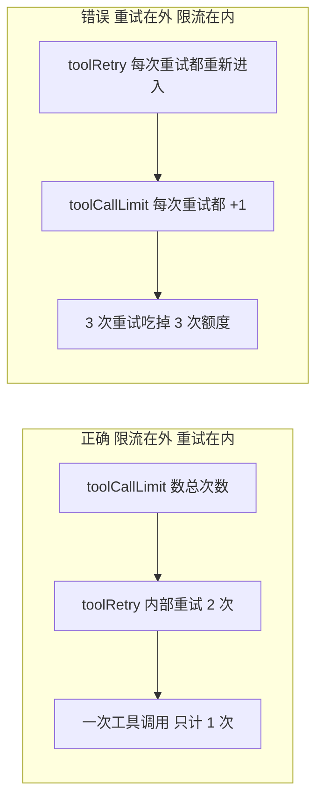

> 模块 05 - Agent 架构 | 前置知识：[Middleware 系统](./07-middleware.md)

## 别什么都自己写

[Middleware 系统](./07-middleware.md) 那一节讲了六个钩子（`beforeAgent` / `beforeModel` / `wrapModelCall` / `afterModel` / `afterAgent` / `wrapToolCall`），也教了怎么用 `createMiddleware` 写自己的中间件。但在动手写之前，先看一眼 LangChain 自带了什么——很多你以为要自己实现的生产能力（摘要压缩、限流、重试、PII 脱敏、模型回退），官方已经做好了，而且都从 `langchain` 顶层直接导出。

这一节把内置 middleware 逐组过一遍，告诉你每个解决什么问题、关键参数是什么、什么时候该挂上。把它当一份"生产 Agent 的标配清单"来读。

## 一张全景表

所有内置 middleware 都从 `langchain` 导入，不需要走子路径：

```typescript
import {
  summarizationMiddleware,
  toolCallLimitMiddleware,
  humanInTheLoopMiddleware,
  modelFallbackMiddleware,
  // ……
} from "langchain";
```

按职责分五组：

| 分组 | Middleware | 一句话用途 | 主要钩子 |
|------|-----------|-----------|---------|
| **上下文 / 记忆** | `summarizationMiddleware` | 历史超阈值时摘要压缩 | `beforeModel` |
| | `contextEditingMiddleware` | token 超限时清理旧工具结果 | `wrapModelCall` |
| | `anthropicPromptCachingMiddleware` | Anthropic prompt 缓存 | `wrapModelCall` |
| **安全 / 护栏** | `humanInTheLoopMiddleware` | 工具调用前人工审批 | interrupt |
| | `piiRedactionMiddleware` | 对模型脱敏、对工具还原 | `wrapModelCall` + `afterModel` |
| | `piiMiddleware` | PII 检测 + 策略处理 | `beforeModel` / `afterModel` |
| | `openAIModerationMiddleware` | OpenAI 内容审核 | `wrapModelCall` |
| **工具控制** | `toolCallLimitMiddleware` | 限制工具调用次数 | `afterModel` + `afterAgent` |
| | `toolRetryMiddleware` | 工具失败重试 | `wrapToolCall` |
| | `llmToolSelectorMiddleware` | 工具太多时先让 LLM 选子集 | `wrapModelCall` |
| | `toolEmulatorMiddleware` | 用 LLM 模拟未实现的工具（测试用） | `wrapModelCall` + `wrapToolCall` |
| | `providerToolSearchMiddleware` | provider 端工具检索 | `wrapModelCall` |
| **模型控制** | `modelCallLimitMiddleware` | 限制模型调用次数 | `beforeModel` + `afterModel` |
| | `modelRetryMiddleware` | 模型调用失败重试（指数退避） | `wrapModelCall` |
| | `modelFallbackMiddleware` | 主模型失败时按序回退 | `wrapModelCall` |
| | `dynamicSystemPromptMiddleware` | 按运行时 context 动态生成 system prompt | `wrapModelCall` |
| **规划** | `todoListMiddleware` | 提供 `write_todos` 规划工具 | `wrapModelCall` + `afterModel` |

下面挑生产里最常用的几个细讲，剩下的用法都能从这张表 + 类型提示推出来。

## 上下文 / 记忆：让长对话不爆窗口

### summarizationMiddleware

最常用的一个。对话历史一长，要么超模型上下文窗口报错，要么 token 成本失控。`summarizationMiddleware` 在每次调模型前检查历史长度，超过阈值就把旧消息摘要成一段、替换掉，保留最近若干条原文。

```typescript
import { createAgent, summarizationMiddleware } from "langchain";
import { ChatAnthropic } from "@langchain/anthropic";

const model = new ChatAnthropic({ model: "claude-sonnet-4-6" });

const agent = createAgent({
  model,
  tools: [/* ... */],
  middleware: [
    summarizationMiddleware({
      model, // 摘要用哪个模型，可以换更便宜的
      trigger: { tokens: 4000 }, // 历史超过 4000 token 触发；也可用 { messages: N } 按条数
      keep: { messages: 6 }, // 保留最近 6 条原文不摘要
    }),
  ],
});
```

它替代了 0.x 时代你手写的 `ConversationSummaryMemory`。[记忆模块](../03-memory/03-summary-memory.md) 里手写 `createMiddleware` 压缩历史那套，理解内部机制有价值，但生产里直接用这个。

### contextEditingMiddleware

和摘要互补。摘要是把旧消息"压成一段话"，`contextEditingMiddleware` 是把"旧的工具调用结果"直接清掉——很多时候一个工具返回几千行 JSON，模型用完一次就再也不需要原文了，留着纯占 token。默认策略对齐 Anthropic 的 ClearToolUses，token 超限时清理最早的工具结果。

```typescript
import { contextEditingMiddleware } from "langchain";

contextEditingMiddleware({ tokenCountMethod: "approx" }); // approx 快，model 准
```

## 安全 / 护栏：生产 Agent 的底线

### humanInTheLoopMiddleware

高风险操作（退款、删数据、发邮件）执行前必须人审。这是 1.x 声明式 HITL 的**唯一**正路——`createAgent` 本身**没有** `interrupts` 参数，所有"工具调用前断点"都通过这个 middleware 实现（完整流程见 [Human-in-the-Loop](./09-human-in-the-loop.md)）。

```typescript
import { humanInTheLoopMiddleware } from "langchain";

humanInTheLoopMiddleware({
  interruptOn: {
    initiate_refund: true, // 退款工具调用前中断，等人批
    query_order: false, // 查询类直接放行
  },
});
```

挂了它的 Agent 必须配 checkpointer——中断要把状态存下来，等人回来再 resume。

### piiRedactionMiddleware

把用户消息里的敏感信息（手机号、身份证、信用卡）在送进模型前脱敏成占位符，工具执行时再还原真实值。模型看到的是 `<phone>`，你的下游工具拿到的是真号码。合规场景的标配。

```typescript
import { piiRedactionMiddleware } from "langchain";

piiRedactionMiddleware({
  rules: {
    phone: /1[3-9]\d{9}/g,
    idcard: /\d{17}[\dXx]/g,
  },
});
```

注意 `piiMiddleware` 和 `piiRedactionMiddleware` 是**两个不同的工厂**：前者偏"检测 + 按策略处理（拦截/告警/脱敏）"，后者专做"对模型脱敏、对工具还原"。别记混。

## 工具与模型控制：防失控、抗抖动

### toolCallLimitMiddleware / modelCallLimitMiddleware

Agent 失控最典型的表现是死循环——反复调同一个工具，或反复请求模型。这两个 middleware 给次数封顶：

```typescript
import { toolCallLimitMiddleware, modelCallLimitMiddleware } from "langchain";

toolCallLimitMiddleware({
  runLimit: 10, // 单次运行最多 10 次工具调用
  exitBehavior: "end", // 超了就结束（也可 "error" 抛错 / "continue" 仅告警）
});

modelCallLimitMiddleware({ runLimit: 20, exitBehavior: "error" });
```

`toolCallLimitMiddleware` 还能按工具名限：`{ toolName: "internet_search", runLimit: 5 }`，只卡某个贵工具。

### modelRetryMiddleware / toolRetryMiddleware

模型 API 偶发 5xx、工具偶发超时，是生产常态。这两个把重试逻辑收敛成 middleware，不用在每个工具里手写 try-catch：

```typescript
import { modelRetryMiddleware, toolRetryMiddleware } from "langchain";

modelRetryMiddleware({ maxRetries: 3, onFailure: "error" }); // 指数退避内置
toolRetryMiddleware({ maxRetries: 2, onFailure: "continue" }); // 失败后把错误喂回模型让它换路
```

### modelFallbackMiddleware

比重试更进一步：主模型彻底不可用（限流、宕机）时，自动切到备用模型。注意它收的是**可变参数**，不是 `{ models: [...] }`：

```typescript
import { modelFallbackMiddleware } from "langchain";
import { ChatOpenAI } from "@langchain/openai";

modelFallbackMiddleware(
  "openai:gpt-4o", // 第一备选
  new ChatOpenAI({ model: "gpt-4o-mini" }) // 第二备选，字符串和实例都行
);
```

主模型在 `createAgent({ model })` 里指定，这里只列回退序列。

### llmToolSelectorMiddleware

工具挂到二三十个时，模型在长列表里选错率上升、token 也浪费。这个 middleware 在正式调模型前，先用一个轻量模型从全集里挑出与当前问题相关的子集，再把子集喂给主模型：

```typescript
import { llmToolSelectorMiddleware } from "langchain";

llmToolSelectorMiddleware({
  maxTools: 5, // 每次最多保留 5 个工具
  alwaysInclude: ["handoff_to_human"], // 这些工具永远保留
});
```

## 顺序很重要

middleware 是**洋葱模型**：数组里靠前的包在外层。`beforeModel` 按数组正序执行，`afterModel` 按逆序执行；`wrapModelCall` / `wrapToolCall` 也是外层先进、内层先出。

这意味着顺序会改变行为。一个实际例子：限流要包在重试外层，否则重试会绕过限流计数。两种排法的差异如图 5-9 所示。



图 5-9：middleware 顺序如何改变限流行为。限流在外层时，一次工具调用内部的多次重试只算 1 次；调反则每次重试都计入额度，10 次额度可能 3 个工具就用光。

```typescript
const agent = createAgent({
  model,
  tools,
  middleware: [
    toolCallLimitMiddleware({ runLimit: 10, exitBehavior: "end" }), // 外层：先数总数
    toolRetryMiddleware({ maxRetries: 2 }), // 内层：单次调用内部重试
  ],
});
```

如果调反，每次重试都被当成新的工具调用计入限额，10 次额度可能 3 个工具就用光。Deep Agent（上一节）内部正是靠精心排列的内置 middleware 顺序保证行为确定的。

## 怎么选

不用全挂。按场景取：

| 场景 | 建议挂的 middleware |
|------|---------------------|
| 任何会多轮对话的 Agent | `summarizationMiddleware` |
| 任何有副作用工具（写数据、花钱） | `humanInTheLoopMiddleware` + `toolCallLimitMiddleware` |
| 面向 C 端、涉及个人信息 | `piiRedactionMiddleware`（+ moderation） |
| 高可用要求 | `modelRetryMiddleware` + `modelFallbackMiddleware` |
| 工具数 > 15 | `llmToolSelectorMiddleware` |
| 写测试、跑 CI | `toolEmulatorMiddleware`（mock 掉真实工具） |

## 小结

LangChain 内置了十几个生产级 middleware，全部从 `langchain` 顶层导出，覆盖上下文压缩、安全护栏、工具/模型限流与重试、动态提示、规划六大类。优先用内置的，不要重复造轮子：长对话挂 `summarizationMiddleware`，有副作用工具挂 `humanInTheLoopMiddleware` + `toolCallLimitMiddleware`，高可用挂重试 + `modelFallbackMiddleware`。记住三个易错点：`humanInTheLoopMiddleware`（不是 `hitlMiddleware`）、`piiMiddleware` 与 `piiRedactionMiddleware` 是两个、`modelFallbackMiddleware` 收可变参数。顺序按洋葱模型排，限流在外、重试在内。

下一节 [Supervisor 模式](./13-supervisor.md) 回到多 Agent，用官方的 `createSupervisor` 替代 [Multi-Agent 协作](./08-multi-agent.md) 里那套手写的路由图——少写很多胶水代码。

---

> 本文摘自[《LangChain.js Agent 开发权威指南》](https://github.com/diguike/book-langchain-agent)，作者[递归客](https://inferloop.dev)。
