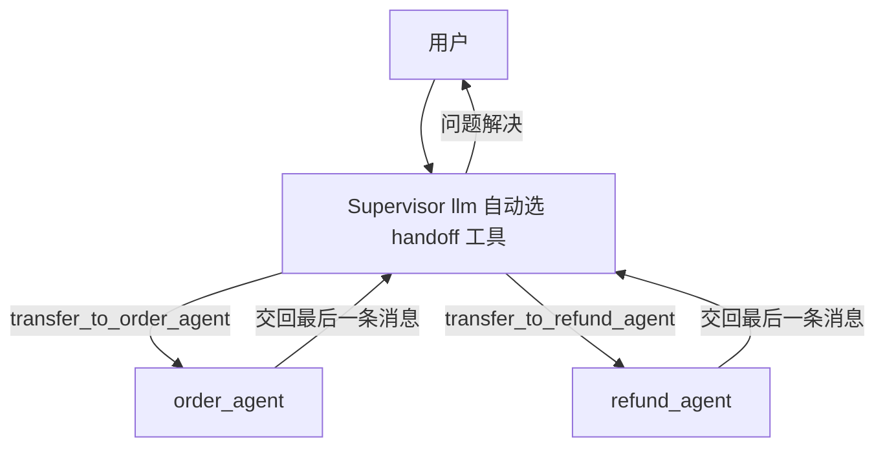

> 模块 05 - Agent 架构 | 前置知识：[Multi-Agent 协作](./08-multi-agent.md)

## 手写 Supervisor 的胶水太多

[Multi-Agent 协作](./08-multi-agent.md) 那一节用 `StateGraph` + `Command` 手写了一个 Supervisor：要自己定义路由 schema、写 supervisor 节点、给每个专科 Agent 包一层 wrapper、声明 `{ ends: [...] }`、组图。能跑，但样板代码不少，每加一个专家就要改三处。

这套"中心化路由"是个高频模式，LangChain 把它固化成了独立包 `@langchain/langgraph-supervisor`，一个 `createSupervisor` 就搞定。手写那一版的价值在于让你看清内部机制；真要上生产，用官方 prebuilt 少写一大半代码。

这一节用 `createSupervisor` 重写上一节的客服分诊例子，并讲清楚它和手写版的取舍。

## createSupervisor 最小实现

先装包：

```bash
npm install @langchain/langgraph-supervisor langchain @langchain/anthropic @langchain/core zod
```

专科 Agent 还是普通的 `createAgent`，唯一要求是**每个都必须有唯一的 `name`**——Supervisor 靠 name 路由，重名会直接抛错：

```typescript
// supervisor.ts
import { z } from "zod";
import { tool, createAgent } from "langchain";
import { ChatAnthropic } from "@langchain/anthropic";
import { createSupervisor } from "@langchain/langgraph-supervisor";

const model = new ChatAnthropic({ model: "claude-sonnet-4-6", temperature: 0 });

// 工具
const queryOrder = tool(
  async ({ orderId }) => `订单 ${orderId} 状态：已发货，预计明天送达`,
  { name: "query_order", description: "查订单状态、物流", schema: z.object({ orderId: z.string() }) }
);
const initiateRefund = tool(
  async ({ orderId, reason }) => `订单 ${orderId} 退款已发起（${reason}），3-5 日到账`,
  { name: "initiate_refund", description: "发起退款", schema: z.object({ orderId: z.string(), reason: z.string() }) }
);

// 专科 Agent —— 每个必须有唯一 name
const orderAgent = createAgent({
  model,
  tools: [queryOrder],
  systemPrompt: "你是订单专员，只处理订单查询与物流。",
  name: "order_agent",
});
const refundAgent = createAgent({
  model,
  tools: [initiateRefund],
  systemPrompt: "你是退款专员，确认订单号和原因后发起退款。",
  name: "refund_agent",
});

// Supervisor —— 注意字段名是 llm，不是 model
const workflow = createSupervisor({
  agents: [orderAgent, refundAgent],
  llm: model,
  prompt:
    "你是客服分诊主管。把订单/物流问题派给 order_agent，退款问题派给 refund_agent。问题解决后直接回复用户。",
});

// 必须 compile 才能 invoke
const app = workflow.compile();

const result = await app.invoke({
  messages: [{ role: "user", content: "我订单 ORD-1234 还没收到，帮我查一下" }],
});
console.log(result.messages.at(-1)?.text);
```

跟手写版比，少掉的东西：路由 schema、supervisor 节点函数、每个 Agent 的 wrapper、`{ ends }` 声明、`addEdge`。Supervisor 内部自动给每个专科 Agent 生成了 handoff 工具，由它自己决定调哪个。这套星型路由如图 5-10 所示——`createSupervisor` 把虚线框里的胶水全自动生成了，你只提供 `agents` / `llm` / `prompt`。



图 5-10：`createSupervisor` 生成的星型路由。每个专科 Agent 对应一个自动生成的 `transfer_to_<name>` handoff 工具，Supervisor 调哪个就路由到哪个；专家干完把消息交回中心（默认 `outputMode: "last_message"`），由 Supervisor 决定再派一个还是回复用户。

## 三个最容易写错的点

`createSupervisor` 的 API 有几处和直觉不符，全书 reviewer 也反复踩，单独拎出来：

1. **模型字段是 `llm`，不是 `model`**。这是它和 `createAgent`（用 `model`）最大的不一致。写成 `model` 不报错但 Supervisor 没模型可用，运行时才炸。
2. **返回的是未编译的图，必须 `.compile()`**。`createSupervisor(...)` 给你的是 `StateGraph` builder，不是能直接 `.invoke()` 的对象。忘了 compile 会报"不是函数"。
3. **每个 agent 必须有唯一 `name`**。没 name 或重名，构造时直接抛错。

记住这三条，剩下的参数都能从类型提示推出来。

## 常用参数

```typescript
createSupervisor({
  agents,                  // 专科 Agent 数组（每个有唯一 name）
  llm,                     // Supervisor 自己的模型
  prompt,                  // Supervisor 的系统提示
  tools,                   // 可选：Supervisor 自己也能挂工具（如查知识库再决定路由）
  outputMode,              // "last_message"（默认）| "full_history"
  addHandoffMessages,      // 默认 true：是否把 handoff 过程写进消息历史
  supervisorName,          // 默认 "supervisor"
  responseFormat,          // 可选：让最终输出走结构化 schema
});
```

两个值得调的：

- **`outputMode`**：默认 `"last_message"`，专科 Agent 只把最后一条消息交回 Supervisor——干净，但 Supervisor 看不到专家的中间推理。需要 Supervisor 基于完整过程做下一步决策时，改成 `"full_history"`。
- **`addHandoffMessages`**：默认 `true`，handoff 的来回会留在消息里，方便 LangSmith 追踪；嫌历史噪音大可关掉。它是 handoff 消息的主开关，`addHandoffBackMessages` 默认跟随它。

## 它和手写版怎么选

| 维度 | `createSupervisor` | 手写 StateGraph + Command |
|------|-------------------|--------------------------|
| 代码量 | 少 | 多（每加专家改三处） |
| 路由逻辑 | LLM 自动选 handoff 工具 | 你完全控制（可加规则、阈值、兜底） |
| 自定义拓扑 | 受限于"星型中心调度" | 任意（并发分支、条件回路） |
| 适合 | 标准的中心化分诊 | 路由要嵌业务规则、或非星型拓扑 |

实战建议：**先用 `createSupervisor` 起步**，跑通业务。当你发现需要"路由前先查一下库存"、"某类请求强制走人工"、"两个专家要并发跑"这种 LLM 自动 handoff 表达不了的逻辑时，再退回到 [手写 StateGraph](./08-multi-agent.md)。多数客服、问答类场景，prebuilt 版够用到上线。

## Hierarchical：Supervisor 套 Supervisor

规模再大，一个 Supervisor 管不过来二十个专家，就分领域。`createSupervisor` 返回的是图，图本身可以作为另一个 Supervisor 的 agent——前提是给它 compile 时起个 name：

```typescript
const presale = createSupervisor({ agents: [guideAgent, configAgent], llm, prompt: "售前主管" })
  .compile({ name: "presale_team" });

const aftersale = createSupervisor({ agents: [refundAgent, warrantyAgent], llm, prompt: "售后主管" })
  .compile({ name: "aftersale_team" });

// 顶层 Supervisor 把两个团队当成"专家"来调度
const top = createSupervisor({
  agents: [presale, aftersale],
  llm,
  prompt: "你是总调度，把售前问题派给 presale_team，售后问题派给 aftersale_team。",
}).compile();
```

子团队作为节点嵌进顶层图——和手写版的 Hierarchical 一个道理，但每层都省掉了胶水。层级越多延迟越高，按 [Multi-Agent 协作](./08-multi-agent.md) 那张表的建议，业务跑通再分层。

## 小结

`@langchain/langgraph-supervisor` 的 `createSupervisor` 把中心化路由这个高频模式固化成一行 API，比手写 `StateGraph` + `Command` 少一大半样板。记牢三个易错点：模型字段是 **`llm`** 不是 `model`、返回值**必须 `.compile()`**、每个 agent **必须有唯一 `name`**。`outputMode` 默认 `last_message`，需要 Supervisor 看完整过程时改 `full_history`。标准分诊用 prebuilt，路由要嵌业务规则就退回手写。Supervisor 可以嵌套成 Hierarchical。

下一节 [Swarm 模式](./14-swarm.md) 讲去中心化的多 Agent——没有 Supervisor，专家之间直接 handoff，同样有官方 prebuilt `createSwarm`。

---

> 本文摘自[《LangChain.js Agent 开发权威指南》](https://github.com/diguike/book-langchain-agent)，作者[递归客](https://inferloop.dev)。
