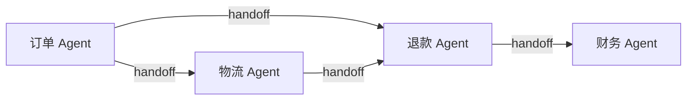

> 模块 05 - Agent 架构 | 前置知识：[Supervisor 模式](./13-supervisor.md)、[State 与 Checkpointer](./04-langgraph-state.md)

## 去中心化：取消 Supervisor

[Supervisor 模式](./13-supervisor.md) 是星型——所有请求先到中心调度，再派给专家。Swarm 反过来：**没有中心**，专家之间直接 handoff。每个 Agent 自己知道"什么情况该把对话交给谁"，控制权像接力棒一样传递。



[Multi-Agent 协作](./08-multi-agent.md) 里手写过一版 Swarm（自己写 `createHandoffTool` 返回 `Command`）。官方包 `@langchain/langgraph-swarm` 把它做完整了——handoff 工具、活跃 Agent 路由、跨轮记忆，都封好了。

Swarm 的核心机制是一个状态字段 `activeAgent`：它记着"现在轮到谁"。用户每发一条消息，图先看 `activeAgent` 决定进哪个 Agent；某个 Agent 调了 handoff 工具，就把 `activeAgent` 改成目标，控制权转移。

## createSwarm 最小实现

```bash
npm install @langchain/langgraph-swarm langchain @langchain/anthropic @langchain/langgraph @langchain/core zod
```

```typescript
// swarm.ts
import { z } from "zod";
import { tool, createAgent } from "langchain";
import { ChatAnthropic } from "@langchain/anthropic";
import { MemorySaver } from "@langchain/langgraph";
import { createSwarm, createHandoffTool } from "@langchain/langgraph-swarm";

const model = new ChatAnthropic({ model: "claude-sonnet-4-6", temperature: 0 });

const queryOrder = tool(
  async ({ orderId }) => `订单 ${orderId}：已发货`,
  { name: "query_order", description: "查订单", schema: z.object({ orderId: z.string() }) }
);
const initiateRefund = tool(
  async ({ orderId }) => `订单 ${orderId} 退款已发起`,
  { name: "initiate_refund", description: "发起退款", schema: z.object({ orderId: z.string() }) }
);

// 订单 Agent：能查单，能把对话转给退款专员
const orderAgent = createAgent({
  model,
  tools: [queryOrder, createHandoffTool({ agentName: "refund_agent", description: "退款问题转给退款专员" })],
  systemPrompt: "你是订单专员。退款类问题用 handoff 工具转给 refund_agent。",
  name: "order_agent",
});

// 退款 Agent：能退款，能转回订单专员
const refundAgent = createAgent({
  model,
  tools: [initiateRefund, createHandoffTool({ agentName: "order_agent", description: "订单查询转给订单专员" })],
  systemPrompt: "你是退款专员。订单查询类问题转回 order_agent。",
  name: "refund_agent",
});

// 组 Swarm：必须指定首轮默认激活的 Agent，必须 compile，必须配 checkpointer
const app = createSwarm({
  agents: [orderAgent, refundAgent],
  defaultActiveAgent: "order_agent",
}).compile({ checkpointer: new MemorySaver() });
```

`createHandoffTool({ agentName })` 自动生成一个名为 `transfer_to_<agent>` 的工具，工具被调用时返回一个 `Command`，把 `activeAgent` 切到目标。你不用自己写 `Command` 逻辑了。

## checkpointer 不是可选的

Swarm 和 Supervisor 有个关键差别：**Swarm 必须配 checkpointer + `thread_id`，否则跨轮就废了**。

原因在 `activeAgent` 这个状态。第一轮用户问订单，`order_agent` 处理；用户追问退款，`order_agent` handoff 给 `refund_agent`，`activeAgent` 改成 `refund_agent`。但用户的"下一条消息"是新的一次 `invoke`——如果没有 checkpointer 把 `activeAgent` 存下来，第二次 invoke 时 `activeAgent` 又回到了 `defaultActiveAgent`，handoff 白做了。

```typescript
const config = { configurable: { thread_id: "customer-001" } };

// 第一轮：order_agent 处理，并 handoff 给 refund_agent
await app.invoke({ messages: [{ role: "user", content: "ORD-1234 我不想要了，能退吗" }] }, config);

// 第二轮：因为 checkpointer 记着 activeAgent=refund_agent，这条直接进退款专员
await app.invoke({ messages: [{ role: "user", content: "对，就退这个" }] }, config);
```

同一个 `thread_id` 串起来，`activeAgent` 才能跨轮保持。这是 Swarm 最容易踩的坑——本地 demo 不配 checkpointer 看着能跑，一上多轮对话就发现"转接没生效"。

## 自定义状态要带上 activeAgent

如果你想给 Swarm 加业务状态字段（比如 `userId`、`orderContext`），用 `stateSchema` 自定义。但有个硬约束：**自定义 schema 必须包含 `activeAgent` 键**，否则路由没法工作，构造时直接抛 `Missing required key 'activeAgent'`。默认的 `SwarmState` 已经带了它，自定义时记得继承或显式加上。

## Swarm 的隐患：踢皮球

Swarm 灵活，但代价是可预测性差。最典型的故障是**死循环 handoff**——A 觉得这不归我管转给 B，B 也觉得不归我管转回 A，两个 Agent 互相踢皮球，把 `recursionLimit` 撞爆。

防御手段：

1. **每个 Agent 的 handoff 边界写死在 systemPrompt 里**，明确"什么情况转、什么情况自己扛"，别留模糊地带。
2. **盯住 handoff 链长度**，接上 [LangSmith Tracing](../07-observability/02-langsmith-tracing.md) 看转接路径，异常长立刻报警。
3. **`recursionLimit` 给合理上限**，让它撞墙报错而不是无声打转。

## Supervisor 还是 Swarm

| 维度 | Supervisor | Swarm |
|------|-----------|-------|
| 拓扑 | 星型，中心调度 | 网状，点对点 handoff |
| 路径可预测性 | 高（都经过中心） | 低（任意两点可转） |
| 单点瓶颈 | 有（Supervisor） | 无 |
| 调试难度 | 低 | 高（路径发散） |
| 适合 | 大多数业务 | 专家间确实需要自由转交 |

延续 [Multi-Agent 协作](./08-multi-agent.md) 的结论：**默认上 Supervisor，Swarm 慎用**。只有当"任意两个专家都可能直接转交、且这种灵活性是真实需求"时，Swarm 才值得它带来的不可预测性。绝大多数客服、问答、工单场景，Supervisor 的星型调度更稳、更好查问题。

## 小结

`@langchain/langgraph-swarm` 的 `createSwarm` 实现去中心化的多 Agent：专家之间用 `createHandoffTool` 直接转交，控制权靠状态字段 `activeAgent` 传递。三个必须：必须指定 `defaultActiveAgent`、必须 `.compile()`、**必须配 checkpointer + `thread_id`**（否则 `activeAgent` 跨轮丢失）。自定义 `stateSchema` 必须带 `activeAgent` 键。主要风险是 handoff 死循环，靠清晰的 prompt 边界 + 链长监控 + `recursionLimit` 防御。选型上默认 Supervisor，Swarm 留给真正需要自由转交的场景。

到这里 Agent 架构的核心模式就齐了：从 [单 Agent](./01-create-agent.md) 到 [Deep Agent](./11-deep-agents.md)，从中心化的 [Supervisor](./13-supervisor.md) 到去中心化的 Swarm。模块 05 至此收尾。下一步进入 [下一模块 RAG 基础管线](../06-rag/01-rag-pipeline.md)，把外部知识库接入 Agent。

---

> 本文摘自[《LangChain.js Agent 开发权威指南》](https://github.com/diguike/book-langchain-agent)，作者[递归客](https://inferloop.dev)。
