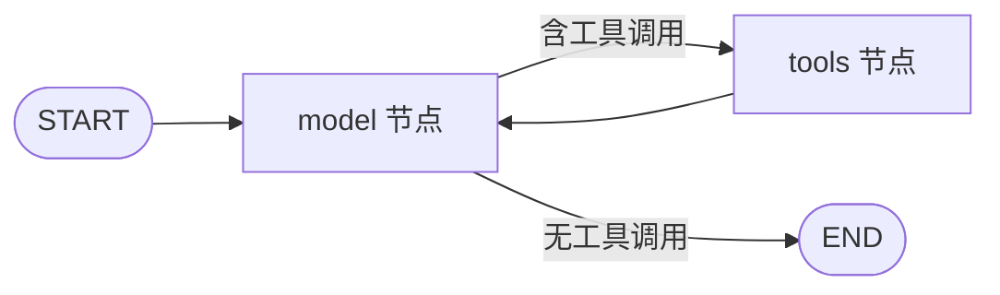

> 模块 05 - Agent 架构 | 前置知识：[Tool 接口与定义](../04-tools/tool-interface.md)、[Function Calling](../04-tools/function-calling.md)

## 为什么从 `createAgent` 开始

在 LangChain.js 1.x 里，`createAgent` 是构建 Agent 的主入口。它做了三件事：

1. 把一个模型、一组工具、一段系统提示拼成一个可运行的 Agent
2. 内部用 [LangGraph](https://langchain-ai.github.io/langgraphjs/) 跑工具调用循环（thinking → tool call → tool result → thinking → ...）
3. 暴露 middleware 接口，让你能在循环的任意一步插入自己的逻辑

第三点是 1.x 和老版本的根本差异。Agent 不再是一个被你"配置"的黑盒，而是一条你可以"切开"的流水线。这一节先把基础的 Agent 跑起来，下一节 [ReAct 模式](./react-pattern.md) 讲循环本身，再下面的 [Middleware 系统](./middleware.md) 讲怎么切。

## 第一个 Agent：30 行代码

先装包：

```bash
npm install langchain @langchain/anthropic @langchain/core zod dotenv
```

写一个最小 Agent，能查天气、能算数：

```typescript
// agent.ts
import { createAgent } from "langchain";
import { ChatAnthropic } from "@langchain/anthropic";
import { tool } from "@langchain/core/tools";
import { z } from "zod";

// 工具 1：模拟天气查询
const getWeather = tool(
  async ({ city }) => {
    // 真实场景这里调外部 API
    return `${city} 今天 22°C，多云`;
  },
  {
    name: "get_weather",
    description: "查询某个城市的实时天气",
    schema: z.object({
      city: z.string().describe("城市名，如 '北京'"),
    }),
  }
);

// 工具 2：四则运算
const calculator = tool(
  async ({ expression }) => {
    // 实际项目请用安全的表达式求值器，这里仅做示例
    return String(eval(expression));
  },
  {
    name: "calculator",
    description: "计算一个数学表达式",
    schema: z.object({
      expression: z.string().describe("如 '3 * (4 + 5)'"),
    }),
  }
);

const agent = createAgent({
  model: new ChatAnthropic({ model: "claude-sonnet-4-6" }),
  tools: [getWeather, calculator],
  systemPrompt: "你是一个简洁的助手，能查天气和算数。回答要短。",
});

const result = await agent.invoke({
  messages: [{ role: "user", content: "北京今天多少度？比 20 度高多少？" }],
});

console.log(result.messages.at(-1)?.content);
```

跑一下：

```bash
ANTHROPIC_API_KEY=sk-ant-xxx npx tsx agent.ts
# 输出：北京今天 22°C，比 20 度高 2 度。
```

Agent 自己规划了执行顺序：先调 `get_weather`，拿到 22，再调 `calculator` 算 `22 - 20`，最后整合成一句话回复。这个调度过程你没写一行代码——`createAgent` 内部用 LangGraph 跑了一个 `model → tools → model → ...` 的循环，遇到模型不再产出工具调用时停止。

## `createAgent` 的参数

完整签名：

```typescript
createAgent({
  model,          // 必填：BaseChatModel 实例或字符串 ID
  tools,          // 必填：Tool 数组
  systemPrompt,   // 可选：系统提示，字符串或动态函数
  middleware,     // 可选：middleware 数组
  responseFormat, // 可选：结构化输出 schema
  stateSchema,    // 可选：自定义状态
  checkpointer,   // 可选：会话持久化（线程级 memory）
  interrupts,     // 可选：HITL 配置
  name,           // 可选：Agent 名字（多 Agent 协作时用）
})
```

其中前三个参数（`model` / `tools` / `systemPrompt`）覆盖了 80% 的日常使用场景。其他几个会在后续章节展开：

| 参数 | 章节 |
|------|------|
| `middleware` | [Middleware 系统](./middleware.md) |
| `responseFormat` | [Output Parsers](../01-core-abstractions/output-parsers.md) |
| `stateSchema` | [State、Channels 与 Checkpointer](./langgraph-state.md) |
| `checkpointer` | [State、Channels 与 Checkpointer](./langgraph-state.md) |
| `interrupts` | [Human-in-the-Loop 与 typed interrupt](./human-in-the-loop.md) |
| `name` | [Multi-Agent 协作](./multi-agent.md) |

### `model` 的两种写法

可以传字符串：

```typescript
model: "anthropic:claude-sonnet-4-6"
// 或
model: "openai:gpt-4o"
```

也可以传实例：

```typescript
model: new ChatAnthropic({ model: "claude-sonnet-4-6", temperature: 0 })
```

字符串写法简洁，实例写法可以精细控制 `temperature`、`maxTokens`、`thinkingBudget`（Claude 推理模式）等参数。**注意：不要再用 `.bindTools()` 预先绑定工具**——这是 v0.3 的写法，1.x 把这件事交给 `createAgent` 内部统一处理。

### `systemPrompt` 的两种写法

静态字符串：

```typescript
systemPrompt: "你是一个简洁的助手..."
```

动态函数（需要用 middleware）：

```typescript
import { dynamicSystemPromptMiddleware } from "langchain";

createAgent({
  model,
  tools,
  middleware: [
    dynamicSystemPromptMiddleware((state, runtime) => {
      const userTier = runtime.context.userTier;
      return userTier === "pro"
        ? "你是一个详细的、能调用所有工具的助手"
        : "你是一个简洁的助手，只能回答基本问题";
    }),
  ],
});
```

为什么动态 prompt 要走 middleware？因为它需要读运行时的 `state`（之前的消息）和 `context`（你传给 invoke 的运行时参数）。这一点在 [Middleware 系统](./middleware.md) 会展开讲。

## 三种调用方式

### 1. `invoke`：一次性返回最终结果

```typescript
const result = await agent.invoke({
  messages: [{ role: "user", content: "..." }],
});
// result.messages 是完整对话历史
// result.messages.at(-1) 是 AI 的最终回复
```

适合后端批处理、CLI 工具。

### 2. `stream`：流式拿到中间步骤

```typescript
for await (const chunk of agent.stream(
  { messages: [{ role: "user", content: "..." }] },
  { streamMode: "updates" }
)) {
  console.log(chunk);
  // 每次模型节点或工具节点完成，都会推送一个 chunk
}
```

`streamMode` 有 5 个值：`values` / `updates` / `messages` / `debug` / `custom`，详见 [流式输出深入](./stream-modes.md)。日常聊天 UI 用 `messages` 拿 token-by-token 流，调试用 `updates` 拿节点级日志。

### 3. `streamEvents`：拿到模型 token + 工具调用 + 自定义事件全套

```typescript
for await (const event of agent.streamEvents(
  { messages: [{ role: "user", content: "..." }] },
  { version: "v2" }
)) {
  if (event.event === "on_chat_model_stream") {
    process.stdout.write(event.data.chunk.contentBlocks[0].text);
  }
}
```

`streamEvents` 比 `stream` 更细粒度，但事件流量大、过滤逻辑复杂，**不要轻易上**。生产环境优先用 `stream({ streamMode: "messages" })`。

## 一个常见的踩坑：工具不被调用

新手最容易遇到的问题是模型完全不调你的工具，直接回答了：

```typescript
// 期望模型调 get_weather，但它直接编造了答案
const agent = createAgent({
  model: new ChatAnthropic({ model: "claude-haiku-4-5" }),
  tools: [getWeather],
  systemPrompt: "你是助手",  // [bad] 太弱
});

await agent.invoke({
  messages: [{ role: "user", content: "北京天气" }],
});
// AI: "北京今天天气晴朗..." （编造）
```

三个原因，按出现频率排序：

1. **工具 `description` 太模糊**：模型根据 description 决定要不要调，描述要写清楚什么场景下用、参数是什么。`"查询天气"` [bad]，`"查询某个城市的实时天气，输入是城市名（中文或英文）"` [ok]
2. **系统提示没强调要用工具**：在 prompt 里明确写"涉及实时信息时必须用工具，不要凭记忆回答"
3. **模型能力不够**：Claude Haiku 4.5 / GPT-4o-mini 在长工具列表（>10 个）下容易选错。复杂场景换 Sonnet 4.6 或 GPT-5

调试时打开 `verbose`：

```typescript
const agent = createAgent({
  model: new ChatAnthropic({ model: "claude-sonnet-4-6", verbose: true }),
  tools: [getWeather],
  systemPrompt: "...",
});
```

或者更系统的做法：接入 [LangSmith Tracing](../07-observability/langsmith-tracing.md)，每次调用都有完整的可视化追踪。

## `createAgent` 内部发生了什么

`createAgent` 返回的是一个 LangGraph `CompiledGraph`，等价于你手写下面这张图：



这张图的循环条件是：模型输出的最后一条消息里**包不包含 `tool_calls`**。包含就跳到 `tools` 节点执行工具、把结果作为消息回灌给 `model`；不包含就结束循环。

理解了这个循环，[ReAct 模式](./react-pattern.md) 就只是给这个循环加了"思考-行动-观察"的语言外壳，[Plan-and-Execute](./plan-and-execute.md) 是在循环前面加了一个"规划"节点，[Self-Reflection](./self-reflection.md) 是在循环外面套了一个"批判-修正"循环。

如果你需要更复杂的拓扑（比如并发分支、显式 HITL、自定义状态），就直接绕过 `createAgent`，自己用 [LangGraph 入门](./langgraph-intro.md) 里的 `StateGraph` 写图。

## 小结

`createAgent` 是 LangChain.js 1.x 的 Agent 主入口，三个必填参数：`model` / `tools` / `systemPrompt`。调用方式有 `invoke` / `stream` / `streamEvents`。背后是一张 `model ↔ tools` 的 LangGraph 状态机。

下一节 [ReAct 模式](./react-pattern.md) 讲这个循环里"模型怎么决定下一步"，把 Agent 的推理过程显式化。

---

> 本文摘自[《LangChain.js Agent 开发权威指南》](https://github.com/diguike/book-langchain-agent)，作者[递归客](https://inferloop.dev)。
