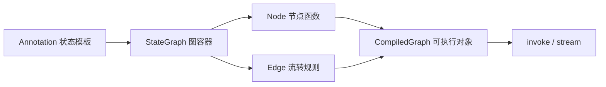
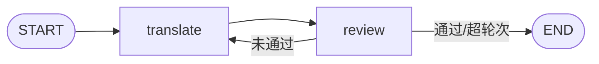

> 模块 05 - Agent 架构 | 前置知识：[createAgent 入门](./create-agent.md)

## 为什么要学 LangGraph

我在 [createAgent 入门](./create-agent.md) 里讲过——`createAgent` 内部就是 LangGraph 跑的 `model ↔ tools` 状态机。日常 90% 的 Agent 场景靠 `createAgent` + middleware 就够了。**剩下 10% 的复杂场景**，需要你自己画图：

- 多 Agent 协作的路由拓扑（[Multi-Agent](./multi-agent.md)）
- Plan / Execute / Reflect 这类多节点循环（[Plan-and-Execute](./plan-and-execute.md)、[Self-Reflection](./self-reflection.md)）
- 并发分支（同时搜多个数据源）
- 显式的人工审批断点（[Human-in-the-Loop](./human-in-the-loop.md)）
- 自定义状态字段（[State 与 Checkpointer](./langgraph-state.md)）

这一节把 LangGraph 1.x 的四个核心抽象一次讲透：**StateGraph、Node、Edge、Annotation**。理解了它们，前面几节用到的所有 graph 都能看懂。

## 四个核心抽象



| 抽象 | 一句话定义 |
|------|------------|
| Annotation | 描述 graph 共享状态的字段结构，每个字段可以配 reducer 决定怎么合并更新 |
| StateGraph | 图的容器，挂节点、连边、最后 `compile()` 出一个可执行的 Runnable |
| Node | 一个函数：吃当前 state，吐 state 的部分更新 |
| Edge | 描述节点之间怎么流转，分普通边、条件边、入口边 |

下面挨个展开。

## State：用 Annotation 定义

LangGraph 1.x 推荐用 `Annotation.Root` 描述 state schema：

```typescript
import { Annotation } from "@langchain/langgraph";
import type { BaseMessage } from "@langchain/core/messages";

const MyState = Annotation.Root({
  // 简单字段：每次更新直接覆盖旧值
  query: Annotation<string>,

  // 带 reducer 的字段：自定义合并逻辑
  messages: Annotation<BaseMessage[]>({
    reducer: (current, update) => [...current, ...update],
    default: () => [],
  }),

  // 计数器：累加
  stepCount: Annotation<number>({
    reducer: (current, update) => current + update,
    default: () => 0,
  }),
});

// 在节点函数里用类型
type MyStateType = typeof MyState.State;
```

**关键概念**：reducer 决定了"节点返回的字段值"如何跟"state 里的旧值"合并。

- 没 reducer → **覆盖**（直接替换）
- 追加型 reducer → 累积（如消息列表）
- 累加型 reducer → 聚合（如计数器）

没 reducer 又有多个并发节点写同一字段，结果不确定，所以**共享字段必须配 reducer**。`reducer` 的设计细节、坑、最佳实践都在 [LangGraph State 与 Checkpointer](./langgraph-state.md) 展开。

## MessagesAnnotation：开箱即用的消息状态

Agent 场景 99% 的时候只需要一个 `messages` 字段。LangGraph 直接给了个预制件：

```typescript
import { MessagesAnnotation } from "@langchain/langgraph";

// MessagesAnnotation 等价于：
const MessagesAnnotation = Annotation.Root({
  messages: Annotation<BaseMessage[]>({
    reducer: messagesStateReducer, // 智能消息合并
    default: () => [],
  }),
});
```

`messagesStateReducer` 比简单的"追加"更聪明：

1. 新消息没匹配 ID → 追加到末尾
2. 新消息的 ID 跟某条已有消息相同 → **替换**那条消息（流式更新场景必备）
3. 收到 `RemoveMessage` → 从列表删除指定消息

要在 `messages` 之外加自定义字段，用 `spec` 合并：

```typescript
const MyAgentState = Annotation.Root({
  ...MessagesAnnotation.spec, // 继承 messages 字段
  currentStep: Annotation<string>,
  toolBudget: Annotation<number>({
    reducer: (cur, upd) => upd,
    default: () => 10,
  }),
});
```

## Node：一个普通的 async 函数

Node 的签名极简——吃 state，吐 partial state：

```typescript
async function modelNode(
  state: typeof MessagesAnnotation.State
): Promise<Partial<typeof MessagesAnnotation.State>> {
  const response = await model.invoke(state.messages);
  return { messages: [response] };
}
```

注意两点：

1. **返回值是部分 state**，不是完整 state。返回 `{ messages: [response] }` 只更新 messages 字段，其他字段不动
2. **不要 mutate `state` 入参**，state 是只读的。所有"修改"通过返回新对象表达

## Edge：四种连接方式

| 方式 | API | 用途 |
|------|-----|------|
| 入口边 | `addEdge(START, "nodeA")` | 图的起点 |
| 普通边 | `addEdge("A", "B")` | A 跑完总是去 B |
| 条件边 | `addConditionalEdges("A", routerFn)` | A 跑完根据 state 决定去哪 |
| 结束边 | `addEdge("nodeA", END)` 或路由函数返回 `END` | 图的终点 |

条件边是 LangGraph 最有表达力的部分——路由函数读 state，返回下一个节点名（或 `END`）：

```typescript
import { END } from "@langchain/langgraph";
import type { AIMessage } from "@langchain/core/messages";

function shouldContinue(state: typeof MessagesAnnotation.State) {
  const last = state.messages.at(-1) as AIMessage | undefined;
  if (last?.tool_calls?.length) return "tools";
  return END;
}

graph.addConditionalEdges("model", shouldContinue);
```

注意没有给 `addConditionalEdges` 传第三个参数（映射表）时，路由函数返回什么，就直接当节点名用。**这种"无映射"的写法是 1.x 推荐的**，简洁、类型安全。

## 把它们组装：一个翻译-审校两段式 graph

学会四个抽象之后，最有用的练习是写一个 `createAgent` 不能直接表达的拓扑。下面这个例子有两个节点：第一个节点翻译用户输入到英文，第二个节点检查翻译质量、必要时回到第一个节点重译。这就是一个最小的"生成-评审"循环，不需要工具调用，纯粹演示 graph 机制。

```typescript
// translate-review.ts
import {
  StateGraph,
  START,
  END,
  Annotation,
} from "@langchain/langgraph";
import { ChatAnthropic } from "@langchain/anthropic";
import { z } from "zod";

// 1. State
const TranslateState = Annotation.Root({
  source: Annotation<string>, // 原文
  draft: Annotation<string>({
    reducer: (_, u) => u,
    default: () => "",
  }), // 当前译稿
  feedback: Annotation<string>({
    reducer: (_, u) => u,
    default: () => "",
  }), // 上一轮反馈
  iteration: Annotation<number>({
    reducer: (c, u) => c + u,
    default: () => 0,
  }),
});

// 2. 节点
const translator = new ChatAnthropic({
  model: "claude-haiku-4-5",
  temperature: 0.3,
});

async function translateNode(state: typeof TranslateState.State) {
  const prompt = state.feedback
    ? `请基于反馈改进英译。原文：${state.source}\n上一版：${state.draft}\n反馈：${state.feedback}`
    : `请把以下中文翻译成英文：${state.source}`;
  const r = await translator.invoke([{ role: "user", content: prompt }]);
  const text = typeof r.content === "string" ? r.content : "";
  return { draft: text, iteration: 1 };
}

const reviewer = new ChatAnthropic({
  model: "claude-sonnet-4-6",
  temperature: 0,
}).withStructuredOutput(
  z.object({
    passed: z.boolean(),
    feedback: z.string(),
  })
);

async function reviewNode(state: typeof TranslateState.State) {
  const r = await reviewer.invoke([
    {
      role: "user",
      content: `检查英译是否准确、自然。原文：${state.source}\n译稿：${state.draft}`,
    },
  ]);
  return { feedback: r.passed ? "" : r.feedback };
}

// 3. 路由：通过则结束，未通过且未超 3 轮则继续
function shouldContinue(state: typeof TranslateState.State) {
  if (!state.feedback) return END;
  if (state.iteration >= 3) return END;
  return "translate";
}

// 4. 组图
const graph = new StateGraph(TranslateState)
  .addNode("translate", translateNode)
  .addNode("review", reviewNode)
  .addEdge(START, "translate")
  .addEdge("translate", "review")
  .addConditionalEdges("review", shouldContinue, {
    translate: "translate",
    [END]: END,
  });

const app = graph.compile();

// 5. 跑
const result = await app.invoke({
  source: "他骑着自行车穿过了被雨水打湿的街道，灯光在路面上拉得很长。",
});

console.log(`经过 ${result.iteration} 轮迭代`);
console.log(result.draft);
```

拓扑：



这个 graph 的所有元素都是前面讲过的——`Annotation.Root` 描述四个字段，两个节点函数返回部分 state，一条条件边根据 `feedback` 决定循环还是结束。整个例子不涉及工具调用，纯粹的 graph 机制。

## 那 ReAct 怎么手写？

聪明的读者会问：标准 ReAct（`model ↔ tools` 循环）在 LangGraph 里到底怎么手写？答案是——**不用手写**。1.x 里 `createAgent` 就是这件事的官方实现，内部用的就是 LangGraph，你不会比它写得更好。

需要 ReAct 时直接用 `createAgent`：

```typescript
import { createAgent } from "langchain";

const agent = createAgent({
  model: new ChatAnthropic({ model: "claude-sonnet-4-6" }),
  tools: [search, calc],
  systemPrompt: "...",
});
// 这个 agent 本身就是一个 CompiledGraph，可以当节点塞进更大的 graph
```

如果要把 `createAgent` 当成一个节点嵌进自己画的 graph（比如 Plan-and-Execute 里 Executor 节点就是这么干的）：

```typescript
const bigGraph = new StateGraph(MyState)
  .addNode("planner", plannerNode)
  .addNode("executor", async (state) => {
    const r = await agent.invoke({ messages: [...] });
    return { messages: r.messages };
  })
  .addEdge(START, "planner")
  .addEdge("planner", "executor");
```

这种"把 `createAgent` 当 LangGraph 节点用"的写法在 [Plan-and-Execute](./plan-and-execute.md) 和 [Multi-Agent](./multi-agent.md) 都有完整示例。

## 可视化 Graph

调试和写文档时，把图 dump 成 Mermaid 极有用：

```typescript
// 拿到 Mermaid 文本
const mermaid = app.getGraph().drawMermaid();
console.log(mermaid);

// 直接生成 PNG（依赖 mermaid-js CLI）
const png = await app.getGraph().drawMermaidPng();
require("fs").writeFileSync("graph.png", Buffer.from(await png.arrayBuffer()));
```

输出例子：

```
graph TD;
    __start__([START]):::startclass
    model([model])
    tools([tools])
    __end__([END]):::endclass
    __start__ --> model
    model -.-> tools
    model -.-> __end__
    tools --> model
```

把这个粘到 [Mermaid Live](https://mermaid.live) 就能看到图。复杂多 Agent 系统上线前必跑一次，肉眼检查拓扑是否符合设计。

## 调用配置

`invoke` / `stream` 时支持几个常用配置：

```typescript
await app.invoke(input, {
  // 最大递归步数，防止循环爆炸。1.x 默认 25
  recursionLimit: 50,

  // 持久化用的会话 ID（配合 checkpointer，见 langgraph-state.md）
  configurable: { thread_id: "user-123-session-1" },

  // 业务上下文（1.x 用 context，老版本用 configurable）
  context: { userId: "u_123", tier: "pro" },

  // LangSmith 标签
  tags: ["production", "v2"],

  // 中断信号
  signal: abortController.signal,
});
```

`context` 是 1.x 引入的——传给节点里读的"业务参数"，比 `configurable` 更类型安全。`thread_id` 等用于持久化的字段仍放在 `configurable`。

## 流式

LangGraph 的 `stream()` 支持 5 种 mode：`values`、`updates`、`messages`、`debug`、`custom`。最常用的两个：

```typescript
// 节点级增量，调试首选
for await (const update of app.stream(input, { streamMode: "updates" })) {
  console.log(update); // { 节点名: { 字段名: 新值 } }
}

// token 级流，聊天 UI 首选
for await (const [chunk, meta] of app.stream(input, { streamMode: "messages" })) {
  if (meta.langgraph_node === "model") {
    process.stdout.write(extractText(chunk));
  }
}
```

完整的 5 种 mode + SSE 集成 + 各种坑见 [流式输出深入](./stream-modes.md)，这里不展开。

## `createAgent` vs 手写 graph

| 维度 | `createAgent` | 手写 `StateGraph` |
|------|---------------|-------------------|
| 上手成本 | 低（一行起手） | 高（要懂四个抽象） |
| 拓扑灵活度 | 固定 `model ↔ tools` 循环 | 完全自由 |
| Middleware | 完整支持 | 需要自己在节点里实现 |
| 多节点协作 | 不直接支持 | 原生支持 |
| 适用场景 | 单 Agent、单循环 | 多 Agent、多阶段、复杂分支 |

我的判断顺序：**先 `createAgent`，遇到 `createAgent` 表达不了的拓扑再手写 graph**。不要为了"显得高级"上手就写 graph，多数场景没必要。

## 小结

LangGraph 1.x 用四个核心抽象表达任意 Agent 拓扑——`Annotation` 描述状态，`StateGraph` 装节点和边，`Node` 是吃 state 吐部分更新的函数，`Edge` 描述节点之间怎么流转。`MessagesAnnotation` 是消息列表的预制件，`ToolNode` 是工具执行的预制件，搭配条件边能手写出 `createAgent` 内部那张 `model ↔ tools` 图。

下一节 [LangGraph State 与 Checkpointer](./langgraph-state.md) 深入 state 设计、reducer 用法、和把 graph 状态持久化到 SQLite / Postgres 的方法。

---

> 本文摘自[《LangChain.js Agent 开发权威指南》](https://github.com/diguike/book-langchain-agent)，作者[递归客](https://inferloop.dev)。
