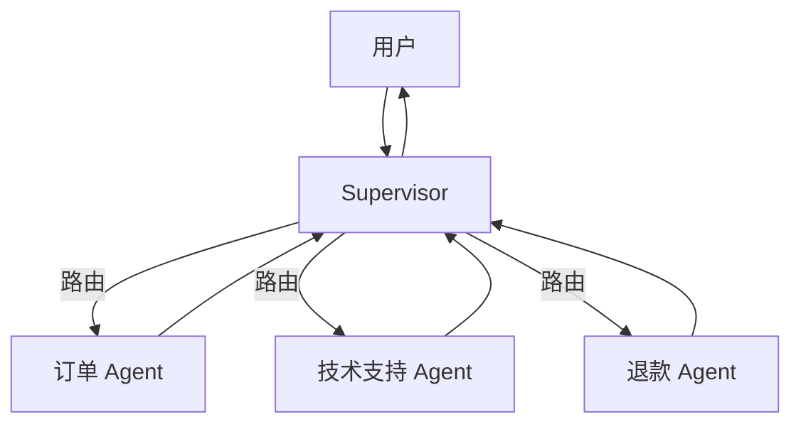
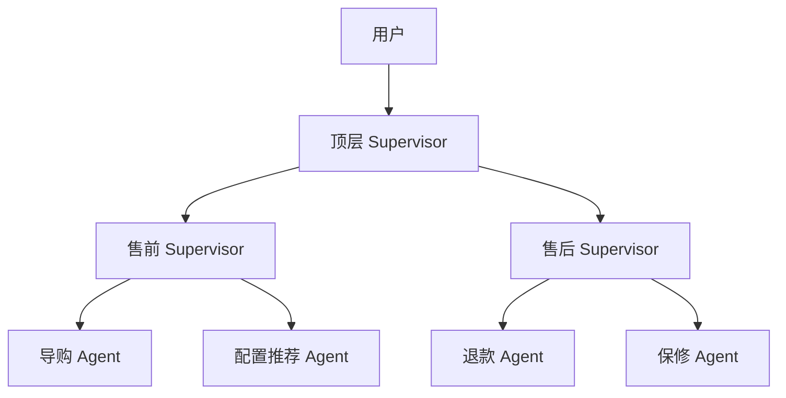
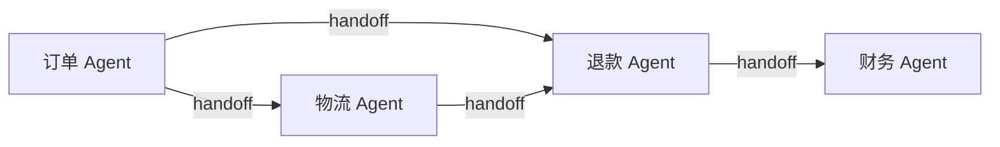

> 模块 05 - Agent 架构 | 前置知识：[createAgent 入门](./create-agent.md)、[LangGraph 入门](./langgraph-intro.md)

## 单 Agent 撑不住的时候

我做过一个客服 Agent，刚开始只挂了 5 个工具：查订单、查物流、申请退款、查 FAQ、转人工。System prompt 短小精悍，效果不错。

三个月后业务方提了一堆新需求：技术支持、营销活动、会员权益、售后保修。我把工具加到 20 个，prompt 写到 800 字。模型开始犯各种错——把营销活动当成会员权益、技术支持的步骤跟售后保修混在一起，整体准确率下降 15%。

**这就是单 Agent 的天花板**：prompt 越长指令越冲突，工具越多选错越多。继续往里塞越塞越坏。

Multi-Agent 把这套东西拆开：每个 Agent 只懂一个领域、只挂 3-5 个工具、prompt 在 200 字以内。然后用一个调度层把请求路由到对的专家那儿。这跟微服务把单体应用拆开是一个道理。

## 三种协作模式

LangGraph 1.x 里多 Agent 落地有三种典型拓扑：

### Supervisor 模式



中心化调度——所有请求先到 Supervisor，由它决定派给哪个专家，专家干完回到 Supervisor，由它决定是再派一个还是给用户回复。

**优点**：流程清晰、容易加监控、专家之间不互相打架。
**缺点**：Supervisor 是单点瓶颈。

### Hierarchical 模式



Supervisor 之上还有 Supervisor。适合规模再上一个量级的场景——一个 Supervisor 协调不过来 20 个 Agent，就拆成多个领域 Supervisor，再上面挂个顶层调度。

**优点**：扩展性好。
**缺点**：层级越多延迟越高，调试越累。

### Swarm 模式



去中心化——Agent 之间直接 handoff，没有 Supervisor。每个 Agent 都知道"什么情况下该把控制权交给谁"。

**优点**：无单点，路径灵活。
**缺点**：决策路径难以追踪，全局最优很难保证。

**实战建议**：从 Supervisor 起步，规模上来再拆成 Hierarchical，**Swarm 慎用**——除非你真的需要"任意两个 Agent 都能直接转交"的灵活度，否则它会让系统的可预测性大幅下降。

## 用 createAgent + Command 实现路由

LangGraph 1.x 的 `Command` 是多 Agent 路由的核心原语。一个节点返回 `new Command({ goto: "其他节点名", update: { ... } })` 就能跳转——比传统的"返回 state + 用条件边判断"更直接。

下面是 Supervisor 模式的最小实现。场景：一个**客服分诊 Agent**，根据用户问题路由到三个专科 Agent。

### 各专科 Agent

每个专科 Agent 都是一个独立的 `createAgent`，挂自己领域的工具：

```typescript
// multi-agent.ts
import { createAgent } from "langchain";
import { ChatAnthropic } from "@langchain/anthropic";
import { tool } from "@langchain/core/tools";
import { z } from "zod";

// 工具：订单查询
const queryOrder = tool(
  async ({ orderId }) => `订单 ${orderId} 状态：已发货，预计明天送达`,
  {
    name: "query_order",
    description: "根据订单号查询订单状态、物流",
    schema: z.object({ orderId: z.string() }),
  }
);

// 工具：退款发起
const initiateRefund = tool(
  async ({ orderId, reason }) =>
    `订单 ${orderId} 退款已发起（原因：${reason}），3-5 个工作日到账`,
  {
    name: "initiate_refund",
    description: "为指定订单发起退款",
    schema: z.object({ orderId: z.string(), reason: z.string() }),
  }
);

// 工具：技术故障排查
const diagnose = tool(
  async ({ symptom }) =>
    `针对症状"${symptom}"的建议：1) 重启设备 2) 检查网络 3) 重置应用缓存`,
  {
    name: "diagnose",
    description: "诊断常见技术故障并给出排查步骤",
    schema: z.object({ symptom: z.string() }),
  }
);

// 三个专科 Agent
const orderAgent = createAgent({
  model: new ChatAnthropic({ model: "claude-haiku-4-5", temperature: 0 }),
  tools: [queryOrder],
  systemPrompt: "你是订单专员。只回答订单查询、物流追踪相关问题。",
  name: "order_agent",
});

const refundAgent = createAgent({
  model: new ChatAnthropic({ model: "claude-sonnet-4-6", temperature: 0 }),
  tools: [initiateRefund],
  systemPrompt:
    "你是退款专员。处理退款申请前，先确认订单号和退款原因，然后调用工具发起。",
  name: "refund_agent",
});

const techAgent = createAgent({
  model: new ChatAnthropic({ model: "claude-sonnet-4-6", temperature: 0 }),
  tools: [diagnose],
  systemPrompt:
    "你是技术支持专员。先询问具体故障现象，再调用 diagnose 给出排查步骤。",
  name: "tech_agent",
});
```

注意几点：

- 每个 Agent 都用了 `name` 字段——多 Agent 协作时必填，否则 LangSmith trace 里分不清谁是谁
- 简单查询（订单）用 Haiku 4.5 省钱，复杂决策（退款、技术）用 Sonnet 4.6
- 每个 Agent 的 prompt 只描述自己领域，不超过 50 字

### Supervisor 节点

Supervisor 本身是一个用 `withStructuredOutput` 的路由模型，不是 `createAgent`——它不需要工具，只需要从用户消息里挑一个目标 Agent：

```typescript
import {
  StateGraph,
  START,
  END,
  MessagesAnnotation,
  Command,
} from "@langchain/langgraph";

const routeSchema = z.object({
  next: z
    .enum(["order_agent", "refund_agent", "tech_agent", "FINISH"])
    .describe("路由目标，FINISH 表示直接给用户回复"),
  reason: z.string().describe("路由理由（用于日志）"),
});

const supervisorModel = new ChatAnthropic({
  model: "claude-sonnet-4-6",
  temperature: 0,
}).withStructuredOutput(routeSchema);

async function supervisorNode(state: typeof MessagesAnnotation.State) {
  const decision = await supervisorModel.invoke([
    {
      role: "system",
      content: `你是客服分诊主管。根据用户的最新问题，路由到合适的专员：
- order_agent：订单查询、物流追踪
- refund_agent：退款、退货
- tech_agent：技术故障、使用问题
- FINISH：问题已解决，可以给用户最终回复

如果同一问题已经被某个专员回答过且用户没有追问，选 FINISH。`,
    },
    ...state.messages.map((m) => ({
      role: m.getType() === "human" ? ("user" as const) : ("assistant" as const),
      content: typeof m.content === "string" ? m.content : "",
    })),
  ]);

  console.log(`[supervisor] → ${decision.next} (${decision.reason})`);

  if (decision.next === "FINISH") {
    return new Command({ goto: END });
  }

  return new Command({ goto: decision.next });
}
```

`Command({ goto: ... })` 是 LangGraph 1.x 多 Agent 路由的标准写法——节点直接告诉 graph 下一步去哪，比"返回 state + 在条件边里判断"少写一层。

### 专科 Agent 节点 wrapper

每个 `createAgent` 都是独立的子图，要塞进 supervisor graph 时包一层——调子 Agent、把结果合并回主 state、跳回 supervisor：

```typescript
async function runOrderAgent(state: typeof MessagesAnnotation.State) {
  const result = await orderAgent.invoke({ messages: state.messages });
  // 只把新产生的消息追加回主 state，不重复已有消息
  const newMessages = result.messages.slice(state.messages.length);
  return new Command({
    goto: "supervisor",
    update: { messages: newMessages },
  });
}

async function runRefundAgent(state: typeof MessagesAnnotation.State) {
  const result = await refundAgent.invoke({ messages: state.messages });
  const newMessages = result.messages.slice(state.messages.length);
  return new Command({
    goto: "supervisor",
    update: { messages: newMessages },
  });
}

async function runTechAgent(state: typeof MessagesAnnotation.State) {
  const result = await techAgent.invoke({ messages: state.messages });
  const newMessages = result.messages.slice(state.messages.length);
  return new Command({
    goto: "supervisor",
    update: { messages: newMessages },
  });
}
```

### 组图

```typescript
import { MemorySaver } from "@langchain/langgraph";

const graph = new StateGraph(MessagesAnnotation)
  .addNode("supervisor", supervisorNode, {
    ends: ["order_agent", "refund_agent", "tech_agent", END],
  })
  .addNode("order_agent", runOrderAgent, { ends: ["supervisor"] })
  .addNode("refund_agent", runRefundAgent, { ends: ["supervisor"] })
  .addNode("tech_agent", runTechAgent, { ends: ["supervisor"] })
  .addEdge(START, "supervisor");

const app = graph.compile({ checkpointer: new MemorySaver() });
```

注意 `addNode` 第三个参数 `{ ends: [...] }`——告诉 LangGraph 这个节点可能跳到哪些其他节点。这是 1.x 用 `Command` 路由时必须显式声明的，否则 graph 静态检查通不过。

### 跑一次

```typescript
const cfg = { configurable: { thread_id: "customer-001" } };

const result = await app.invoke(
  {
    messages: [
      {
        role: "user",
        content: "我订单 ORD-1234 还没收到，帮我查一下",
      },
    ],
  },
  cfg
);

// 看完整对话
for (const m of result.messages) {
  const tag = m.getType() === "human" ? "用户" : `AI (${m.name ?? "?"})`;
  const text = typeof m.content === "string" ? m.content : "";
  console.log(`[${tag}] ${text}`);
}
```

输出大致这样：

```
[supervisor] → order_agent (查询订单物流)
[用户] 我订单 ORD-1234 还没收到，帮我查一下
[AI (order_agent)] 订单 ORD-1234 状态：已发货，预计明天送达
[supervisor] → FINISH (订单状态已告知)
```

继续追问退款：

```typescript
const r2 = await app.invoke(
  { messages: [{ role: "user", content: "那我不要了，能退款吗" }] },
  cfg
);
// supervisor 会路由到 refund_agent
```

完整路径：`supervisor → refund_agent → supervisor → FINISH`。

## Hierarchical：多层 Supervisor

业务再大就分领域。下面只给骨架——每个领域 supervisor 内部就是上面那套：

```typescript
// 售前 supervisor 子图
const presaleGraph = new StateGraph(MessagesAnnotation)
  .addNode("supervisor", presaleSupervisorNode, { ends: ["guide", "config", END] })
  .addNode("guide", runGuideAgent, { ends: ["supervisor"] })
  .addNode("config", runConfigAgent, { ends: ["supervisor"] })
  .addEdge(START, "supervisor");

const presale = presaleGraph.compile();

// 售后 supervisor 子图
const aftersaleGraph = new StateGraph(MessagesAnnotation)
  .addNode("supervisor", aftersaleSupervisorNode, { ends: ["refund", "warranty", END] })
  .addNode("refund", runRefundAgent, { ends: ["supervisor"] })
  .addNode("warranty", runWarrantyAgent, { ends: ["supervisor"] })
  .addEdge(START, "supervisor");

const aftersale = aftersaleGraph.compile();

// 顶层 supervisor 把请求路由到子图
const topGraph = new StateGraph(MessagesAnnotation)
  .addNode("top", topSupervisorNode, { ends: ["presale", "aftersale", END] })
  .addNode("presale", async (state) => {
    const r = await presale.invoke({ messages: state.messages });
    return new Command({ goto: "top", update: { messages: r.messages.slice(state.messages.length) } });
  }, { ends: ["top"] })
  .addNode("aftersale", async (state) => {
    const r = await aftersale.invoke({ messages: state.messages });
    return new Command({ goto: "top", update: { messages: r.messages.slice(state.messages.length) } });
  }, { ends: ["top"] })
  .addEdge(START, "top");
```

子图作为节点嵌进主图——这是 LangGraph 最强大的能力之一。每个子图可以独立测试、独立部署、独立调优。

## Swarm：handoff 自由传递

Swarm 模式取消 Supervisor，每个 Agent 自己决定 handoff 给谁。实现思路是给每个 Agent 提供一组 "handoff 工具"——这些工具的作用就是返回一个 `Command` 跳到目标 Agent：

```typescript
function createHandoffTool(targetAgent: string, description: string) {
  return tool(
    async (_input, config) => {
      // 工具返回值不重要，关键是抛出 Command 让 graph 跳转
      // 1.x 的 ToolNode 会识别返回的 Command 并执行路由
      return new Command({
        goto: targetAgent,
        update: {
          messages: [
            {
              role: "tool",
              content: `已转接到 ${targetAgent}`,
              // 此字段来自 LangGraph 工具调用上下文，如遇 undefined 检查 LangGraph 版本
              tool_call_id: config?.toolCall?.id,
            },
          ],
        },
      });
    },
    {
      name: `handoff_to_${targetAgent}`,
      description,
      schema: z.object({}),
    }
  );
}

const handoffToRefund = createHandoffTool("refund_agent", "把对话转交给退款专员");
const handoffToTech = createHandoffTool("tech_agent", "把对话转交给技术专员");

const orderAgent = createAgent({
  model: new ChatAnthropic({ model: "claude-haiku-4-5" }),
  tools: [queryOrder, handoffToRefund, handoffToTech],
  systemPrompt:
    "你是订单专员。如果用户问的是退款，调 handoff_to_refund；如果问技术问题，调 handoff_to_tech；否则用 query_order 自己处理。",
  name: "order_agent",
});
```

Swarm 的隐患：模型可能"踢皮球"——A 转给 B，B 又转回 A。生产用 Swarm 必须监控 handoff 链长度，超过 3 次强制结束。

## 实战建议

| 场景 | 推荐模式 |
|------|----------|
| < 5 个工具、单一领域 | 不上多 Agent，单个 `createAgent` 够用 |
| 5-15 个工具、2-4 个领域 | Supervisor |
| 多领域、每领域有多专家 | Hierarchical |
| 工作流灵活多变、专家之间频繁互转 | Swarm（慎用） |

**几条硬规则**：

1. **每个专科 Agent 工具数控制在 3-5 个**。超过就该再拆
2. **Agent 之间通过 messages 通信，不要直接共享 state**——业务字段（订单 ID、用户身份）放在 message content 或单独 state 字段，不要塞 prompt
3. **加 `recursionLimit`**——多 Agent 嵌套时 25 步上限很容易撞到，按需提到 50-100
4. **每个 Agent 必填 `name`**，否则 LangSmith trace 看不清是谁在说话
5. **从最简单的 Supervisor 起步**，业务跑通再考虑 Hierarchical

## 小结

Multi-Agent 把单 Agent prompt 过载、工具过多的问题拆解掉——每个专家 Agent 只做一件事，由一个 Supervisor 路由。LangGraph 1.x 用 `Command({ goto, update })` 实现节点级路由，比"返回 state + 条件边"更直接。Supervisor 起步、Hierarchical 扩展、Swarm 慎用。每个 Agent 工具数控制在 3-5 个，`name` 必填，`recursionLimit` 调高。

下一节 [Human-in-the-Loop 与 typed interrupt](./human-in-the-loop.md) 给多 Agent 加上人工审批断点——在高风险操作（退款、删数据）执行前必须经过人审。

---

> 本文摘自[《LangChain.js Agent 开发权威指南》](https://github.com/diguike/book-langchain-agent)，作者[递归客](https://inferloop.dev)。
