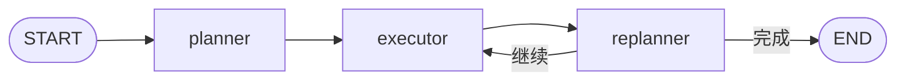

> 模块 05 - Agent 架构 | 前置知识：[ReAct 模式](./react-pattern.md)、[LangGraph 入门](./langgraph-intro.md)

## ReAct 在长任务上为什么会翻车

[ReAct 模式](./react-pattern.md) 一节里我提过，ReAct 是贪心策略——每一步只看眼前。任务 2 到 4 步时这没问题，但一旦上了 5 步以上，三个问题集中爆发：

1. **走弯路**：模型在第 3 步发现第 1 步的搜索词选错了，会重新搜，但已经浪费了 token
2. **撞 `recursionLimit`**：默认 25 步用光了，任务没做完
3. **上下文膨胀**：每一步都带着完整的消息历史调模型，token 成本随步数二次增长

Plan-and-Execute 直接换一套思路：**先规划、再执行、必要时重规划。** 把"想清楚"和"干活"拆成两个角色，规划阶段用强模型一次性产出完整步骤，执行阶段用便宜模型逐步推进，中间允许根据现实情况调整计划。

## 三个角色



| 角色 | 职责 | 推荐模型 |
|------|------|----------|
| Planner | 把用户任务拆成有序的 3-7 个子步骤 | Claude Opus 4.7 / GPT-5（复杂规划） |
| Executor | 执行计划里"当前这一步" | Claude Sonnet 4.6 / GPT-5.4（标准 Agent） |
| Replanner | 看完已完成步骤的结果，决定是继续、改计划、还是收工 | Claude Sonnet 4.6 |

Planner 和 Replanner 走结构化输出，Executor 是一个嵌套的 ReAct Agent（用 `createAgent` 创建），可以调工具。

## 什么时候该用 Plan-and-Execute

我的经验阈值：

| 任务特征 | 选 ReAct | 选 Plan-and-Execute |
|----------|----------|---------------------|
| 步骤数 | ≤ 4 步 | ≥ 5 步 |
| 子任务可不可以提前列出来 | 不能（路径依赖中间结果） | 能 |
| 是否容易陷入循环 | 容易 | 不容易（规划阶段排了序） |
| token 成本敏感度 | 一般 | 高（每步只带本步上下文） |
| 实现复杂度 | 一行 `createAgent` | 自己画 graph |

简单的"查个天气、算个数"用 ReAct，写一份"分析某个市场竞争格局的报告"才上 Plan-and-Execute。**实现复杂度高一截，别滥用**。

## 完整实现

下面用 LangGraph 1.x 的 `StateGraph` 手画一张图，构造一个研究分析 Agent，接受复杂任务并分步完成。

### State 定义

```typescript
// plan-and-execute.ts
import {
  StateGraph,
  START,
  END,
  Annotation,
  MemorySaver,
} from "@langchain/langgraph";

const PlanExecuteState = Annotation.Root({
  // 用户原始任务
  input: Annotation<string>,

  // 当前执行计划（剩余步骤）
  plan: Annotation<string[]>({
    reducer: (_, update) => update, // 整体替换
    default: () => [],
  }),

  // 已完成步骤及其结果
  pastSteps: Annotation<Array<{ step: string; result: string }>>({
    reducer: (current, update) => [...current, ...update],
    default: () => [],
  }),

  // 最终回答（replanner 决定收工时写入）
  response: Annotation<string>({
    reducer: (_, update) => update,
    default: () => "",
  }),
});
```

State 里只放最必要的字段。注意 `plan` 是覆盖型 reducer——replanner 整体替换剩余步骤；`pastSteps` 是追加型 reducer——每完成一步就 append 一条记录。这两种语义在 [LangGraph State 与 Checkpointer](./langgraph-state.md) 里有展开。

### Planner 节点

Planner 用 Claude Opus 4.7 做规划，要求结构化输出确保我能拿到一个干净的字符串数组：

```typescript
import { ChatAnthropic } from "@langchain/anthropic";
import { z } from "zod";

const planSchema = z.object({
  steps: z
    .array(z.string())
    .describe("按顺序排列的执行步骤列表，每步一句话，3 到 7 步"),
});

const plannerModel = new ChatAnthropic({
  model: "claude-opus-4-7",
  temperature: 0,
}).withStructuredOutput(planSchema);

async function plannerNode(state: typeof PlanExecuteState.State) {
  const result = await plannerModel.invoke([
    {
      role: "system",
      content: `你是一个任务规划专家。把用户任务拆成 3 到 7 个有序步骤。
每个步骤必须：
1. 足够具体，可以独立交给执行者去做
2. 前后有清晰的依赖关系
3. 一句话讲清楚

最后一步必须是"基于前面所有信息给出最终答案"，不要写"汇总"这种空话。`,
    },
    { role: "user", content: state.input },
  ]);

  return { plan: result.steps };
}
```

### Executor 节点

Executor 本身是一个 ReAct Agent——用 `createAgent` 创建，可以调工具：

```typescript
import { createAgent } from "langchain";
import { tool } from "@langchain/core/tools";

const webSearch = tool(
  async ({ query }) => {
    // 真实场景接 Tavily / SerpAPI
    return `关于"${query}"的检索结果：行业 2025 年增长 28%，主要玩家包括 A、B、C 三家...`;
  },
  {
    name: "web_search",
    description: "从公开互联网检索事实信息",
    schema: z.object({ query: z.string() }),
  }
);

const analyze = tool(
  async ({ data, question }) => {
    return `针对"${question}"对数据"${data}"的分析：呈现集中度提升趋势，CR3 达到 65%...`;
  },
  {
    name: "analyze_data",
    description: "对一段数据进行结构化分析",
    schema: z.object({
      data: z.string(),
      question: z.string(),
    }),
  }
);

const executorAgent = createAgent({
  model: new ChatAnthropic({ model: "claude-sonnet-4-6", temperature: 0 }),
  tools: [webSearch, analyze],
  systemPrompt: "你是任务执行者。专注完成当前这一步，使用工具获取数据，给出简洁的步骤结果。",
});

async function executorNode(state: typeof PlanExecuteState.State) {
  // 当前要执行的是 plan 的第一项
  const currentStep = state.plan[0];

  // 给 executor 提供上下文：原始任务 + 已完成步骤 + 当前步骤
  const context = state.pastSteps
    .map((s, i) => `${i + 1}. ${s.step}\n   结果: ${s.result}`)
    .join("\n");

  const prompt = `原始任务：${state.input}

${context ? `已完成的步骤：\n${context}\n` : ""}
现在请执行这一步：${currentStep}

执行完后给出简洁的步骤结果（不超过 200 字）。`;

  const result = await executorAgent.invoke({
    messages: [{ role: "user", content: prompt }],
  });

  const lastMessage = result.messages.at(-1);
  const stepResult = extractText(lastMessage);

  return {
    pastSteps: [{ step: currentStep, result: stepResult }],
  };
}

function extractText(msg: unknown): string {
  if (!msg || typeof msg !== "object") return "";
  const m = msg as { content?: unknown; contentBlocks?: unknown };
  if (Array.isArray(m.contentBlocks)) {
    return (m.contentBlocks as Array<{ type?: string; text?: string }>)
      .filter((b) => b.type === "text")
      .map((b) => b.text ?? "")
      .join("");
  }
  return typeof m.content === "string" ? m.content : "";
}
```

注意 Executor 只看到当前这一步 + 已完成步骤的简短摘要，**不带完整消息历史**。这是 Plan-and-Execute 比 ReAct token 高效的关键。

### Replanner 节点

Replanner 拿到 pastSteps，判断三件事之一：继续按原计划（什么都不改）、改剩余计划、收工：

```typescript
const replanSchema = z.object({
  action: z.enum(["continue", "replan", "finish"]),
  updatedPlan: z
    .array(z.string())
    .optional()
    .describe("如果 action 是 replan，给出更新后的剩余步骤"),
  finalAnswer: z
    .string()
    .optional()
    .describe("如果 action 是 finish，给出最终回答"),
});

const replannerModel = new ChatAnthropic({
  model: "claude-sonnet-4-6",
  temperature: 0,
}).withStructuredOutput(replanSchema);

async function replannerNode(state: typeof PlanExecuteState.State) {
  const completed = state.pastSteps
    .map((s, i) => `${i + 1}. ${s.step}\n   结果: ${s.result}`)
    .join("\n");

  const remaining = state.plan.slice(1); // 把刚执行完的那一步从计划里去掉

  const result = await replannerModel.invoke([
    {
      role: "system",
      content: `你是任务规划评估者。根据已完成步骤的结果，决定下一步：
- continue: 按原剩余计划继续
- replan: 根据新信息调整剩余计划
- finish: 已经收集到足够信息，直接给最终答案

如果剩余步骤为空，必须 finish。`,
    },
    {
      role: "user",
      content: `原始任务：${state.input}

已完成：
${completed}

剩余计划：
${remaining.map((s, i) => `${i + 1}. ${s}`).join("\n") || "（空）"}`,
    },
  ]);

  if (result.action === "finish") {
    return { response: result.finalAnswer ?? "（无回答）", plan: [] };
  }

  if (result.action === "replan" && result.updatedPlan) {
    return { plan: result.updatedPlan };
  }

  // continue：把刚执行完的步骤从计划里弹掉
  return { plan: remaining };
}
```

### 路由 + 组图

```typescript
function shouldEnd(state: typeof PlanExecuteState.State) {
  if (state.response) return END;
  if (state.plan.length === 0) return END;
  return "executor";
}

const graph = new StateGraph(PlanExecuteState)
  .addNode("planner", plannerNode)
  .addNode("executor", executorNode)
  .addNode("replanner", replannerNode)
  .addEdge(START, "planner")
  .addEdge("planner", "executor")
  .addEdge("executor", "replanner")
  .addConditionalEdges("replanner", shouldEnd, {
    executor: "executor",
    [END]: END,
  });

const app = graph.compile({ checkpointer: new MemorySaver() });
```

### 跑起来

```typescript
const result = await app.invoke(
  {
    input:
      "分析 2025 年中国新能源汽车市场的竞争格局，包括头部玩家市场份额和主要技术路线对比",
  },
  { configurable: { thread_id: "research-001" } }
);

console.log("===== 最终计划路径 =====");
result.pastSteps.forEach((s, i) => {
  console.log(`步骤 ${i + 1}: ${s.step}`);
  console.log(`  → ${s.result.slice(0, 150)}...`);
});

console.log("\n===== 最终回答 =====");
console.log(result.response);
```

观察流式执行过程（强烈推荐写 demo 时这么看）：

```typescript
for await (const update of app.stream(
  { input: "..." },
  { streamMode: "updates", configurable: { thread_id: "research-002" } }
)) {
  for (const [node, payload] of Object.entries(update)) {
    console.log(`[${node}]`, JSON.stringify(payload).slice(0, 200));
  }
}
```

会看到清晰的 `planner → executor → replanner → executor → replanner → ...` 路径，直到 replanner 决定 finish。

## 何时该 replan

Replanner 是这个架构的灵魂。常见的 replan 触发条件：

| 触发条件 | 处理方式 |
|----------|----------|
| 某一步执行失败（API 超时、数据为空） | 插入重试步骤，或改走备用数据源 |
| 中间发现任务前提错误 | 调整后续方向 |
| 一步意外完成了原本两步的工作 | 跳过冗余步骤 |
| 已经收集够了，不需要剩余步骤 | 直接 finish |

如果你发现 Replanner 几乎从不 replan，要么是任务太简单（不该用 Plan-and-Execute，回去用 ReAct），要么是 Planner 把计划做得太粗略——没给 Replanner 留出调整空间。

## 几个常见坑

### Planner 把计划做得太细或太粗

太细（拆 15 步以上）：每一步 token 成本高，整体延迟拉满，还很容易出错。

太粗（只拆 2-3 步）：Plan-and-Execute 失去了意义，本质退化成 ReAct。

控在 3-7 步，并在 system prompt 里明写。

### Executor 看不到完整历史

我前面强调 Executor "不带完整消息历史" 是优势。但这有个 tradeoff——如果一个步骤的执行依赖前面好几步的细节，简短摘要会丢信息。

解决办法：让 Planner 在生成步骤时显式标注"依赖步骤 2 的输出"，Executor 拼 prompt 时把这一步的完整结果拼进去；或者直接把 pastSteps 的全文都给 Executor，牺牲一些 token 效率换准确性。

### 不要重新发明 ReAct

Executor 节点的实现是 `createAgent`，因为它本来就是 ReAct——内部已经处理了"调工具 → 看结果 → 决定下一步是再调工具还是回答"。不要在 Executor 节点里自己手写循环、自己处理 tool_calls。把这一层交给 `createAgent`，整个架构就清爽了。

## 小结

Plan-and-Execute 用三个 LangGraph 节点（Planner / Executor / Replanner）解决 ReAct 在长任务上的弱点：贪心、易循环、token 浪费。Planner 用强模型一次性出全局计划，Executor 是嵌套的 `createAgent`，Replanner 看结果决定是否调整。**5+ 步且子任务可提前列出**时再上这个架构。

下一节 [Self-Reflection](./self-reflection.md) 讲另一种循环模式——让 Agent 自己评估输出、迭代改进。

---

> 本文摘自[《LangChain.js Agent 开发权威指南》](https://github.com/diguike/book-langchain-agent)，作者[递归客](https://inferloop.dev)。
