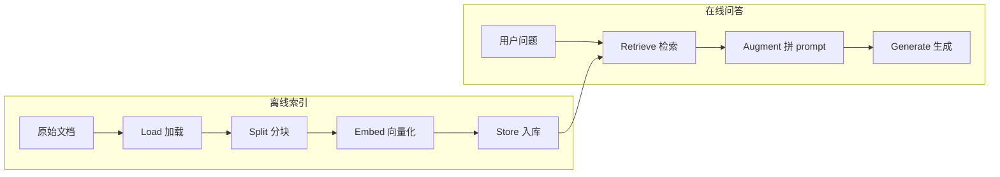

> 模块 06 - RAG | 前置知识：[Tool 接口](../04-tools/01-tool-interface.md)、[createAgent 入门](../05-agent-architecture/01-create-agent.md)

## RAG 解决什么问题

我做过的第一个客服 Bot，上线两周就被业务方喊停。原因不是模型不聪明，而是它"太自信"——用户问"退货 30 天能不能办"，它直接编了一条"我司支持 90 天无理由退货"。模型没有这个知识，但又必须回答，于是开始编。

要把模型变成靠谱的领域问答系统，得做两件事：

1. 让它在回答之前，先去查公司内部资料
2. 把查到的资料拼到 prompt 里，明确告诉它"只能基于这些资料回答"

这就是 RAG (Retrieval-Augmented Generation，检索增强生成)。把"参数化的世界知识"和"实时可更新的私有知识库"切开。模型不变，每次回答前临时灌入相关上下文。

跟 Fine-tuning 比，RAG 的好处很直接：

- **更新成本低**：知识库改一条记录，下一次问答就生效
- **可溯源**：每个答案都能指回原始片段
- **不污染模型**：模型权重不动，可以随时换模型

代价是检索质量决定一切。检索不对，模型再强也只能编。本章把整条管线先跑通，后面五节再一个一个环节深挖。

## 完整管线的 7 个环节

RAG 不是一个步骤，是一条流水线。离线阶段建索引，在线阶段做问答：



七个动词：Load → Split → Embed → Store → Retrieve → Augment → Generate。每一个都有独立的技术栈和坑：

| 环节 | 负责的事 | 本模块对应章节 |
|------|----------|---------------|
| Load | 把 PDF / Markdown / 网页 / Notion 等异构源变成统一的 `Document` | [Document Loaders](./02-document-loaders.md) |
| Split | 把长文档切成"够大能讲清一件事、够小能精准检索"的 chunk | [Text Splitters](./03-text-splitters.md) |
| Embed | 用 embedding 模型把 chunk 变成高维向量 | 本节 |
| Store | 写入向量库（Chroma / Qdrant / PGVector / Pinecone） | 本节 |
| Retrieve | 把用户问题向量化后做相似度搜索，找回 top-k | [Retriever 策略](./04-retrievers.md) |
| Augment | 把检索片段拼进 prompt，约束模型只用这些资料 | 本节 |
| Generate | 模型基于受限上下文生成答案，最好带引用 | 本节 |

后面四节会展开 Load / Split / Retrieve / 高级技巧。这一节只做一件事——用最少的代码把整条管线跑起来。

## 10 行内能跑的最小示例

先装包：

```bash
npm install langchain @langchain/openai @langchain/textsplitters \
  @langchain/community @langchain/core
```

`@langchain/community` 里有最常用的内存向量库 `MemoryVectorStore`，足够本地验证。生产用 Chroma 或 Qdrant，后面会换。

最小可运行示例：

```typescript
// rag-min.ts
import { ChatOpenAI, OpenAIEmbeddings } from "@langchain/openai";
import { MemoryVectorStore } from "langchain/vectorstores/memory";
import { Document } from "@langchain/core/documents";

// 1. 假装这是从 loader 加载来的文档
const docs = [
  new Document({ pageContent: "我司支持 7 天无理由退货，需保持商品完好。" }),
  new Document({ pageContent: "VIP 用户的退货时限延长至 14 天。" }),
  new Document({ pageContent: "生鲜类商品一经签收，不支持无理由退货。" }),
];

// 2. 向量化并入库
const vectorStore = await MemoryVectorStore.fromDocuments(
  docs,
  new OpenAIEmbeddings({ model: "text-embedding-3-large" })
);

// 3. 检索 + 生成
const question = "我买的草莓不喜欢能退吗？";
const retrieved = await vectorStore.similaritySearch(question, 2);
const context = retrieved.map((d) => d.pageContent).join("\n");

const model = new ChatOpenAI({ model: "gpt-4o", temperature: 0 });
const answer = await model.invoke(
  `只根据以下资料回答用户问题，资料没说就回答"暂无相关政策"。

资料:
${context}

用户: ${question}`
);

console.log(answer.text);
```

跑一下：

```bash
OPENAI_API_KEY=sk-xxx npx tsx rag-min.ts
# 输出大意：根据资料，生鲜类商品（包括草莓）签收后不支持无理由退货。
```

10 行核心逻辑就把 Embed → Store → Retrieve → Augment → Generate 全跑完了。Load 和 Split 因为示例数据已经是切好的短句，省略了。

两个细节：

- **embedding 模型选了 `text-embedding-3-large`**。`-small` 便宜（1536 维），适合大规模索引；`-large`（3072 维）准确率更高，适合质量优先场景。中文密集场景可以考虑 Cohere [embed-multilingual-v4](https://docs.cohere.com/docs/cohere-embed) 或国产 [BGE](https://huggingface.co/BAAI) 系列。
- **prompt 里明确写了"资料没说就回答暂无相关政策"**。这是 RAG 的护栏，缺了它模型就开始编。

## 把这条管线"产品化"

把上面的代码搬进生产，要补三块：

### 1. 用真实的 Loader 和 Splitter

`Document` 不会从天上掉下来。真实场景你要从 PDF / 网页 / Notion 加载，然后切块：

```typescript
import { PDFLoader } from "@langchain/community/document_loaders/fs/pdf";
import { RecursiveCharacterTextSplitter } from "@langchain/textsplitters";

const loader = new PDFLoader("./policies/return-policy.pdf");
const rawDocs = await loader.load();

const splitter = new RecursiveCharacterTextSplitter({
  chunkSize: 500,
  chunkOverlap: 50,
});
const chunks = await splitter.splitDocuments(rawDocs);
```

Loader 的全套选项见 [Document Loaders](./02-document-loaders.md)，Splitter 的调参见 [Text Splitters](./03-text-splitters.md)。

### 2. 换掉内存向量库

`MemoryVectorStore` 进程一关数据就没了，只适合 demo。生产环境四个主流选项：

| 向量库 | 适合场景 | 特点 |
|--------|----------|------|
| [Chroma](https://www.trychroma.com/) | 中小型项目、本地优先 | 开源、零运维、Docker 一行启动 |
| [Qdrant](https://qdrant.tech/) | 大规模、性能优先 | Rust 写的、HNSW 调参丰富、有云托管 |
| PGVector | 已有 Postgres 基础设施 | Postgres 插件，事务/SQL 全保留 |
| [Pinecone](https://www.pinecone.io/) | 不想自己运维 | 全托管、按用量计费 |

换成 Chroma 的写法（先 `docker run -p 8000:8000 chromadb/chroma`）：

```typescript
import { Chroma } from "@langchain/community/vectorstores/chroma";

const vectorStore = await Chroma.fromDocuments(
  chunks,
  new OpenAIEmbeddings({ model: "text-embedding-3-large" }),
  {
    collectionName: "return-policy",
    url: "http://localhost:8000",
  }
);

// 后续 query
const found = await vectorStore.similaritySearch(question, 4);
```

换成 Qdrant 也类似，import 改成 `@langchain/community/vectorstores/qdrant`、传 `url: "http://localhost:6333"` 即可。

### 3. 把检索 → 生成做成可复用的函数

最小示例把检索和生成都写在主流程里，工程化要把它收成一个 `ask` 函数：

```typescript
import type { VectorStore } from "@langchain/core/vectorstores";
import type { BaseChatModel } from "@langchain/core/language_models/chat_models";

interface AskOptions {
  vectorStore: VectorStore;
  model: BaseChatModel;
  k?: number;
}

async function ask(question: string, opts: AskOptions): Promise<{
  answer: string;
  sources: Array<{ content: string; metadata: Record<string, unknown> }>;
}> {
  const { vectorStore, model, k = 4 } = opts;

  // 检索
  const docs = await vectorStore.similaritySearch(question, k);
  const context = docs
    .map((d, i) => `[${i + 1}] ${d.pageContent}`)
    .join("\n\n");

  // 生成
  const response = await model.invoke(
    `你是企业知识库助手。只根据下面带编号的资料回答，回答时在相关句末标注引用编号如 [1][2]。
若资料不足以回答，直说"资料中没有相关信息"。

资料:
${context}

用户问题: ${question}`
  );

  const text = response.contentBlocks
    .map((b) => (b.type === "text" ? b.text : ""))
    .join("");

  return {
    answer: text,
    sources: docs.map((d) => ({
      content: d.pageContent.slice(0, 120),
      metadata: d.metadata,
    })),
  };
}

// 使用
const { answer, sources } = await ask("VIP 用户退货有什么特别政策？", {
  vectorStore,
  model: new ChatOpenAI({ model: "gpt-4o", temperature: 0 }),
  k: 3,
});

console.log(answer);
console.log("\n引用来源:");
console.table(sources);
```

这个 `ask` 函数已经具备产品形态了：传问题进去、拿答案和引用出来。引用是 RAG 区别于纯模型问答的核心价值——用户可以点开溯源，运营可以基于引用统计哪些文档被用得最多。

## Naive RAG 的天花板

上面这条管线叫 **Naive RAG**——一次问、一次检索、一次生成。在你的语料质量好、用户问题清晰时它能跑到 70 分。但接下来这些场景它会摔得很惨：

| 场景 | Naive RAG 的问题 | 改进方向 | 章节 |
|------|----------------|----------|------|
| 用户问得很口语，文档很书面 | 向量距离对不上 | HyDE / Multi-Query | [advanced-rag](./05-advanced-rag.md) |
| 关键词必须精确匹配（型号、人名） | 纯向量召不回 | BM25 + 向量 Hybrid | [retrievers](./04-retrievers.md) |
| 小 chunk 检准了但缺上下文 | LLM 看片段看不明白 | Parent-Document Retriever | [advanced-rag](./05-advanced-rag.md) |
| Top-K 里塞了一堆相似冗余 | 真信息被淹没 | Rerank | [advanced-rag](./05-advanced-rag.md) |
| 用户问"对比 A 和 B 政策" | 一次检索不够 | Agent 多步检索 | [rag-agent](./06-rag-agent.md) |
| 闲聊问题也走检索 | 浪费 token、引入噪声 | Adaptive RAG | [rag-agent](./06-rag-agent.md) |

后面五节就是按这张表一点点把天花板打穿。

## 怎么判断你的 RAG"够好了"

写完管线下一个问题是：怎么知道它行不行。我用的最小评估闭环：

1. 从真实业务整理一份 50-100 条的"问题-标准答案"集
2. 跑一遍，记录每条的 (检索到的 chunk, 模型答案)
3. 三个维度打分：
   - **Recall@k**：标准答案对应的 chunk 是否在 top-k 里
   - **Faithfulness**：模型答案是否完全基于检索片段（用 LLM 自动判）
   - **Answer Relevancy**：答案是否切题（用 LLM 自动判）

50 条样本花不了多少钱，但能把"凭感觉调参"变成"看数字调参"。指标定义和实现细节在 [评估章节](./05-advanced-rag.md#评估) 展开。

## 小结

RAG 是把外部知识临时灌进 prompt 的工程模式，七个环节构成一条流水线：Load → Split → Embed → Store → Retrieve → Augment → Generate。最小可运行版本 10 行代码搞定，工程化要补真实 Loader、生产向量库（Chroma / Qdrant / PGVector / Pinecone 任选）、带引用的封装。

Naive RAG 是起点不是终点。问题越复杂，越需要 Hybrid 检索、Rerank、Multi-Query、Agent 路由这些更重的方案。下一节 [Document Loaders](./02-document-loaders.md) 从管线第一环开始展开——数据怎么进来，决定后面所有环节的上限。

---

> 本文摘自[《LangChain.js Agent 开发权威指南》](https://github.com/diguike/book-langchain-agent)，作者[递归客](https://inferloop.dev)。
