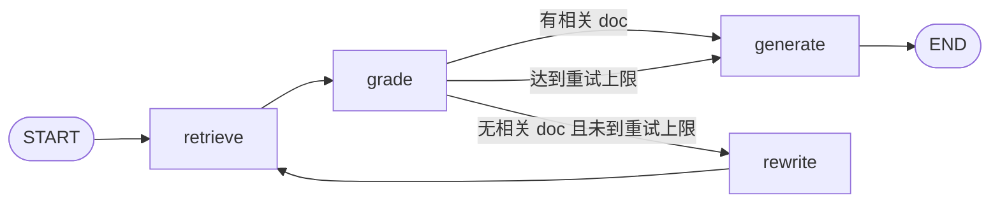

> 模块 06 - RAG | 前置知识：[高级 RAG 技术](./advanced-rag.md)、[createAgent 入门](../05-agent-architecture/create-agent.md)

## 从"固定管线"到"自主决策"

前面五节搭起来的 RAG 都是固定管线——不管用户问什么，都走"检索 → 拼 prompt → 生成"这一套。但真实场景里：

- 用户说"你好"——根本不需要检索
- 用户说"对比 A 政策和 B 政策"——需要分两步检索
- 用户问"今天有什么新闻"——内部知识库没有，得走 web search
- 检索回来的 chunk 跟问题不太相关——要换个查询再试一次

把这种"看情况决定下一步"的逻辑硬编进 if/else 很快就会失控。正确的做法是把决策权交给一个 Agent，让模型自己判断每一步该干什么。两条实现路线：

1. **createAgent + retriever-as-tool**：把检索器包成工具，让 Agent 自由调用。简洁，覆盖 80% 场景
2. **LangGraph StateGraph**：显式画状态机，节点之间有评估、重试、路由。适合需要严格控制流程的场景

本节两种都讲。

## 路线一：把 Retriever 包成 Tool

### 最小示例

`createAgent` 的核心思路是：给模型一组工具，让它自己决定调哪个、按什么顺序调。把 retriever 包成 tool 后，Agent 就能：

- 简单问题直接回答（不调工具）
- 知识库问题主动调 retriever
- 复杂问题多次调 retriever（每次换查询）

```typescript
import { createAgent } from "langchain";
import { ChatAnthropic } from "@langchain/anthropic";
import { tool } from "@langchain/core/tools";
import { Chroma } from "@langchain/community/vectorstores/chroma";
import { OpenAIEmbeddings } from "@langchain/openai";
import { z } from "zod";

// 准备向量库
const policyStore = await Chroma.fromExistingCollection(
  new OpenAIEmbeddings({ model: "text-embedding-3-large" }),
  { collectionName: "policies", url: "http://localhost:8000" }
);

// 把 retriever 包成 tool
const searchPolicy = tool(
  async ({ query, topK }) => {
    const docs = await policyStore.similaritySearch(query, topK);
    if (docs.length === 0) return "未找到相关政策";
    return docs
      .map(
        (d, i) =>
          `[${i + 1}] (来源: ${d.metadata.source}, 章节: ${d.metadata.section ?? "N/A"})\n${d.pageContent}`
      )
      .join("\n\n---\n\n");
  },
  {
    name: "search_policy",
    description:
      "在公司政策知识库里检索相关条款。用于退货、年假、报销、入职等内部政策问题。" +
      "查询语句要具体清晰，topK 默认 4，需要全面对比时可调到 8。",
    schema: z.object({
      query: z.string().describe("具体的检索查询语句"),
      topK: z.number().int().min(1).max(10).default(4),
    }),
  }
);

const agent = createAgent({
  model: new ChatAnthropic({ model: "claude-sonnet-4-6", temperature: 0 }),
  tools: [searchPolicy],
  systemPrompt: `你是公司政策助手。回答政策相关问题时必须先调用 search_policy 检索依据，
基于检索结果作答并在相关句末标注 [编号]。资料没说就如实告知，不要编造。
闲聊、问候等无关问题直接回答即可，不要调用工具。`,
});

const result = await agent.invoke({
  messages: [{ role: "user", content: "VIP 客户的退货政策是怎样的？" }],
});

console.log(result.messages.at(-1)?.contentBlocks[0]);
```

Agent 内部会自动跑 model → tool → model 的循环：

1. 模型看到问题，决定调 `search_policy(query="VIP 客户退货政策")`
2. 工具返回检索片段
3. 模型基于片段生成最终答案

整个循环不需要你写一行调度代码。如果用户问"你好"，模型会直接回答，不调工具。

### 多库路由：让 Agent 自己选

企业 RAG 经常面对多个知识库——产品、政策、技术文档各一份。把每个库包成独立 tool，描述写清楚用途，Agent 自然会选：

```typescript
const searchProduct = tool(
  async ({ query }) => {
    const docs = await productStore.similaritySearch(query, 4);
    return docs.map((d) => d.pageContent).join("\n\n");
  },
  {
    name: "search_product",
    description: "检索产品功能、规格、定价、API 文档。用于和产品技术细节相关的问题。",
    schema: z.object({ query: z.string() }),
  }
);

const searchPolicy = tool(
  async ({ query }) => { /* ... */ },
  {
    name: "search_policy",
    description: "检索公司内部政策——退货、年假、报销、HR、入职流程。",
    schema: z.object({ query: z.string() }),
  }
);

const searchTechDoc = tool(
  async ({ query }) => { /* ... */ },
  {
    name: "search_tech_doc",
    description: "检索工程内部技术文档：架构设计、运维手册、故障排查。",
    schema: z.object({ query: z.string() }),
  }
);

const agent = createAgent({
  model: new ChatAnthropic({ model: "claude-sonnet-4-6" }),
  tools: [searchProduct, searchPolicy, searchTechDoc],
  systemPrompt: `你是企业助手。根据问题判断查哪个知识库：
- 产品相关 → search_product
- HR/政策相关 → search_policy
- 技术/运维相关 → search_tech_doc
跨域问题可以调用多个工具。回答时引用来源编号。`,
});
```

模型根据 tool description 选库，规则全写在 description 里。这种做法简洁，但有两个限制：

- 模型偶尔会判错（小模型尤其明显）
- 没法对检索结果做评估和重试

更严格的场景往下看 LangGraph 方案。

### 加 web search 作为兜底

内部知识库没命中时回退到 web search。把 web 搜索也包成 tool：

```typescript
import { TavilySearch } from "@langchain/tavily";

const webSearch = new TavilySearch({
  maxResults: 5,
  apiKey: process.env.TAVILY_API_KEY!,
});

const agent = createAgent({
  model: new ChatAnthropic({ model: "claude-sonnet-4-6" }),
  tools: [searchPolicy, searchProduct, webSearch],
  systemPrompt: `你是企业助手。优先用内部知识库（search_policy / search_product）回答。
如果内部检索结果明显不相关，或者用户问的是公开信息（新闻、行业动态、第三方库使用方法），用 web 搜索。
回答时明确标注信息来源是"内部文档"还是"网络搜索"。`,
});

const r = await agent.invoke({
  messages: [{ role: "user", content: "最新的 Node.js LTS 是哪个版本？" }],
});
```

Tavily 是 LangChain 生态里搜索类工具的默认选择，[官方文档](https://docs.tavily.com/) 有具体用法。

## 路线二：LangGraph StateGraph 做严格控制

createAgent 把循环逻辑藏在内部，对很多场景够用。但当你需要：

- 显式的"评估检索质量"节点
- 检索失败时按规则重试（改写查询、换数据源、降级到 web search）
- 在某些关键节点插入人工审核
- 强约束最大重试次数和失败兜底

这时把状态机画出来比交给模型自由发挥更可靠。LangGraph 1.x 的 `StateGraph` 就是为这种场景设计的。

### Corrective RAG：检索后评估、不行就重写

最小可用的"自纠正"RAG：检索 → 评估相关性 → 不相关就改写查询重试 → 用尽次数就生成 fallback 答案。

```typescript
import { StateGraph, Annotation, START, END } from "@langchain/langgraph";
import { ChatOpenAI } from "@langchain/openai";
import { Document } from "@langchain/core/documents";
import { z } from "zod";
import type { VectorStore } from "@langchain/core/vectorstores";

// 1. State 定义
const RagState = Annotation.Root({
  question: Annotation<string>,
  rewrittenQuery: Annotation<string>({ default: () => "" }),
  documents: Annotation<Document[]>({
    default: () => [],
    reducer: (_, next) => next,
  }),
  retryCount: Annotation<number>({ default: () => 0 }),
  answer: Annotation<string>({ default: () => "" }),
});

type State = typeof RagState.State;

// 2. 准备
const vectorStore: VectorStore = await /* ... */;
const judge = new ChatOpenAI({ model: "gpt-4o-mini", temperature: 0 });
const writer = new ChatOpenAI({ model: "gpt-4o", temperature: 0 });

const gradeSchema = z.object({
  relevant: z.boolean(),
  reason: z.string(),
});

// 3. 节点：检索
async function retrieve(state: State): Promise<Partial<State>> {
  const query = state.rewrittenQuery || state.question;
  const docs = await vectorStore.similaritySearch(query, 5);
  return { documents: docs };
}

// 4. 节点：评估相关性
async function gradeDocuments(state: State): Promise<Partial<State>> {
  const graded: Document[] = [];
  const structured = judge.withStructuredOutput(gradeSchema, { strategy: "tool" });

  for (const doc of state.documents) {
    const r = await structured.invoke(
      `判断这段文档是否能帮助回答用户问题。

用户问题: ${state.question}
文档内容: ${doc.pageContent.slice(0, 800)}

如果文档明显相关返回 true，否则返回 false。`
    );
    if (r.relevant) graded.push(doc);
  }

  return { documents: graded };
}

// 5. 节点：改写查询
async function rewriteQuery(state: State): Promise<Partial<State>> {
  const r = await writer.invoke(
    `用户的原问题检索效果不好。改写一个更利于向量检索的版本，
保留原意但用更书面、更具体的表述。直接输出改写后的查询，不要解释。

原问题: ${state.question}
${state.rewrittenQuery ? `上次改写: ${state.rewrittenQuery}（也没召回到相关结果）` : ""}`
  );
  const text = r.contentBlocks.map((b) => (b.type === "text" ? b.text : "")).join("").trim();
  return { rewrittenQuery: text, retryCount: state.retryCount + 1 };
}

// 6. 节点：生成最终答案
async function generate(state: State): Promise<Partial<State>> {
  if (state.documents.length === 0) {
    return { answer: "抱歉，我在知识库里没有找到相关信息，无法给出准确答案。" };
  }

  const context = state.documents
    .map((d, i) => `[${i + 1}] ${d.pageContent}`)
    .join("\n\n");

  const r = await writer.invoke(
    `只根据下面带编号的资料回答问题。在相关句末标 [编号]。资料没说就如实告知。

资料:
${context}

问题: ${state.question}`
  );
  const text = r.contentBlocks.map((b) => (b.type === "text" ? b.text : "")).join("");
  return { answer: text };
}

// 7. 条件路由
function decideAfterGrading(state: State): "generate" | "rewrite" {
  if (state.documents.length > 0) return "generate";
  if (state.retryCount >= 2) return "generate"; // 达到上限，让 generate 走 fallback
  return "rewrite";
}

// 8. 编译
const correctiveRag = new StateGraph(RagState)
  .addNode("retrieve", retrieve)
  .addNode("grade", gradeDocuments)
  .addNode("rewrite", rewriteQuery)
  .addNode("generate", generate)
  .addEdge(START, "retrieve")
  .addEdge("retrieve", "grade")
  .addConditionalEdges("grade", decideAfterGrading, {
    generate: "generate",
    rewrite: "rewrite",
  })
  .addEdge("rewrite", "retrieve")
  .addEdge("generate", END)
  .compile();

// 使用
const out = await correctiveRag.invoke({
  question: "VIP 用户退货时限的具体条款？",
});
console.log(out.answer);
```

状态机长这样：



跟 createAgent 路线相比，这里的优势：

- 评估相关性的 prompt 完全可控（你可以塞业务规则）
- 重试次数硬上限，不会陷入循环
- 每个节点的输入输出都在 state 里，调试和 trace 很直接

### Adaptive RAG：先分类再分流

更复杂的场景：闲聊不走检索、内部问题走 KB、最新信息走 web search。把"分类"作为入口节点。

下面代码中的 `judge` / `writer` / `vectorStore` / `webSearch` 沿用前面 Corrective RAG 一节的定义（模型 + 内部向量库 + Tavily），这里只展示新增的图结构：

```typescript
import { StateGraph, Annotation, START, END } from "@langchain/langgraph";
import { z } from "zod";

const AdaptiveState = Annotation.Root({
  question: Annotation<string>,
  route: Annotation<"chitchat" | "kb" | "web" | "">({ default: () => "" }),
  documents: Annotation<Document[]>({
    default: () => [],
    reducer: (_, next) => next,
  }),
  answer: Annotation<string>({ default: () => "" }),
});

type AState = typeof AdaptiveState.State;

const routeSchema = z.object({
  route: z
    .enum(["chitchat", "kb", "web"])
    .describe(
      "chitchat: 问候/闲聊/无关问题；kb: 公司内部政策/产品/技术文档；web: 公开信息、新闻、第三方知识"
    ),
});

async function classify(state: AState): Promise<Partial<AState>> {
  const structured = judge.withStructuredOutput(routeSchema, { strategy: "tool" });
  const { route } = await structured.invoke(
    `给下面的用户问题分类：

问题: ${state.question}`
  );
  return { route };
}

async function chitchat(state: AState): Promise<Partial<AState>> {
  const r = await writer.invoke(state.question);
  const text = r.contentBlocks.map((b) => (b.type === "text" ? b.text : "")).join("");
  return { answer: text };
}

async function kbRetrieve(state: AState): Promise<Partial<AState>> {
  const docs = await vectorStore.similaritySearch(state.question, 5);
  return { documents: docs };
}

async function webRetrieve(state: AState): Promise<Partial<AState>> {
  // 调 Tavily 或类似工具
  const results = await webSearch.invoke({ query: state.question });
  const docs = results.results.map(
    (r: { content: string; url: string; title: string }) =>
      new Document({
        pageContent: r.content,
        metadata: { source: r.url, title: r.title, channel: "web" },
      })
  );
  return { documents: docs };
}

async function generateFromDocs(state: AState): Promise<Partial<AState>> {
  const context = state.documents
    .map((d, i) => `[${i + 1}] (${d.metadata.source ?? "?"}) ${d.pageContent}`)
    .join("\n\n");

  const r = await writer.invoke(
    `根据资料回答问题，相关句末标 [编号]。

资料:
${context}

问题: ${state.question}`
  );
  const text = r.contentBlocks.map((b) => (b.type === "text" ? b.text : "")).join("");
  return { answer: text };
}

function routeAfterClassify(state: AState): "chitchat" | "kb" | "web" {
  return state.route || "kb";
}

const adaptive = new StateGraph(AdaptiveState)
  .addNode("classify", classify)
  .addNode("chitchat", chitchat)
  .addNode("kb_retrieve", kbRetrieve)
  .addNode("web_retrieve", webRetrieve)
  .addNode("generate", generateFromDocs)
  .addEdge(START, "classify")
  .addConditionalEdges("classify", routeAfterClassify, {
    chitchat: "chitchat",
    kb: "kb_retrieve",
    web: "web_retrieve",
  })
  .addEdge("chitchat", END)
  .addEdge("kb_retrieve", "generate")
  .addEdge("web_retrieve", "generate")
  .addEdge("generate", END)
  .compile();

// 用法
console.log((await adaptive.invoke({ question: "你好啊" })).answer);
console.log((await adaptive.invoke({ question: "公司年假怎么申请？" })).answer);
console.log((await adaptive.invoke({ question: "最新的 Claude 模型是哪个？" })).answer);
```

把 Corrective 和 Adaptive 合体（分类 → KB 检索 → 评估 → 不行就改写或转 web search），就是 paper 里的 Self-RAG 雏形。代码会长但思路一脉相承，按本节给的两个模板扩展即可。

## 路线选择：createAgent vs StateGraph

| 维度 | createAgent + tools | StateGraph |
|------|---------------------|-----------|
| 实现复杂度 | 低 | 中-高 |
| 流程可控性 | 靠 system prompt 引导 | 显式节点 + 边 |
| 评估/重试 | 模型自己判断 | 节点级别可定制 |
| HITL 注入 | 用 interrupts | 任意节点中断 |
| 调试体验 | 看消息历史 | 看 state 演化 |
| 适合场景 | 80% 的问答 Bot | 严格 SLA、合规审查、复杂流程 |

我的实操原则是：先用 createAgent 跑起来，跑稳了再看需不需要升级到 StateGraph。大多数客服/内部问答场景 createAgent 已经够了，过早工程化反而拖慢迭代。

## 容易踩的坑

### Tool description 写得太泛

`description: "检索知识库"` 太弱了。模型在两个相似 tool 里挑会判错，或者闲聊问题也调工具。改成：

```
description: "在【公司退货/年假/报销】政策知识库里检索。仅当用户问 HR 或客服相关政策时使用。
不要用于产品功能、技术问题或闲聊。"
```

把"什么时候用"和"什么时候不用"都写进去。

### 没设置重试上限

LangGraph 状态机最容易出 bug 的地方是死循环。任何"评估失败就重试"的节点都要带 `retryCount` 并在条件边里做兜底。我的规矩：所有重试节点都让 retryCount 在 state 里，达到上限强制走 fallback。

### 检索结果直接塞进 prompt 不做清洗

检索回来的 chunk 经常带乱七八糟的换行、HTML 标签、表格残骸。生成前先清洗：

```typescript
function cleanChunk(text: string): string {
  return text
    .replace(/\n{3,}/g, "\n\n")        // 多余换行
    .replace(/[\t ]+/g, " ")            // 空白合并
    .replace(/<[^>]+>/g, "")            // HTML 标签
    .trim();
}
```

### Agent 调用 retriever 用了原话

模型有时候会直接把用户原话作为 `query` 参数，但用户原话往往口语化。在 tool description 里强调"将用户问题改写成检索友好的查询语句"通常能引导得更好。HyDE 那一节的思路也可以借鉴。

## 与可观测性对接

Agent 多步检索的链路比静态管线复杂得多。生产环境必须接 [LangSmith Tracing](https://docs.smith.langchain.com/) 或类似平台，否则出问题根本查不到。每个节点的 input/output、tool 调用参数、检索的 doc IDs，都应该有 trace 可以回放。

具体接入方法在 [可观测性章节](../07-observability/langsmith-tracing.md) 展开，这里只强调一点：**RAG Agent 上生产前必须先有 trace 工具**。

## 小结

RAG Agent 是把"什么时候检索、检索哪个库、要不要重试"的决策权从写代码的人手里交给模型。两条路线各有适用场景：

- **createAgent + retriever-as-tool**：把检索器和 web search 都包成 tool，让 Agent 自由调度。代码最短，覆盖大部分实战需求
- **LangGraph StateGraph**：显式画状态机，每个节点的逻辑完全可控。适合需要严格评估、重试、HITL 的场景

无论哪条路线，核心还是前五节打下的基础：好的 Loader 设计、合理的分块、可靠的检索、必要时的 rerank。Agent 是这些零件上的调度层，它放大底座的优点也放大缺点。

本模块（06-RAG）到此结束。下一步推荐进入 [07 可观测性](../07-observability/) 给 RAG Agent 装上眼睛——多步检索的系统没有 trace 等于在黑屋里调试。

---

> 本文摘自[《LangChain.js Agent 开发权威指南》](https://github.com/diguike/book-langchain-agent)，作者[递归客](https://inferloop.dev)。
