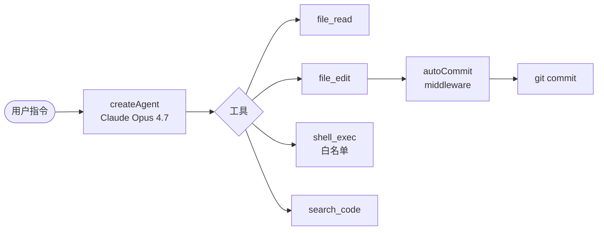

> 模块 09 - 综合项目 | 前置：[createAgent 入门](../05-agent-architecture/01-create-agent.md)、[Streaming API](../08-production/02-streaming-api.md)

## 这一章要做什么

做一个能在终端里跑的代码助手，定位是 Cursor / Claude Code 这类工具的最小可行版本：

- 用自然语言指挥它**读文件、改文件、跑命令、搜代码**
- 命令执行走白名单，避免被 prompt 注入诱导执行危险操作
- 每次改完代码自动 `git commit`，让回滚有路可走
- 终端里实时看到模型的思考和工具调用（流式 UI）

整个 Agent 由 `createAgent` + 4 个工具 + 1 个 middleware 构成。我在 macOS 和 Linux 上都跑通过，Windows 的 shell 命令需要自己改成 PowerShell 等价物。

## 架构



| 组件 | 选型 |
|------|------|
| 模型 | Claude Opus 4.7（代码任务旗舰，extended thinking 开） |
| 框架 | `createAgent` 单 Agent |
| Shell 沙箱 | 命令白名单 + 工作目录约束 |
| 自动提交 | LangChain Middleware |

## 项目骨架

```
code-assistant/
├── package.json
├── tsconfig.json
├── src/
│   ├── cli.ts                  # 终端入口
│   ├── agent.ts                # createAgent 装配
│   ├── tools/
│   │   ├── file.ts             # file_read / file_edit
│   │   ├── shell.ts            # shell_exec
│   │   └── search.ts           # search_code (ripgrep)
│   └── middleware/
│       └── auto-commit.ts      # 改文件后自动 git commit
└── workspace/                  # Agent 被允许操作的目录
```

## 工具实现

### 文件读 / 写

```typescript
// src/tools/file.ts
import { tool } from "@langchain/core/tools";
import { z } from "zod";
import { readFile, writeFile, stat } from "node:fs/promises";
import { resolve, relative } from "node:path";

const WORKSPACE = resolve(process.env.WORKSPACE ?? "./workspace");

// 限制文件路径必须在 WORKSPACE 内，防止逃逸
function safeResolve(input: string): string {
  const full = resolve(WORKSPACE, input);
  const rel = relative(WORKSPACE, full);
  if (rel.startsWith("..") || rel.startsWith("/")) {
    throw new Error(`路径越界：${input} 不在 workspace 内`);
  }
  return full;
}

// 敏感文件名黑名单：路径越界拦不住的"workspace 内的密钥文件"，再过一层
const FILENAME_BLACKLIST: Array<string | RegExp> = [
  ".env",
  ".env.local",
  ".env.production",
  /\.key$/,
  /\.pem$/,
];

function isBlacklisted(filename: string): boolean {
  return FILENAME_BLACKLIST.some((p) =>
    typeof p === "string" ? filename === p : p.test(filename)
  );
}

export const fileRead = tool(
  async ({ path, startLine, endLine }) => {
    const full = safeResolve(path);
    // basename 维度过黑名单：避免 ./.env、subdir/.env 都漏
    const base = full.split("/").pop() ?? "";
    if (isBlacklisted(base)) {
      throw new Error(`文件 ${path} 在敏感文件名黑名单内，禁止读取`);
    }
    const content = await readFile(full, "utf-8");
    if (startLine === undefined) return content;
    const lines = content.split("\n");
    const slice = lines.slice(startLine - 1, endLine ?? lines.length);
    return slice
      .map((line, i) => `${startLine + i}: ${line}`)
      .join("\n");
  },
  {
    name: "file_read",
    description:
      "读取 workspace 内的文件内容。可选传 startLine/endLine 只读某段（行号从 1 开始）。",
    schema: z.object({
      path: z.string().describe("workspace 内的相对路径"),
      startLine: z.number().int().min(1).optional(),
      endLine: z.number().int().min(1).optional(),
    }),
  }
);

export const fileEdit = tool(
  async ({ path, oldText, newText }) => {
    const full = safeResolve(path);
    let current: string;
    try {
      current = await readFile(full, "utf-8");
    } catch {
      // 文件不存在时，oldText 必须是空字符串（表示新建文件）
      if (oldText !== "") throw new Error(`文件不存在：${path}`);
      await writeFile(full, newText, "utf-8");
      return `已创建 ${path}（${newText.length} 字符）`;
    }
    const idx = current.indexOf(oldText);
    if (idx === -1) {
      throw new Error(
        `在 ${path} 中找不到 oldText。请先用 file_read 看一下当前内容。`
      );
    }
    if (current.indexOf(oldText, idx + 1) !== -1) {
      throw new Error(
        `oldText 在 ${path} 中出现多次，请提供更多上下文确保唯一匹配。`
      );
    }
    const next = current.slice(0, idx) + newText + current.slice(idx + oldText.length);
    await writeFile(full, next, "utf-8");
    return `已修改 ${path}：替换了 ${oldText.length} 字符 → ${newText.length} 字符`;
  },
  {
    name: "file_edit",
    description: `修改 workspace 内的文件。把 oldText 精确替换为 newText。
要求：
- oldText 必须在文件中唯一匹配，否则报错（保护性设计）
- 新建文件时 oldText 传空字符串
- 修改前建议先 file_read 看一下当前内容`,
    schema: z.object({
      path: z.string(),
      oldText: z.string().describe("要被替换的原始文本（必须唯一匹配）"),
      newText: z.string().describe("替换后的新文本"),
    }),
  }
);
```

### Shell 白名单

模型生成的命令一律不直接喂 `bash`，先按白名单分发：

```typescript
// src/tools/shell.ts
import { tool } from "@langchain/core/tools";
import { z } from "zod";
import { spawn } from "node:child_process";
import { resolve } from "node:path";

const WORKSPACE = resolve(process.env.WORKSPACE ?? "./workspace");

// 允许的命令列表，每个命令可单独配 timeout
const ALLOWED = new Map<string, { timeoutMs: number; argChecker?: (args: string[]) => void }>([
  ["ls", { timeoutMs: 5_000 }],
  ["cat", { timeoutMs: 5_000 }],
  ["pwd", { timeoutMs: 1_000 }],
  ["node", { timeoutMs: 30_000 }],
  ["npm", { timeoutMs: 120_000 }],
  ["npx", { timeoutMs: 120_000 }],
  ["git", {
    timeoutMs: 30_000,
    argChecker: (args) => {
      // 禁止 git push / git reset --hard / git clean -f 等危险操作
      const dangerous = ["push", "reset", "clean", "rebase", "filter-branch"];
      if (dangerous.includes(args[0])) {
        throw new Error(`不允许的 git 子命令：${args[0]}`);
      }
    },
  }],
  ["tsc", { timeoutMs: 60_000 }],
  ["vitest", { timeoutMs: 120_000 }],
]);

export const shellExec = tool(
  async ({ command, args }) => {
    const policy = ALLOWED.get(command);
    if (!policy) {
      return `命令 "${command}" 不在白名单内。允许的命令：${[...ALLOWED.keys()].join(", ")}`;
    }
    policy.argChecker?.(args);

    return new Promise<string>((resolveP) => {
      const child = spawn(command, args, {
        cwd: WORKSPACE,
        env: { ...process.env, NODE_ENV: "development" },
      });
      let stdout = "";
      let stderr = "";
      child.stdout.on("data", (b) => (stdout += b.toString()));
      child.stderr.on("data", (b) => (stderr += b.toString()));
      const timer = setTimeout(() => {
        child.kill("SIGKILL");
      }, policy.timeoutMs);
      child.on("close", (code) => {
        clearTimeout(timer);
        const out = [
          `exit: ${code}`,
          stdout && `stdout:\n${stdout.slice(-4000)}`,
          stderr && `stderr:\n${stderr.slice(-2000)}`,
        ]
          .filter(Boolean)
          .join("\n");
        resolveP(out);
      });
    });
  },
  {
    name: "shell_exec",
    description: `在 workspace 目录下执行一条命令。命令走白名单，参数会被严格校验。
适合场景：安装依赖、运行测试、查看 git 状态、跑 TypeScript 编译。`,
    schema: z.object({
      command: z.string().describe("命令名，如 npm / git / node"),
      args: z.array(z.string()).describe("命令参数数组"),
    }),
  }
);
```

### 代码搜索（ripgrep）

```typescript
// src/tools/search.ts
import { tool } from "@langchain/core/tools";
import { z } from "zod";
import { spawn } from "node:child_process";
import { resolve } from "node:path";

const WORKSPACE = resolve(process.env.WORKSPACE ?? "./workspace");

export const searchCode = tool(
  async ({ pattern, fileGlob }) => {
    return new Promise<string>((resolveP) => {
      const args = ["--max-count=5", "--max-columns=200", "-n"];
      if (fileGlob) args.push("-g", fileGlob);
      args.push(pattern);
      const child = spawn("rg", args, { cwd: WORKSPACE });
      let out = "";
      child.stdout.on("data", (b) => (out += b.toString()));
      child.on("close", () => resolveP(out.slice(0, 8000) || "（无匹配）"));
      child.on("error", () => resolveP("ripgrep 未安装"));
    });
  },
  {
    name: "search_code",
    description:
      "在 workspace 内用 ripgrep 搜代码。pattern 是正则，fileGlob 可选（如 '*.ts'）。",
    schema: z.object({
      pattern: z.string().describe("正则表达式"),
      fileGlob: z.string().optional().describe("文件名通配，如 '*.ts'"),
    }),
  }
);
```

## 自动提交 Middleware

每次 `file_edit` 之后自动 `git add` + `git commit`，commit message 由模型在工具参数里附带的 `intent` 字段生成：

```typescript
// src/middleware/auto-commit.ts
import { createMiddleware } from "langchain";
import { spawn } from "node:child_process";
import { resolve } from "node:path";

const WORKSPACE = resolve(process.env.WORKSPACE ?? "./workspace");

function git(args: string[]): Promise<void> {
  return new Promise((resolveP, rejectP) => {
    const child = spawn("git", args, { cwd: WORKSPACE });
    child.on("close", (code) => (code === 0 ? resolveP() : rejectP(new Error(`git ${args[0]} exit ${code}`))));
  });
}

export const autoCommitMiddleware = createMiddleware({
  name: "auto_commit",
  async wrapToolCall(call, next) {
    const result = await next(call);
    if (call.name === "file_edit") {
      const input = call.input as { path: string };
      try {
        await git(["add", input.path]);
        const msg = `code-assistant: edit ${input.path}`;
        await git(["commit", "-m", msg]);
      } catch (err) {
        // 没有变更或者 git 未初始化都 ok，不打断 Agent
      }
    }
    return result;
  },
});
```

## Agent 装配

```typescript
// src/agent.ts
import { createAgent } from "langchain";
import { ChatAnthropic } from "@langchain/anthropic";
import { MemorySaver } from "@langchain/langgraph";
import { fileRead, fileEdit } from "./tools/file.js";
import { shellExec } from "./tools/shell.js";
import { searchCode } from "./tools/search.js";
import { autoCommitMiddleware } from "./middleware/auto-commit.js";

const model = new ChatAnthropic({
  model: "claude-opus-4-7",
  temperature: 0,
  // 开启 extended thinking，让模型先在草稿区想清楚再动手
  thinkingBudget: 4_000,
});

const SYSTEM_PROMPT = `你是一个代码助手，工作在用户的本地 workspace 目录下。

你可以用四种工具：
1. file_read：读文件（先读再改）
2. file_edit：精确替换文件内容（oldText 必须唯一匹配）
3. search_code：用 ripgrep 搜代码（找符号定义、引用很有用）
4. shell_exec：在白名单内执行命令（跑测试、装依赖、查 git）

工作纪律：
- 改代码前先用 file_read / search_code 弄清楚现状，不要盲改
- 每次改完跑一次 tsc 或 vitest 验证，验证失败要自己定位修复
- 涉及多个文件的修改，每改一个文件用一次 file_edit，不要打包改
- 用中文跟用户沟通，代码和命令保持英文
- 不要假设依赖已安装，先 file_read package.json 看一下`;

export const codeAgent = createAgent({
  model,
  tools: [fileRead, fileEdit, searchCode, shellExec],
  middleware: [autoCommitMiddleware],
  systemPrompt: SYSTEM_PROMPT,
  // 多轮对话靠 checkpointer 持久化；CLI 用同一个 thread_id 复用历史
  checkpointer: new MemorySaver(),
});
```

## CLI 终端 UI（流式）

```typescript
// src/cli.ts
import readline from "node:readline/promises";
import { stdin, stdout } from "node:process";
import { codeAgent } from "./agent.js";

const rl = readline.createInterface({ input: stdin, output: stdout });

// 多轮对话需要在同一个 thread 里
const threadId = `cli-${Date.now()}`;

console.log("代码助手已启动，输入 /exit 退出\n");

while (true) {
  const input = await rl.question("> ");
  if (input.trim() === "/exit") break;
  if (!input.trim()) continue;

  let buffer = "";
  for await (const chunk of codeAgent.stream(
    { messages: [{ role: "user", content: input }] },
    { configurable: { thread_id: threadId }, streamMode: "messages" }
  )) {
    const [msg, meta] = chunk as [
      { contentBlocks?: Array<{ type: string; text?: string; name?: string }> },
      { langgraph_node?: string }
    ];
    for (const block of msg.contentBlocks ?? []) {
      if (block.type === "text" && block.text) {
        process.stdout.write(block.text);
        buffer += block.text;
      }
      if (block.type === "tool_call") {
        process.stdout.write(`\n[工具调用] ${block.name}\n`);
      }
      if (block.type === "thinking") {
        // Claude extended thinking 内容默认不展示，要可改
      }
    }
  }
  process.stdout.write("\n\n");
}

rl.close();
```

## package.json

```json
{
  "name": "code-assistant",
  "private": true,
  "type": "module",
  "engines": { "node": ">=20" },
  "scripts": {
    "dev": "tsx src/cli.ts"
  },
  "dependencies": {
    "@langchain/anthropic": "^1.4.0",
    "@langchain/core": "^1.4.0",
    "@langchain/langgraph": "^1.0.0",
    "langchain": "^1.4.0",
    "zod": "^3.23.0"
  },
  "devDependencies": {
    "tsx": "^4.19.0",
    "typescript": "^5.5.0"
  }
}
```

`.env`：

```
ANTHROPIC_API_KEY=sk-ant-...
WORKSPACE=/absolute/path/to/your/project
```

## 跑起来

```bash
# 1. 装依赖（含系统级的 ripgrep）
brew install ripgrep        # macOS
# apt install ripgrep        # Debian/Ubuntu
npm install

# 2. 在 workspace 里初始化 git（让 autoCommit 有家可归）
cd workspace && git init && git add . && git commit -m "init"
cd ..

# 3. 启动
npm run dev
```

交互示例：

```
> 在 src/math.ts 里加一个 average(numbers: number[]): number 函数，并写一个 vitest 测试

[工具调用] file_read
读完 package.json，确认了用 vitest。

[工具调用] file_edit (src/math.ts)
[工具调用] file_edit (src/math.test.ts)
[工具调用] shell_exec (npx vitest run)

测试通过，已经提交两次：edit src/math.ts、edit src/math.test.ts。
```

## 安全注意事项

代码助手是高权限工具，下面这些坑必须自己堵：

1. **WORKSPACE 必须是项目目录，不能是 `/` 或者你的整个 home**——`file_edit` 用相对路径解析，但底线还是物理目录的隔离
2. **shell 白名单别太宽**：默认禁掉 `rm`、`mv`、`curl`、`wget` 等任何可以删数据 / 联外网的命令
3. **API Key 不要进 workspace**：模型 `file_read` 不应读到你的 `.env`，在 `safeResolve` 后再加一个文件名黑名单
4. **autoCommit 是写到本地 git，不要 push**：`git push` 已经在白名单参数检查里禁了

## 已知限制

1. **没有 tool_use_id 关联展示**：UI 上看到的 `[工具调用]` 是分离的，工具结果和调用没有 inline 关联，复杂任务调试不直观
2. **`file_edit` 是字符串精确匹配**：模型偶尔会因为缩进/空白匹配不上失败一次，需要它自己重试
3. **没多文件批改**：一次只能改一个 `oldText → newText`，大规模重构步数会爆
4. **shell 输出截断**：stdout/stderr 各只取末尾几 KB，长日志要让模型自己分块读
5. **没接 MCP**：未来对接外部工具应换成 MCP server，工具会更丰富
6. **没解决长对话上下文**：跑超过几十轮会超 token，加 `summarizationMiddleware`

## 小结

代码助手的核心难点不在模型本身，而在**给模型一组既强又安全的工具**。三个设计选择：

- **`file_edit` 用唯一匹配替换**——比 diff/patch 更鲁棒，匹配失败时模型自己能恢复
- **shell 走白名单 + 参数 checker**——比执行任意命令安全得多，也比写 sandbox 简单
- **autoCommit middleware**——给每一步加一个 "git checkpoint"，出问题随时 `git reset`

下一节[数据分析 Agent](./03-data-analysis.md) 换个场景：让 Agent 自己写 SQL，挑战在沙箱执行和结果可视化。

---

> 本文摘自[《LangChain.js Agent 开发权威指南》](https://github.com/diguike/book-langchain-agent)，作者[递归客](https://inferloop.dev)。
