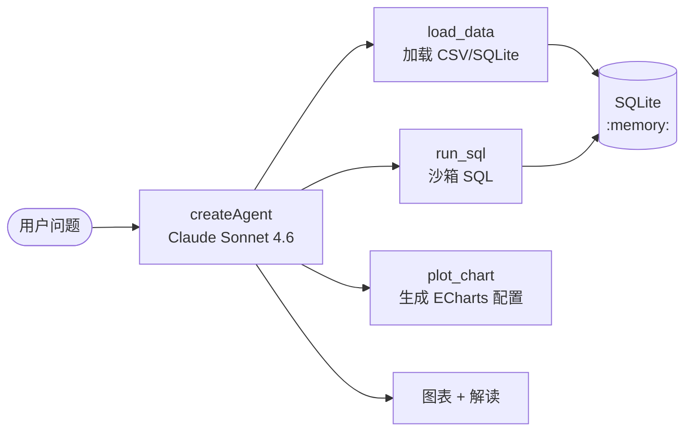

> 模块 09 - 综合项目 | 前置：[Tool 接口与定义](../04-tools/01-tool-interface.md)、[Output Parsers](../01-core-abstractions/05-output-parsers.md)

## 这一章要做什么

做一个自然语言数据分析 Agent。用户给一个 CSV 或 SQLite 文件，再用中文提问，比如"上个月每个城市的订单量是多少？"，Agent 自己写 SQL、跑查询、生成图表配置、再用一段话把结论说出来。

技术挑战只有三件：

1. **让 Agent 写正确的 SQL**——比起业务复杂度，这其实是 prompt + schema 描述的工程问题
2. **沙箱执行**——只允许 SELECT，禁掉一切修改语句，绑定查询超时
3. **结果可视化 + 解读**——返回前端能直接渲染的 ECharts 配置，外加一段人话总结

## 架构



整个 Agent 只有 3 个工具，但每个工具都包含了不少防御性逻辑。模型选 Sonnet 4.6 而不是 Opus——SQL 生成是相对结构化的任务，Sonnet 已经够用且更便宜。

## 项目骨架

```
data-analysis/
├── package.json
├── tsconfig.json
├── src/
│   ├── cli.ts                  # 命令行入口
│   ├── agent.ts                # createAgent 装配
│   ├── db.ts                   # 进程内 SQLite 会话
│   └── tools/
│       ├── load.ts             # load_data
│       ├── sql.ts              # run_sql（含安全验证）
│       └── chart.ts            # plot_chart
└── data/
    └── orders.csv              # 示例数据
```

## 进程内 SQLite 会话

数据加载和查询都在同一个内存 SQLite 实例里完成，避免文件状态在工具之间走丢：

```typescript
// src/db.ts
import Database from "better-sqlite3";

// 全局单例：整个 CLI 会话共用一个 :memory: 数据库
let _db: Database.Database | null = null;

export function getDb(): Database.Database {
  if (_db) return _db;
  _db = new Database(":memory:");
  _db.pragma("journal_mode = WAL");
  // 安全开关：禁止附加新数据库、禁止用户函数
  _db.pragma("trusted_schema = OFF");
  return _db;
}

export function listTables(): string[] {
  const db = getDb();
  const rows = db.prepare(
    "SELECT name FROM sqlite_master WHERE type='table'"
  ).all() as Array<{ name: string }>;
  return rows.map((r) => r.name);
}

export function describeTable(name: string): Array<{
  name: string;
  type: string;
}> {
  const db = getDb();
  // pragma_table_info 是 SQLite 内置元数据，安全
  return db.prepare(`PRAGMA table_info(${quoteIdent(name)})`).all() as Array<{
    name: string;
    type: string;
  }>;
}

// 简单防御 identifier 注入
export function quoteIdent(name: string): string {
  if (!/^[A-Za-z_][A-Za-z0-9_]*$/.test(name)) {
    throw new Error(`非法标识符：${name}`);
  }
  return `"${name}"`;
}
```

## load_data 工具

```typescript
// src/tools/load.ts
import { tool } from "@langchain/core/tools";
import { z } from "zod";
import { readFile } from "node:fs/promises";
import { getDb, quoteIdent } from "../db.js";

export const loadData = tool(
  async ({ path, tableName }) => {
    const db = getDb();

    if (path.endsWith(".csv")) {
      const raw = await readFile(path, "utf-8");
      const lines = raw.trim().split("\n");
      if (lines.length < 2) return "CSV 行数过少";
      const header = parseCsvLine(lines[0]);
      const sample = parseCsvLine(lines[1]);

      // 简单类型推断
      const cols = header.map((h, i) => ({
        name: h,
        type: inferType(sample[i]),
      }));

      const ddl =
        `CREATE TABLE ${quoteIdent(tableName)} (` +
        cols.map((c) => `${quoteIdent(c.name)} ${c.type}`).join(", ") +
        ")";
      db.exec(`DROP TABLE IF EXISTS ${quoteIdent(tableName)}`);
      db.exec(ddl);

      const insert = db.prepare(
        `INSERT INTO ${quoteIdent(tableName)} VALUES (${header.map(() => "?").join(",")})`
      );
      const tx = db.transaction((rows: string[][]) => {
        for (const r of rows) insert.run(...r);
      });
      tx(lines.slice(1).map(parseCsvLine));

      return JSON.stringify({
        table: tableName,
        rows: lines.length - 1,
        columns: cols,
      });
    }

    if (path.endsWith(".sqlite") || path.endsWith(".db")) {
      // 用 ATTACH 把外部数据库挂进来然后复制表
      const tmp = new (await import("better-sqlite3")).default(path, {
        readonly: true,
      });
      const tables = tmp
        .prepare("SELECT name FROM sqlite_master WHERE type='table'")
        .all() as Array<{ name: string }>;
      const summary: Array<{ table: string; rows: number }> = [];
      for (const t of tables) {
        const rows = tmp.prepare(`SELECT * FROM ${quoteIdent(t.name)}`).all();
        if (rows.length === 0) continue;
        const cols = Object.keys(rows[0]);
        db.exec(`DROP TABLE IF EXISTS ${quoteIdent(t.name)}`);
        db.exec(
          `CREATE TABLE ${quoteIdent(t.name)} (${cols.map((c) => quoteIdent(c)).join(", ")})`
        );
        const insert = db.prepare(
          `INSERT INTO ${quoteIdent(t.name)} VALUES (${cols.map(() => "?").join(",")})`
        );
        const tx = db.transaction((rs: Array<Record<string, unknown>>) => {
          for (const r of rs) insert.run(...cols.map((c) => r[c]));
        });
        tx(rows as Array<Record<string, unknown>>);
        summary.push({ table: t.name, rows: rows.length });
      }
      tmp.close();
      return JSON.stringify({ source: path, imported: summary });
    }

    return "不支持的文件类型，目前支持 .csv / .sqlite / .db";
  },
  {
    name: "load_data",
    description: `把外部数据文件加载到内存 SQLite 中以便 SQL 查询。
- CSV：需要指定 tableName
- SQLite/DB：直接导入所有表，tableName 参数被忽略`,
    schema: z.object({
      path: z.string().describe("文件路径"),
      tableName: z.string().describe("CSV 加载后的表名（如 'orders'）"),
    }),
  }
);

function parseCsvLine(line: string): string[] {
  // 简化版 CSV 解析；生产环境用 csv-parse
  const result: string[] = [];
  let cur = "";
  let inQuote = false;
  for (let i = 0; i < line.length; i++) {
    const c = line[i];
    if (c === '"') inQuote = !inQuote;
    else if (c === "," && !inQuote) {
      result.push(cur);
      cur = "";
    } else cur += c;
  }
  result.push(cur);
  return result;
}

function inferType(value: string): string {
  if (/^-?\d+$/.test(value)) return "INTEGER";
  if (/^-?\d+\.\d+$/.test(value)) return "REAL";
  if (/^\d{4}-\d{2}-\d{2}/.test(value)) return "TEXT"; // SQLite 日期都用 TEXT
  return "TEXT";
}
```

## run_sql 工具（沙箱）

这是最关键的工具。安全验证写得严，模型可以放心写 SQL：

```typescript
// src/tools/sql.ts
import { tool } from "@langchain/core/tools";
import { z } from "zod";
import { getDb, listTables, describeTable } from "../db.js";

const FORBIDDEN = [
  /\bDROP\b/i,
  /\bDELETE\b/i,
  /\bTRUNCATE\b/i,
  /\bALTER\b/i,
  /\bCREATE\b/i,
  /\bINSERT\b/i,
  /\bUPDATE\b/i,
  /\bREPLACE\b/i,
  /\bATTACH\b/i,
  /\bDETACH\b/i,
  /\bPRAGMA\b/i,
  /\bVACUUM\b/i,
];

function validateReadOnly(sql: string): void {
  const trimmed = sql.trim();
  if (!/^(SELECT|WITH)\b/i.test(trimmed)) {
    throw new Error("只允许 SELECT 或 WITH 查询");
  }
  for (const pattern of FORBIDDEN) {
    if (pattern.test(trimmed)) {
      throw new Error(`SQL 包含被禁用的关键字：${pattern.source}`);
    }
  }
  // 防止多语句
  if (trimmed.replace(/;\s*$/, "").includes(";")) {
    throw new Error("不允许多条语句");
  }
}

export const runSql = tool(
  async ({ sql }) => {
    validateReadOnly(sql);
    const db = getDb();

    // 强制套上 LIMIT，避免一次拉百万行
    let safe = sql.trim().replace(/;\s*$/, "");
    if (!/\bLIMIT\b/i.test(safe)) safe += " LIMIT 1000";

    // better-sqlite3 同步 API 不支持语句级超时；
    // 生产环境需在 worker_threads 中运行或换 async 驱动（参见已知限制第 3 条）
    const start = Date.now();
    const rows = db.prepare(safe).all() as Array<Record<string, unknown>>;
    const elapsed = Date.now() - start;
    return JSON.stringify({
      sql: safe,
      rowCount: rows.length,
      elapsedMs: elapsed,
      rows: rows.slice(0, 200), // 截断回模型，避免吃太多 token
      truncated: rows.length > 200,
    });
  },
  {
    name: "run_sql",
    description: `在内存 SQLite 上执行一条只读 SQL（SELECT / WITH）。
重要：调用前必须先用 inspect_schema 看清楚表结构。结果集会自动加 LIMIT 1000。`,
    schema: z.object({
      sql: z.string().describe("一条只读 SQL（不要写分号结尾的多语句）"),
    }),
  }
);

export const inspectSchema = tool(
  async () => {
    const tables = listTables();
    const result = tables.map((t) => ({
      table: t,
      columns: describeTable(t),
    }));
    return JSON.stringify(result);
  },
  {
    name: "inspect_schema",
    description: "列出当前数据库中所有表和它们的字段。写 SQL 前必看。",
    schema: z.object({}),
  }
);
```

## plot_chart 工具

```typescript
// src/tools/chart.ts
import { tool } from "@langchain/core/tools";
import { z } from "zod";

export const plotChart = tool(
  async ({ chartType, title, xField, yField, data }) => {
    // 返回前端可直接渲染的 ECharts option
    const option: Record<string, unknown> = {
      title: { text: title },
      tooltip: { trigger: "axis" },
    };

    if (chartType === "pie") {
      option.series = [
        {
          type: "pie",
          data: data.map((d) => ({ name: String(d[xField]), value: d[yField] })),
        },
      ];
    } else {
      option.xAxis = { type: "category", data: data.map((d) => String(d[xField])) };
      option.yAxis = { type: "value" };
      option.series = [
        {
          type: chartType,
          data: data.map((d) => d[yField]),
        },
      ];
    }

    return JSON.stringify({ chartType, option });
  },
  {
    name: "plot_chart",
    description: `把 run_sql 的结果做成 ECharts 配置。
xField/yField 是 SQL 结果集中的字段名。data 是 run_sql 返回的 rows。`,
    schema: z.object({
      chartType: z.enum(["bar", "line", "pie", "scatter"]),
      title: z.string(),
      xField: z.string(),
      yField: z.string(),
      data: z.array(z.record(z.unknown())),
    }),
  }
);
```

## Agent 装配

```typescript
// src/agent.ts
import { createAgent } from "langchain";
import { ChatAnthropic } from "@langchain/anthropic";
import { loadData } from "./tools/load.js";
import { runSql, inspectSchema } from "./tools/sql.js";
import { plotChart } from "./tools/chart.js";

const SYSTEM_PROMPT = `你是数据分析助手。用户给你一个数据文件路径和一个中文问题，你的任务：

1. 用 load_data 把文件导入内存数据库（如果还没导入）
2. 用 inspect_schema 看清楚表结构（绝不要凭想象写 SQL）
3. 写一条 SELECT 完成查询；只能 SELECT，没有写权限
4. 必要时用 plot_chart 生成图表配置
5. 用中文给出一段简洁的解读（具体数字，不要套话）

输出要求：
- 最后一条消息里同时包含：SQL、行数、图表配置 JSON、3-5 句业务解读
- 解读基于查询结果，不要编造数据`;

export const dataAgent = createAgent({
  model: new ChatAnthropic({ model: "claude-sonnet-4-6", temperature: 0 }),
  tools: [loadData, inspectSchema, runSql, plotChart],
  systemPrompt: SYSTEM_PROMPT,
});
```

## CLI 入口

```typescript
// src/cli.ts
import readline from "node:readline/promises";
import { stdin, stdout } from "node:process";
import { dataAgent } from "./agent.js";

const rl = readline.createInterface({ input: stdin, output: stdout });

const threadId = `cli-${Date.now()}`;

console.log("数据分析 Agent 已启动。先告诉我你要分析的文件路径，再问问题。\n");

while (true) {
  const input = await rl.question("> ");
  if (!input.trim()) continue;
  if (input.trim() === "/exit") break;

  for await (const chunk of dataAgent.stream(
    { messages: [{ role: "user", content: input }] },
    { configurable: { thread_id: threadId }, streamMode: "messages" }
  )) {
    const [msg] = chunk as [
      { contentBlocks?: Array<{ type: string; text?: string; name?: string }> }
    ];
    for (const block of msg.contentBlocks ?? []) {
      if (block.type === "text" && block.text) process.stdout.write(block.text);
      if (block.type === "tool_call") process.stdout.write(`\n[调用 ${block.name}]\n`);
    }
  }
  process.stdout.write("\n\n");
}

rl.close();
```

## package.json

```json
{
  "name": "data-analysis-agent",
  "private": true,
  "type": "module",
  "engines": { "node": ">=20" },
  "scripts": {
    "dev": "tsx src/cli.ts"
  },
  "dependencies": {
    "@langchain/anthropic": "^1.4.0",
    "@langchain/core": "^1.4.0",
    "@langchain/langgraph": "^1.0.0",
    "better-sqlite3": "^11.3.0",
    "langchain": "^1.4.0",
    "zod": "^3.23.0"
  },
  "devDependencies": {
    "@types/better-sqlite3": "^7.6.0",
    "tsx": "^4.19.0",
    "typescript": "^5.5.0"
  }
}
```

`.env`：

```
ANTHROPIC_API_KEY=
```

## 示例数据

随便造一份 `data/orders.csv` 测试：

```csv
order_id,city,amount,created_at
O001,北京,299.00,2026-04-12
O002,上海,1599.00,2026-04-15
O003,广州,89.00,2026-04-20
O004,北京,499.00,2026-04-22
O005,上海,239.00,2026-05-01
O006,深圳,1099.00,2026-05-03
```

## 跑起来

```bash
npm install
npm run dev
```

交互示例：

```
> 加载 data/orders.csv 到 orders 表

[调用 load_data]
已导入 6 行，字段：order_id, city, amount, created_at。

> 每个城市的订单数和总金额是多少？画个柱状图

[调用 inspect_schema]
[调用 run_sql]
SELECT city, COUNT(*) AS order_count, SUM(amount) AS total_amount
FROM orders GROUP BY city ORDER BY total_amount DESC LIMIT 1000

[调用 plot_chart]

查询结果：
- 上海：2 单，¥1838.00
- 北京：2 单，¥798.00
- 深圳：1 单，¥1099.00
- 广州：1 单，¥89.00

解读：上海和深圳客单价显著高于北京、广州，但订单频次上海最高。
如果做活动投放，上海是首选；深圳值得做客单价稳定性分析。

图表配置（前端 ECharts.setOption 直接吃）：
{"chartType":"bar","option":{...}}
```

## 已知限制

1. **CSV 解析是手写的简化版**：碰到带换行的引号字段会断。生产换 [csv-parse](https://github.com/adaltas/node-csv)。
2. **类型推断只看第一行**：第一行是整数后面有小数会被截断，要么人工传 schema，要么扫描多行。
3. **没有真正的查询超时**：better-sqlite3 是同步 API，超时控制需要在 worker 里跑或者换 async 驱动。
4. **没接 PostgreSQL / MySQL**：换驱动后 `validateReadOnly` 的方言要重新评估（例如 PG 的 `CTE` 写法和 SQLite 不完全一致）。
5. **图表是 ECharts only**：要支持 vega-lite 或 Chart.js 得加分支。
6. **大表会爆内存**：`:memory:` 数据库放千万行级别数据会拖死进程。生产应该让 Agent 直接连只读副本数据库。
7. **没有 PII 脱敏**：示例数据干净，但真实场景里"列出所有用户手机号"这种问法要拦下来。加一个 `wrapToolCall` middleware 扫 SELECT 字段名。

## 小结

数据分析 Agent 看着简单，其实考验的是工具边界：

- **`inspect_schema` 是写 SQL 前的强制前置步骤**——在 system prompt 里反复强调，模型才会乖乖先看再写
- **`run_sql` 是只读、限语句、限行数、限时长**——四道防线缺一不可，缺一道线下就会出生产事故
- **结果集要截断再喂回模型**——前 200 行足够 LLM 总结，全量给会浪费 token 且容易 OOM

下一节[多 Agent 工作流平台](./04-multi-agent-platform.md) 把视角拉高：当 Agent 不止一个、工作流可由用户自定义时，平台层要怎么设计。

---

> 本文摘自[《LangChain.js Agent 开发权威指南》](https://github.com/diguike/book-langchain-agent)，作者[递归客](https://inferloop.dev)。
