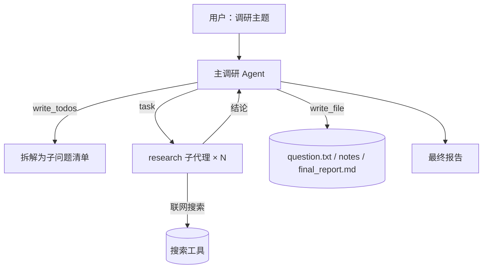

> 模块 09 - 综合项目 | 前置知识：[Deep Agents 深度智能体](../05-agent-architecture/11-deep-agents.md)、[RAG Agent](../06-rag/06-rag-agent.md)、[Multi-Agent 协作](../05-agent-architecture/08-multi-agent.md)

## 这个项目要做成什么

一个能自主完成"主题调研 → 写成报告"的 Agent。你丢给它一句"对比 LangGraph、CrewAI、AutoGen 三个 Agent 框架，输出一份带优劣分析的报告"，它自己规划步骤、分头查资料、把中间结论存成文件、最后汇总成一篇结构化报告。

这是 [Deep Agents](../05-agent-architecture/11-deep-agents.md) 那一章四大支柱的综合落地——规划、子代理、虚拟文件系统、详细提示一个不少。前面四个项目（[客服](./01-customer-service.md)、[代码助手](./02-code-assistant.md)、[数据分析](./03-data-analysis.md)、[多 Agent 平台](./04-multi-agent-platform.md)）都是"单轮或几轮就出结果"的任务；这个不一样，它是典型的**长周期任务**：几十步工具调用、上下文很容易爆、子任务之间会互相干扰。普通 `createAgent` 扛不住，正是 Deep Agent 的主场。

## 整体设计



分工很清楚：

- **主 Agent** 负责规划（把大主题拆成几个子问题）、调度（把每个子问题派给子代理）、汇总（把子代理的结论写成报告）。
- **research 子代理** 负责单个子问题的深度调研。它有**独立的上下文窗口**——查到的几千行原始资料留在它自己的上下文里，只把提炼后的结论交回主 Agent。这是整个设计能扛长任务的关键：脏活在隔离的上下文里干，主线只留干净结论。
- **虚拟文件系统** 是两者交换数据的媒介：子代理把调研笔记写进文件，主 Agent 读文件来写报告，而不是把所有原文堆在对话历史里。

## 搭起来

装包：

```bash
npm install deepagents langchain @langchain/anthropic @langchain/tavily @langchain/core zod
```

### 搜索工具

调研离不开联网搜索。用 Tavily（注意参数是 `tavilyApiKey`，包是 `@langchain/tavily`）：

```typescript
// research-agent.ts
import { z } from "zod";
import { tool } from "langchain";
import { ChatAnthropic } from "@langchain/anthropic";
import { createDeepAgent, type SubAgent } from "deepagents";
import { TavilySearch } from "@langchain/tavily";

const tavily = new TavilySearch({
  maxResults: 5,
  tavilyApiKey: process.env.TAVILY_API_KEY,
});

// 把 Tavily 包成一个简单的搜索工具
const internetSearch = tool(
  async ({ query }) => {
    const resp = await tavily.invoke({ query });
    // TavilySearch 失败时返回 { error }，不会有 results，先挡一道
    if (typeof resp === "object" && resp && "error" in resp) {
      return `搜索失败：${(resp as any).error}`;
    }
    return resp.results.map((r) => `【${r.title}】${r.content}\n${r.url}`).join("\n\n");
  },
  {
    name: "internet_search",
    description: "联网搜索，返回相关网页的标题、摘要和链接",
    schema: z.object({ query: z.string().describe("搜索关键词") }),
  }
);
```

### 调研子代理

子代理是一个专注的"研究员"——一次只研究一个子问题，查透了给一段详尽结论：

```typescript
const researchSubAgent: SubAgent = {
  name: "research-agent",
  description: "用于深入调研单个子问题。一次只丢给它一个聚焦的问题，它会查透并给出详尽结论。",
  systemPrompt:
    "你是一名专职技术调研员。针对给你的问题做多轮搜索，交叉验证后给出一份带事实和来源的详尽结论。不要泛泛而谈。",
  tools: [internetSearch],
};
```

### 主调研 Agent

主 Agent 用 `createDeepAgent` 一行拿到规划 + 子代理 + 文件系统全套，`systemPrompt` 拼接到内置的基础提示之后：

```typescript
const agent = createDeepAgent({
  model: new ChatAnthropic({ model: "claude-sonnet-4-6", temperature: 0 }),
  tools: [internetSearch],
  subagents: [researchSubAgent],
  systemPrompt: `你是一名资深调研总控。工作流程：
1. 先用 write_todos 把调研主题拆成 3-5 个子问题，列成清单。
2. 把每个子问题用 task 工具派给 research-agent 子代理，逐个完成。
3. 把每个子问题的结论用 write_file 存进 notes-<n>.md。
4. 全部子问题完成后，综合所有 notes，把最终报告写进 final_report.md（要有结构：背景、逐项分析、对比结论）。
回答用中文。`,
});
```

### 跑

```typescript
const result = await agent.invoke(
  {
    messages: [
      { role: "user", content: "对比 LangGraph、CrewAI、AutoGen 三个 Agent 框架，输出一份带优劣分析的报告" },
    ],
  },
  { recursionLimit: 1000 } // Deep Agent 步数多，上限给大
);

// result.files 是 Record<string, FileData>，FileData.content 是 string[]（v1）
// 或 string | Uint8Array（v2），直接打印会变成 [object]，统一用 helper 取文本
function readFile(files: Record<string, any> | undefined, name: string): string {
  const f = files?.[name];
  if (!f) return "(未生成)";
  const c = f.content;
  if (Array.isArray(c)) return c.join("\n");
  if (typeof c === "string") return c;
  return new TextDecoder().decode(c);
}

// 内置 middleware 把规划和文件状态注入了返回值
console.log("规划清单：", result.todos);
console.log("产出文件：", Object.keys(result.files ?? {}));
console.log("\n===== 最终报告 =====\n");
console.log(readFile(result.files, "final_report.md"));
```

执行过程大致是：主 Agent 先 `write_todos` 列出"逐个框架调研 → 横向对比 → 写报告"的计划，然后三次 `task` 把三个框架分别派给 `research-agent`（每个子代理独立查资料、互不干扰），把结论写进 `notes-1/2/3.md`，最后读回所有笔记，综合成 `final_report.md`。

## 几个工程要点

这个项目把前面零散的工程经验集中用上了：

1. **`recursionLimit` 一定要调大**。Deep Agent 一个任务几十上百步是常态，默认上限会很快撞到。`createDeepAgent` 内部默认给到很高，但你 invoke 时按需覆盖。
2. **子代理的粒度别太细**。每次 `task` 调用就是一轮完整的 Agent 循环，开销不小。"一个框架一个子代理"是合适的粒度；"一个搜索查询一个子代理"就过细了。
3. **报告质量取决于子代理的 prompt**。子代理的 `systemPrompt` 里要明确要求"交叉验证、带来源、不要泛泛而谈"，否则它会给你一堆正确的废话。
4. **加 HITL 防跑偏**。长任务跑一半发现方向错了很浪费。可以给主 Agent 挂 [humanInTheLoopMiddleware](../05-agent-architecture/09-human-in-the-loop.md)，在"清单列好、即将开始大规模调研"那一步插一个人工确认。
5. **接 LangSmith 看轨迹**。几十步的执行，出问题靠 console.log 根本看不清。接上 [LangSmith Tracing](../07-observability/02-langsmith-tracing.md)，每个子代理的调用链一目了然；再用 [轨迹评估](../07-observability/05-agent-trajectory-eval.md) 回归"调研路径是否合理"。

## 怎么继续往下做

这个骨架能扩展成一个真正的产品：

- **多种子代理**：除了 `research-agent`，再加一个 `fact-check-agent`（核查结论）、一个 `writer-agent`（润色报告），主 Agent 按阶段调度。
- **持久化 + 断点续跑**：配 checkpointer，调研中途断了能从上次的 todos / files 接着跑。
- **前端实时呈现**：用 [生成式 UI / useStream](../10-frontend-ui/01-streaming-ui-usestream.md) 把 Agent 的规划清单、正在调研哪个子问题、报告逐段生成实时显示给用户——这正是 Deep Research 类产品的交互。
- **换数据源**：把 `internet_search` 换成内部知识库的 [RAG 检索](../06-rag/01-rag-pipeline.md)，就成了一个"企业内部资料调研 Agent"。

## 小结

深度调研 Agent 是 [Deep Agents](../05-agent-architecture/11-deep-agents.md) 的综合落地：主 Agent 用 `write_todos` 规划、用 `task` 把子问题派给有独立上下文的 `research-agent` 子代理、用虚拟文件系统在子代理和主线之间交换中间产物，最后汇总成报告。它处理的是普通 `createAgent` 扛不住的长周期任务——靠子代理的上下文隔离 + 文件系统的产物暂存，把"几十步、上下文易爆"的活做下来。`recursionLimit` 给大、子代理粒度别太细、prompt 里强约束质量、长任务配 HITL + LangSmith，是把它做稳的几条经验。

这是本书最后一个综合项目。从 [createAgent 入门](../05-agent-architecture/01-create-agent.md) 的三十行 Agent，到这里能自主调研、写报告的 Deep Agent，你已经走完了 LangChain.js Agent 工程的主干。

---

> 本文摘自[《LangChain.js Agent 开发权威指南》](https://github.com/diguike/book-langchain-agent)，作者[递归客](https://inferloop.dev)。
