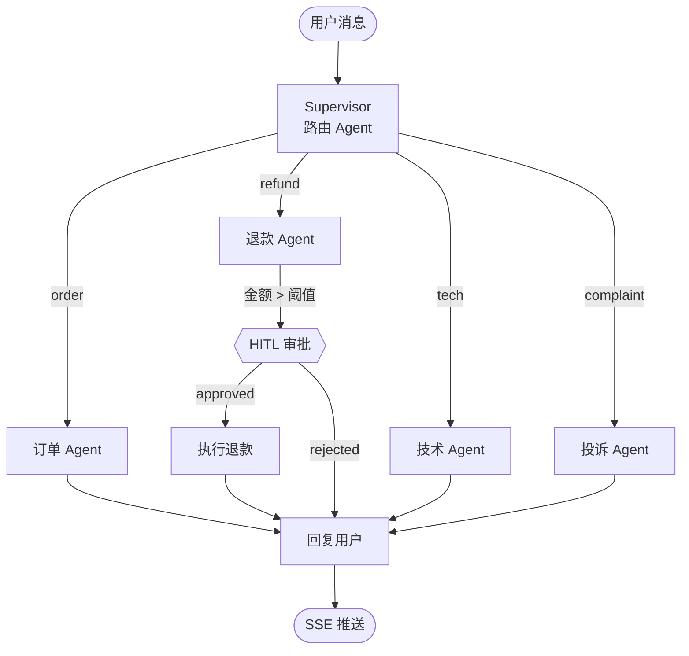

> 模块 09 - 综合项目 | 前置：[Multi-Agent 协作](../05-agent-architecture/multi-agent.md)、[Human-in-the-Loop](../05-agent-architecture/human-in-the-loop.md)

## 这一章要做什么

做一个能真正放到电商场景里跑的智能客服。业务上覆盖四种典型工单：

- **订单**：查物流、查发货状态
- **退款**：发起退款流程（高风险，要 HITL 审批）
- **技术**：产品使用问题，走 FAQ 知识库
- **投诉**：升级到人工客服并写工单

技术上验证三件事：

1. 用一个 Supervisor Agent 做路由，下挂 4 个专科 Agent，每个 Agent 自己持有一组工具
2. 高风险操作（退款金额超过阈值）走 typed interrupt 让人工审批
3. 用 LangGraph 的 Channel + Checkpointer 做对话持久化和 SSE 流式输出
4. 用 LangSmith dataset 跑一个端到端评估

## 架构



| 角色 | 模型 | 选型原因 |
|------|------|---------|
| Supervisor | Claude Haiku 4.5 | 路由是简单分类任务，低延迟 + 低成本 |
| Order / Tech / Complaint | Claude Sonnet 4.6 | 平衡：要理解工单语义又不过分烧钱 |
| Refund | Claude Sonnet 4.6 | 退款描述需要更精准的金额/订单号识别 |
| 评估器 | Claude Opus 4.7 | 评估器要比被评估的模型聪明 |

## 项目骨架

```
customer-service/
├── package.json
├── tsconfig.json
├── .env.example
├── src/
│   ├── index.ts                # Hono 服务入口
│   ├── agents/
│   │   ├── supervisor.ts       # 路由 Agent
│   │   ├── order.ts            # 订单 Agent
│   │   ├── refund.ts           # 退款 Agent
│   │   ├── tech.ts             # 技术 Agent
│   │   └── complaint.ts        # 投诉 Agent
│   ├── tools/
│   │   ├── orders.ts           # 订单查询工具
│   │   ├── refunds.ts          # 退款工具
│   │   ├── knowledge.ts        # FAQ 检索工具
│   │   └── tickets.ts          # 工单工具
│   ├── graph.ts                # 顶层 LangGraph
│   └── eval/
│       └── run-dataset.ts      # LangSmith 评估
```

## 工具实现

工具是 Agent 的手脚。先把工具写干净，Agent 才有发挥的空间。

```typescript
// src/tools/orders.ts
import { tool } from "@langchain/core/tools";
import { z } from "zod";

// 模拟订单数据库
const ORDERS = new Map([
  ["O-1001", { status: "shipped", carrier: "顺丰", trackingNo: "SF1234", amount: 299 }],
  ["O-1002", { status: "delivered", carrier: "京东", trackingNo: "JD5678", amount: 1599 }],
  ["O-1003", { status: "pending_payment", amount: 89 }],
]);

export const queryOrder = tool(
  async ({ orderId }) => {
    const order = ORDERS.get(orderId);
    if (!order) return `订单 ${orderId} 不存在`;
    return JSON.stringify({ orderId, ...order });
  },
  {
    name: "query_order",
    description: "根据订单号查询订单状态、物流、金额。订单号格式为 O- 开头的字符串。",
    schema: z.object({
      orderId: z.string().describe("订单号，如 O-1001"),
    }),
  }
);
```

```typescript
// src/tools/refunds.ts
import { tool } from "@langchain/core/tools";
import { z } from "zod";

export const initiateRefund = tool(
  async ({ orderId, amount, reason }) => {
    // 真实场景调支付网关 API；这里返回模拟结果
    const refundId = `R-${Date.now()}`;
    return JSON.stringify({
      refundId,
      orderId,
      amount,
      reason,
      status: "processing",
      estimatedDays: 3,
    });
  },
  {
    name: "initiate_refund",
    description:
      "对一个订单发起退款。调用前必须已经通过 query_order 确认订单存在且状态允许退款。",
    schema: z.object({
      orderId: z.string().describe("订单号"),
      amount: z.number().positive().describe("退款金额（元）"),
      reason: z.string().describe("退款原因，用户描述"),
    }),
  }
);
```

```typescript
// src/tools/knowledge.ts
import { tool } from "@langchain/core/tools";
import { z } from "zod";

// 简化：真实场景应换成 PGVector 检索
const FAQ = [
  { q: "如何重置密码", a: "登录页点击「忘记密码」，输入注册邮箱，按邮件指引重置。" },
  { q: "如何修改收货地址", a: "已发货订单不能改地址，未发货订单在订单详情页可修改。" },
  { q: "如何开发票", a: "在订单详情页点「申请发票」，电子发票 1-3 个工作日内到邮箱。" },
];

export const searchFAQ = tool(
  async ({ query }) => {
    // 真实场景：vectorStore.similaritySearch(query, 3)
    const hit = FAQ.filter(
      (f) => f.q.includes(query) || query.includes(f.q.slice(0, 4))
    ).slice(0, 3);
    if (hit.length === 0) return "知识库未命中";
    return hit.map((h, i) => `[${i + 1}] Q: ${h.q}\n   A: ${h.a}`).join("\n\n");
  },
  {
    name: "search_faq",
    description: "在 FAQ 知识库中检索相关问答。输入是用户问题的关键词。",
    schema: z.object({
      query: z.string().describe("搜索关键词"),
    }),
  }
);
```

```typescript
// src/tools/tickets.ts
import { tool } from "@langchain/core/tools";
import { z } from "zod";

export const createTicket = tool(
  async ({ customerId, title, description, priority }) => {
    const ticketId = `T-${Date.now()}`;
    return JSON.stringify({
      ticketId,
      customerId,
      title,
      description,
      priority,
      assignedTo: priority === "high" ? "senior_agent_pool" : "general_pool",
    });
  },
  {
    name: "create_ticket",
    description: "为无法立即处理的复杂问题创建工单，会自动派单给人工客服。",
    schema: z.object({
      customerId: z.string(),
      title: z.string().describe("工单标题（一句话）"),
      description: z.string().describe("问题详细描述"),
      priority: z.enum(["low", "medium", "high"]),
    }),
  }
);
```

## 专科 Agent

每个专科 Agent 用 `createAgent` 单独定义，只持有自己用得到的工具，避免无关工具污染选择空间。

```typescript
// src/agents/order.ts
import { createAgent } from "langchain";
import { ChatAnthropic } from "@langchain/anthropic";
import { queryOrder } from "../tools/orders.js";

export const orderAgent = createAgent({
  name: "order_agent",
  model: new ChatAnthropic({ model: "claude-sonnet-4-6", temperature: 0 }),
  tools: [queryOrder],
  systemPrompt: `你是订单专员。职责：根据用户消息识别订单号，调用 query_order 工具查询，再用中文复述结果。
规则：
- 订单号格式为 O- 开头，如 O-1001
- 如果用户没给订单号，先反问引导用户提供
- 物流信息一定要包含承运商和单号
- 不要伪造任何订单数据`,
});
```

```typescript
// src/agents/tech.ts
import { createAgent } from "langchain";
import { ChatAnthropic } from "@langchain/anthropic";
import { searchFAQ } from "../tools/knowledge.js";

export const techAgent = createAgent({
  name: "tech_agent",
  model: new ChatAnthropic({ model: "claude-sonnet-4-6", temperature: 0 }),
  tools: [searchFAQ],
  systemPrompt: `你是技术支持。流程：
1. 先调 search_faq 检索知识库
2. 若命中，结合知识库内容回答
3. 若未命中，诚实告知用户并建议提交工单
回答不超过 200 字。`,
});
```

```typescript
// src/agents/complaint.ts
import { createAgent } from "langchain";
import { ChatAnthropic } from "@langchain/anthropic";
import { createTicket } from "../tools/tickets.js";

export const complaintAgent = createAgent({
  name: "complaint_agent",
  model: new ChatAnthropic({ model: "claude-sonnet-4-6", temperature: 0 }),
  tools: [createTicket],
  systemPrompt: `你是投诉专员。要求：
1. 先表达共情和歉意（一句话即可，不要油腻）
2. 调用 create_ticket 创建高优先级工单
3. 告知用户工单号和预期处理时间
`,
});
```

退款 Agent 是这一章的重点——它需要在金额超过 500 元时挂起等人工审批：

```typescript
// src/agents/refund.ts
import { createAgent } from "langchain";
import { ChatAnthropic } from "@langchain/anthropic";
import { queryOrder } from "../tools/orders.js";
import { initiateRefund } from "../tools/refunds.js";
import { createMiddleware } from "langchain";
import { interrupt } from "@langchain/langgraph";

// 中间件：拦截 initiate_refund 工具调用，金额超过阈值时挂起
const refundApprovalMiddleware = createMiddleware({
  name: "refund_approval",
  async wrapToolCall(call, next) {
    if (call.name !== "initiate_refund") return next(call);
    const amount = (call.input as { amount: number }).amount;
    if (amount <= 500) return next(call);

    // 触发 typed interrupt，挂起等人工审批
    const decision = interrupt<{
      reason: string;
      orderId: string;
      amount: number;
    }>({
      reason: "退款金额超过 500 元，需要人工审批",
      orderId: (call.input as { orderId: string }).orderId,
      amount,
    });

    // 恢复执行后从 decision 拿到审批结果
    const { approved, note } = decision as { approved: boolean; note?: string };
    if (!approved) {
      return {
        content: `退款申请被拒绝。原因：${note ?? "未通过审核"}`,
      };
    }
    return next(call);
  },
});

export const refundAgent = createAgent({
  name: "refund_agent",
  model: new ChatAnthropic({ model: "claude-sonnet-4-6", temperature: 0 }),
  tools: [queryOrder, initiateRefund],
  middleware: [refundApprovalMiddleware],
  systemPrompt: `你是退款专员。流程：
1. 先用 query_order 确认订单存在且状态允许退款（已发货 / 已送达可退）
2. 调 initiate_refund 发起退款，金额以订单金额为准（除非用户明确要部分退款）
3. 退款成功后告知用户退款编号和预计到账时间
注意：金额超过 500 元的退款会自动转人工审批，无需你介入审批流程。`,
});
```

## Supervisor 路由

Supervisor 不直接调任何业务工具，它只决定"这条消息该走哪个专科 Agent"。

```typescript
// src/agents/supervisor.ts
import { ChatAnthropic } from "@langchain/anthropic";
import { toolStrategy } from "langchain";
import { z } from "zod";

const RouteSchema = z.object({
  category: z.enum(["order", "refund", "tech", "complaint"]).describe(
    "用户意图分类：order=订单查询；refund=退款；tech=产品使用问题；complaint=投诉"
  ),
  reasoning: z.string().describe("简要说明为什么这么分类"),
});

const supervisorModel = new ChatAnthropic({
  model: "claude-haiku-4-5",
  temperature: 0,
});

const structured = supervisorModel.withStructuredOutput(
  toolStrategy(RouteSchema)
);

export async function route(messages: Array<{ role: string; content: string }>) {
  const result = await structured.invoke([
    {
      role: "system",
      content:
        "你是客服分诊。读最新一条用户消息，分类到 order / refund / tech / complaint 之一。",
    },
    ...messages,
  ]);
  return result;
}
```

## 顶层 LangGraph

把 Supervisor 和专科 Agent 编排成一张 StateGraph：

```typescript
// src/graph.ts
import {
  Annotation,
  MessagesAnnotation,
  StateGraph,
  END,
  START,
} from "@langchain/langgraph";
import { MemorySaver } from "@langchain/langgraph/checkpointers";
import { route } from "./agents/supervisor.js";
import { orderAgent } from "./agents/order.js";
import { refundAgent } from "./agents/refund.js";
import { techAgent } from "./agents/tech.js";
import { complaintAgent } from "./agents/complaint.js";

const State = Annotation.Root({
  ...MessagesAnnotation.spec,
  customerId: Annotation<string>({ reducer: (_, v) => v, default: () => "" }),
  category: Annotation<string>({ reducer: (_, v) => v, default: () => "" }),
});

async function supervisorNode(state: typeof State.State) {
  const messages = state.messages.map((m) => ({
    role: m.getType() === "human" ? "user" : m.getType(),
    content:
      m.contentBlocks
        ?.filter((b) => b.type === "text")
        .map((b) => (b as { text: string }).text)
        .join("") ?? "",
  }));
  const { category } = await route(messages);
  return { category };
}

function routeToAgent(state: typeof State.State) {
  return state.category;
}

async function runAgent(
  agent: typeof orderAgent,
  state: typeof State.State
) {
  const result = await agent.invoke({ messages: state.messages });
  // 把专科 Agent 的最终回复合并回主流
  return { messages: result.messages.slice(state.messages.length) };
}

const builder = new StateGraph(State)
  .addNode("supervisor", supervisorNode)
  .addNode("order", (s) => runAgent(orderAgent, s))
  .addNode("refund", (s) => runAgent(refundAgent, s))
  .addNode("tech", (s) => runAgent(techAgent, s))
  .addNode("complaint", (s) => runAgent(complaintAgent, s))
  .addEdge(START, "supervisor")
  .addConditionalEdges("supervisor", routeToAgent, {
    order: "order",
    refund: "refund",
    tech: "tech",
    complaint: "complaint",
  })
  .addEdge("order", END)
  .addEdge("refund", END)
  .addEdge("tech", END)
  .addEdge("complaint", END);

export const graph = builder.compile({
  checkpointer: new MemorySaver(),
});
```

## Hono + SSE 服务

```typescript
// src/index.ts
import { Hono } from "hono";
import { streamSSE } from "hono/streaming";
import { GraphInterrupt, Command } from "@langchain/langgraph";
import { graph } from "./graph.js";

const app = new Hono();

app.post("/chat", async (c) => {
  const { customerId, conversationId, message } = await c.req.json();
  const threadId = `${customerId}:${conversationId}`;

  return streamSSE(c, async (stream) => {
    try {
      for await (const chunk of graph.stream(
        {
          messages: [{ role: "user", content: message }],
          customerId,
        },
        {
          configurable: { thread_id: threadId },
          streamMode: "messages",
        }
      )) {
        const [msg] = chunk as [{ contentBlocks?: Array<{ type: string; text?: string }> }];
        const text =
          msg.contentBlocks
            ?.filter((b) => b.type === "text")
            .map((b) => b.text ?? "")
            .join("") ?? "";
        if (text) await stream.writeSSE({ event: "token", data: text });
      }
      await stream.writeSSE({ event: "done", data: "" });
    } catch (err) {
      if (err instanceof GraphInterrupt) {
        // 退款审批挂起：把 interrupt value 推给前端
        const value = err.interrupts[0].value;
        await stream.writeSSE({
          event: "approval_required",
          data: JSON.stringify({ threadId, value }),
        });
      } else {
        throw err;
      }
    }
  });
});

// 审批回调：审批员前端调这个接口恢复执行
app.post("/approve", async (c) => {
  const { threadId, approved, note } = await c.req.json();
  await graph.invoke(new Command({ resume: { approved, note } }), {
    configurable: { thread_id: threadId },
  });
  return c.json({ ok: true });
});

export default app;
```

## package.json

```json
{
  "name": "customer-service-agent",
  "private": true,
  "type": "module",
  "engines": { "node": ">=20" },
  "scripts": {
    "dev": "tsx watch src/index.ts",
    "start": "node --import tsx src/index.ts",
    "eval": "tsx src/eval/run-dataset.ts"
  },
  "dependencies": {
    "@hono/node-server": "^1.13.0",
    "@langchain/anthropic": "^1.4.0",
    "@langchain/core": "^1.4.0",
    "@langchain/langgraph": "^1.0.0",
    "hono": "^4.6.0",
    "langchain": "^1.4.0",
    "langsmith": "^0.3.0",
    "zod": "^3.23.0"
  },
  "devDependencies": {
    "tsx": "^4.19.0",
    "typescript": "^5.5.0"
  }
}
```

`.env.example`：

```
ANTHROPIC_API_KEY=
LANGSMITH_TRACING=true
LANGSMITH_API_KEY=
LANGSMITH_PROJECT=customer-service-dev
```

## 用 LangSmith dataset 跑评估

把测试用例先存到 LangSmith 上，然后跑批跑：

```typescript
// src/eval/run-dataset.ts
import { Client } from "langsmith";
import { evaluate } from "langsmith/evaluation";
import { ChatAnthropic } from "@langchain/anthropic";
import { z } from "zod";
import { graph } from "../graph.js";

const client = new Client();

// 一次性建数据集（建好以后注释掉这段）
async function seed() {
  const ds = await client.createDataset("customer-service-v1", {
    description: "客服 Agent 端到端测试",
  });
  await client.createExamples({
    inputs: [
      { message: "查一下我的订单 O-1001" },
      { message: "我要退掉 O-1002 这个单，质量太差" },
      { message: "怎么修改收货地址" },
      { message: "你们服务态度太差了！" },
    ],
    outputs: [
      { expectedCategory: "order" },
      { expectedCategory: "refund" },
      { expectedCategory: "tech" },
      { expectedCategory: "complaint" },
    ],
    datasetId: ds.id,
  });
}

// LLM-as-judge 评估器
const judge = new ChatAnthropic({ model: "claude-opus-4-7", temperature: 0 });

async function categoryEvaluator({
  run,
  example,
}: {
  run: { outputs?: { category?: string } };
  example: { outputs?: { expectedCategory?: string } };
}) {
  const expected = example.outputs?.expectedCategory;
  const actual = run.outputs?.category;
  return {
    key: "category_match",
    score: actual === expected ? 1 : 0,
  };
}

async function helpfulnessEvaluator({
  run,
}: {
  run: { outputs?: { reply?: string } };
}) {
  const reply = run.outputs?.reply ?? "";
  const result = await judge.invoke([
    {
      role: "system",
      content:
        "评估客服回复是否：1) 准确解决问题；2) 语气专业。给 0-1 之间的分数和简短理由，JSON 输出。",
    },
    { role: "user", content: reply },
  ]);
  // 占位实现：从文本里正则取分。生产环境用下面的 withStructuredOutput 版本。
  const text =
    result.contentBlocks
      ?.filter((b) => b.type === "text")
      .map((b) => (b as { text: string }).text)
      .join("") ?? "";
  const match = text.match(/[\d.]+/);
  return {
    key: "helpfulness",
    score: match ? Number(match[0]) : 0,
  };
}

// 正式写法：用 withStructuredOutput 直接拿到 typed 评分，免去解析正则
const structuredJudge = judge.withStructuredOutput(
  z.object({
    score: z.number().min(0).max(1).describe("0-1 之间的总分"),
    reason: z.string().describe("一句话理由"),
  }),
  { name: "rate_reply", strategy: "tool" }
);

async function helpfulnessEvaluatorV2({
  run,
}: {
  run: { outputs?: { reply?: string } };
}) {
  const reply = run.outputs?.reply ?? "";
  const { score, reason } = await structuredJudge.invoke([
    {
      role: "system",
      content: "评估客服回复是否：1) 准确解决问题；2) 语气专业。",
    },
    { role: "user", content: reply },
  ]);
  return { key: "helpfulness", score, comment: reason };
}

async function target(inputs: { message: string }) {
  const result = await graph.invoke(
    { messages: [{ role: "user", content: inputs.message }] },
    { configurable: { thread_id: `eval-${Date.now()}-${Math.random()}` } }
  );
  const reply =
    result.messages
      .at(-1)
      ?.contentBlocks?.filter((b) => b.type === "text")
      .map((b) => (b as { text: string }).text)
      .join("") ?? "";
  return { category: result.category, reply };
}

if (process.argv[2] === "seed") {
  await seed();
} else {
  await evaluate(target, {
    data: "customer-service-v1",
    evaluators: [categoryEvaluator, helpfulnessEvaluator],
    experimentPrefix: "cs-agent-",
  });
}
```

跑评估：

```bash
npm run eval -- seed   # 第一次建 dataset
npm run eval           # 跑评估
```

LangSmith 控制台会自动生成实验对比页面，能看到每个用例的实际回复、评分、token 消耗。

## 部署

最简部署（单机）：

```bash
# 1. 装依赖
npm install

# 2. 配环境变量
cp .env.example .env && vim .env

# 3. 跑起来
npm run dev
```

生产部署要把 `MemorySaver` 换成 `PostgresSaver`（[Memory / Checkpointer](../05-agent-architecture/langgraph-state.md) 有完整写法），否则进程重启会丢对话历史。

## 已知限制

诚实交代这版没有处理的事：

1. **意图分类只有一轮**：用户中途切换话题（"先查订单，再退一下另一个"），Supervisor 不会回头重新分类，会继续走第一次选中的 Agent。
2. **审批通知**：示例里只在 SSE 上推 `approval_required` 事件，没接入企业内部的飞书/钉钉通知系统。审批员感知有两条路：(a) 轮询一个 `/approvals/pending` 列表接口；(b) 订阅 SSE / WebSocket 事件流，新请求即时弹通知。另外要给挂起的 thread 设 TTL——纯 `MemorySaver` 是永久挂起，生产里要么用 PostgresSaver + 定时任务把超时的 thread 标记 `expired` 并回填一条"审批超时，自动拒绝"消息，要么在前端层定一个"未响应 N 分钟自动 release"的策略，避免内存/数据库被半成品对话撑爆。
3. **FAQ 检索是字符串匹配**：真实场景要换成 PGVector + Embedding 检索，参考[向量存储](../06-rag/vector-stores.md)。
4. **没接限流**：高并发场景要在 Supervisor 节点前加 `humanInTheLoopMiddleware` 之外的速率限制 middleware。
5. **多轮上下文压缩没做**：长对话下 token 会涨。生产环境加 `summarizationMiddleware`。
6. **评估数据集太小**：只有 4 条，仅做演示。真实项目应至少 50-200 条覆盖各类边界。

## 小结

这个客服 Agent 的关键设计点：

- **每个专科 Agent 持有自己的工具**——Supervisor 只做路由，避免一个超级 Agent 在 20 个工具之间挑花眼
- **HITL 用 middleware 实现**——`wrapToolCall` 拦截敏感工具调用，配合 typed interrupt 把审批挂起到外部系统
- **顶层用 StateGraph 而不是 createAgent**——因为我们要的不是"模型自己规划工具调用"，而是"先分类、再交给专科"的确定性流程
- **评估和实现一起做**——LangSmith dataset 是个低成本的回归测试入口，每改一次 prompt 都能跑一遍

下一节[代码助手 Agent](./code-assistant.md) 换个场景：单 Agent + 大量工具 + 流式 UI。

---

> 本文摘自[《LangChain.js Agent 开发权威指南》](https://github.com/diguike/book-langchain-agent)，作者[递归客](https://inferloop.dev)。
