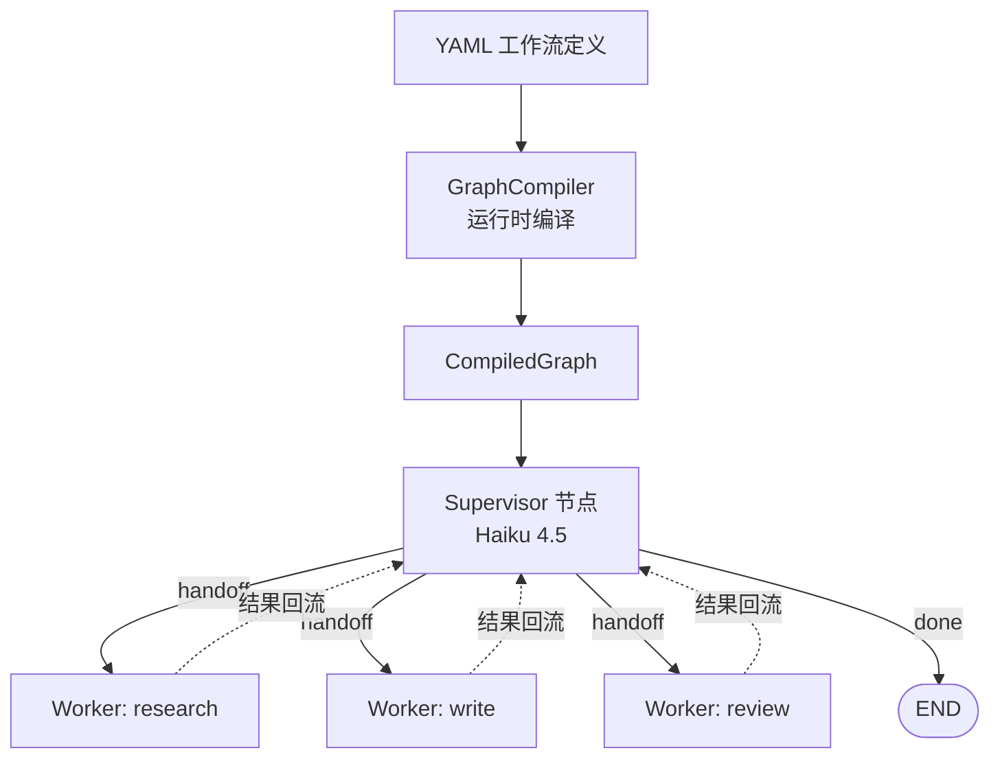

> 模块 09 - 综合项目 | 前置：[Multi-Agent 协作](../05-agent-architecture/multi-agent.md)、[State、Channels 与 Checkpointer](../05-agent-architecture/langgraph-state.md)

## 这一章要做什么

做一个简化版的 Dify / n8n：用户用 YAML 描述工作流，平台动态编译成一张 LangGraph，运行时按 Supervisor + Worker 模式执行。我把目标限定在三件事：

1. **YAML 定义工作流**——节点用什么模型、跑什么工具、怎么衔接，全部声明式描述
2. **运行时编译**——读 YAML，生成一张 `StateGraph` 并 `.compile()`，不依赖代码改动
3. **Supervisor + Worker 拓扑**——一个调度 Agent + 多个执行 Agent，调度结果用 `Command({ goto, update })` 显式传递

不做：可视化拖拽编辑器、节点级权限、计费、多租户隔离。这些是产品工程问题，跟 Agent 架构关系不大。

## 架构



| 角色 | 模型 | 选型原因 |
|------|------|---------|
| Supervisor | Claude Haiku 4.5 | 决策"下一步谁来干"，简单分类任务 |
| Worker（默认） | Claude Sonnet 4.6 | 业务执行，可在 YAML 里按节点覆盖 |
| Worker（重推理） | Claude Opus 4.7 | 用户在 YAML 显式声明 |

## YAML 工作流定义

设计一份足够表达力又不会失控的 schema：

```yaml
# workflows/content-pipeline.yaml
id: content-pipeline
name: 内容生产流水线
description: 调研 → 写作 → 审核

workers:
  - id: researcher
    model: anthropic:claude-sonnet-4-6
    systemPrompt: |
      你是调研员。根据用户给的主题，列 3-5 个关键事实和引用源。
      输出格式：项目符号列表。
    tools: [web_search]

  - id: writer
    model: anthropic:claude-sonnet-4-6
    systemPrompt: |
      你是写手。基于调研结果写一篇 300-500 字的中文短文。
      读者画像：互联网产品经理。
    tools: []

  - id: reviewer
    model: anthropic:claude-opus-4-7
    systemPrompt: |
      你是审稿编辑。读文章，指出 3 个具体可改进的点，并给出修改建议。
      不要笼统的"语言可以更流畅"，要具体指出哪一句、怎么改。
    tools: []

# Supervisor 决策的 worker 调用顺序提示（hint，不是强约束）
supervisor:
  model: anthropic:claude-haiku-4-5
  policy: |
    一般流程：先 researcher，再 writer，再 reviewer。
    若用户已提供调研材料则跳过 researcher。
    所有 worker 都执行完后，回复 done。
  maxSteps: 6   # 防止死循环
```

## 工作流编译器

```typescript
// src/compiler.ts
import {
  Annotation,
  MessagesAnnotation,
  StateGraph,
  END,
  START,
  Command,
} from "@langchain/langgraph";
import { MemorySaver } from "@langchain/langgraph/checkpointers";
import { createAgent, toolStrategy } from "langchain";
import { ChatAnthropic } from "@langchain/anthropic";
import { z } from "zod";
import type { WorkflowConfig } from "./types.js";
import { resolveTools } from "./tool-registry.js";

const State = Annotation.Root({
  ...MessagesAnnotation.spec,
  // Worker 各自的产出
  workerOutputs: Annotation<Record<string, string>>({
    reducer: (prev, update) => ({ ...prev, ...update }),
    default: () => ({}),
  }),
  // Supervisor 累计的决策步数
  step: Annotation<number>({
    reducer: (prev, update) => prev + update,
    default: () => 0,
  }),
});

type StateType = typeof State.State;

export function compileWorkflow(config: WorkflowConfig) {
  // 1. 用 createAgent 把每个 worker 包成可调用 Agent
  const workerAgents = new Map(
    config.workers.map((w) => [
      w.id,
      createAgent({
        name: w.id,
        model: parseModel(w.model),
        tools: resolveTools(w.tools),
        systemPrompt: w.systemPrompt,
      }),
    ])
  );

  // 2. Supervisor 决策 schema
  const DecisionSchema = z.object({
    next: z
      .enum([...config.workers.map((w) => w.id), "done"] as [string, ...string[]])
      .describe("下一步要执行的 worker id；全部完成时返回 done"),
    instruction: z
      .string()
      .describe("传给该 worker 的具体指令（一段话，包含必要上下文）"),
  });

  const supervisorModel = parseModel(config.supervisor.model);
  const supervisorStructured = supervisorModel.withStructuredOutput(
    toolStrategy(DecisionSchema)
  );

  // 3. Supervisor 节点
  async function supervisorNode(state: StateType): Promise<Command> {
    if (state.step >= config.supervisor.maxSteps) {
      return new Command({
        goto: END,
        update: { messages: [{ role: "assistant", content: "已达最大步数，工作流终止。" }] },
      });
    }

    const ctx = formatContext(state, config);
    const decision = await supervisorStructured.invoke([
      { role: "system", content: config.supervisor.policy },
      {
        role: "user",
        content: `当前上下文：\n${ctx}\n请决定下一步。`,
      },
    ]);

    if (decision.next === "done") {
      // 把所有 worker 输出合成最终回复
      const finalReply = Object.entries(state.workerOutputs)
        .map(([id, out]) => `## ${id}\n${out}`)
        .join("\n\n");
      return new Command({
        goto: END,
        update: { messages: [{ role: "assistant", content: finalReply }] },
      });
    }

    return new Command({
      goto: decision.next,
      update: {
        step: 1,
        messages: [
          {
            role: "assistant",
            content: `→ ${decision.next}：${decision.instruction}`,
          },
        ],
      },
    });
  }

  // 4. Worker 节点
  function makeWorkerNode(workerId: string) {
    const agent = workerAgents.get(workerId)!;
    return async (state: StateType): Promise<Command> => {
      // Worker 拿到的是 supervisor 刚发出的指令（最后一条 assistant 消息）
      const lastMsg = state.messages.at(-1);
      const instruction =
        lastMsg?.contentBlocks
          ?.filter((b) => b.type === "text")
          .map((b) => (b as { text: string }).text)
          .join("") ?? "";

      const result = await agent.invoke({
        messages: [{ role: "user", content: instruction }],
      });

      const reply =
        result.messages.at(-1)?.contentBlocks
          ?.filter((b) => b.type === "text")
          .map((b) => (b as { text: string }).text)
          .join("") ?? "";

      return new Command({
        goto: "supervisor",
        update: {
          workerOutputs: { [workerId]: reply },
          messages: [{ role: "assistant", content: `[${workerId}] ${reply}` }],
        },
      });
    };
  }

  // 5. 拼图
  const builder = new StateGraph(State)
    .addNode("supervisor", supervisorNode, {
      ends: [...config.workers.map((w) => w.id), END],
    });

  for (const w of config.workers) {
    builder.addNode(w.id, makeWorkerNode(w.id), { ends: ["supervisor"] });
  }
  builder.addEdge(START, "supervisor");

  return builder.compile({ checkpointer: new MemorySaver() });
}

function parseModel(spec: string) {
  // 简化：只演示 anthropic provider
  const [provider, name] = spec.split(":");
  if (provider !== "anthropic") throw new Error(`暂不支持 provider: ${provider}`);
  return new ChatAnthropic({ model: name, temperature: 0 });
}

function formatContext(state: StateType, config: WorkflowConfig): string {
  if (Object.keys(state.workerOutputs).length === 0) {
    const userMsg = state.messages.find((m) => m.getType() === "human");
    const userText =
      userMsg?.contentBlocks
        ?.filter((b) => b.type === "text")
        .map((b) => (b as { text: string }).text)
        .join("") ?? "";
    return `用户原始请求：${userText}\n（尚无任何 worker 产出）`;
  }
  const lines = ["已完成的 worker："];
  // 截取前 200 字作为 supervisor 决策上下文：
  // 完整 worker 输出超出后边际收益低，且能省 token
  for (const [id, out] of Object.entries(state.workerOutputs)) {
    lines.push(`- ${id}: ${out.slice(0, 200)}${out.length > 200 ? "…" : ""}`);
  }
  lines.push("\n剩余 worker：");
  for (const w of config.workers) {
    if (!state.workerOutputs[w.id]) lines.push(`- ${w.id}: ${w.systemPrompt.slice(0, 80)}…`);
  }
  return lines.join("\n");
}
```

## 类型与 YAML 解析

```typescript
// src/types.ts
export interface WorkerConfig {
  id: string;
  model: string;          // 'anthropic:claude-sonnet-4-6'
  systemPrompt: string;
  tools: string[];        // 工具注册表里的 id
}

export interface SupervisorConfig {
  model: string;
  policy: string;
  maxSteps: number;
}

export interface WorkflowConfig {
  id: string;
  name: string;
  description?: string;
  workers: WorkerConfig[];
  supervisor: SupervisorConfig;
}
```

```typescript
// src/load.ts
import { readFile } from "node:fs/promises";
import { parse } from "yaml";
import type { WorkflowConfig } from "./types.js";

export async function loadWorkflow(path: string): Promise<WorkflowConfig> {
  const raw = await readFile(path, "utf-8");
  const config = parse(raw) as WorkflowConfig;
  validate(config);
  return config;
}

function validate(c: WorkflowConfig) {
  if (!c.id || !c.workers?.length || !c.supervisor) {
    throw new Error("YAML 缺少必需字段：id / workers / supervisor");
  }
  const ids = new Set<string>();
  for (const w of c.workers) {
    if (ids.has(w.id)) throw new Error(`worker id 重复：${w.id}`);
    ids.add(w.id);
    if (!w.model || !w.systemPrompt) {
      throw new Error(`worker ${w.id} 缺少 model 或 systemPrompt`);
    }
  }
  if (c.supervisor.maxSteps < 1) throw new Error("maxSteps 必须 >= 1");
}
```

## 工具注册表

工具不放在 YAML 里写死代码，而是注册到平台运行时的 registry 中，用 id 引用：

```typescript
// src/tool-registry.ts
import { tool } from "@langchain/core/tools";
import { z } from "zod";

const registry = new Map<string, ReturnType<typeof tool>>();

export function register(id: string, t: ReturnType<typeof tool>) {
  registry.set(id, t);
}

export function resolveTools(ids: string[]) {
  return ids.map((id) => {
    const t = registry.get(id);
    if (!t) throw new Error(`工具未注册：${id}`);
    return t;
  });
}

// 内置工具：网络搜索（demo 用，真实场景接 Tavily / Bing API）
register(
  "web_search",
  tool(
    async ({ query }) => {
      // 真实接 Tavily：const result = await tavily.search(query);
      return JSON.stringify({
        query,
        results: [
          { title: "Mock result 1", url: "https://example.com/1", snippet: "..." },
          { title: "Mock result 2", url: "https://example.com/2", snippet: "..." },
        ],
      });
    },
    {
      name: "web_search",
      description: "搜索网络获取最新信息。",
      schema: z.object({ query: z.string() }),
    }
  )
);
```

## HTTP 服务（Hono）

```typescript
// src/index.ts
import { Hono } from "hono";
import { streamSSE } from "hono/streaming";
import { compileWorkflow } from "./compiler.js";
import { loadWorkflow } from "./load.js";

const app = new Hono();

// 编译缓存
const compiled = new Map<string, Awaited<ReturnType<typeof compileWorkflow>>>();

async function getGraph(workflowId: string) {
  let g = compiled.get(workflowId);
  if (!g) {
    const config = await loadWorkflow(`./workflows/${workflowId}.yaml`);
    g = compileWorkflow(config);
    compiled.set(workflowId, g);
  }
  return g;
}

app.post("/workflows/:id/run", async (c) => {
  const id = c.req.param("id");
  const { input, threadId } = await c.req.json();
  const graph = await getGraph(id);
  const tid = threadId ?? `${id}-${Date.now()}`;

  return streamSSE(c, async (stream) => {
    for await (const update of graph.stream(
      { messages: [{ role: "user", content: input }] },
      { configurable: { thread_id: tid }, streamMode: "updates" }
    )) {
      // update 形如 { supervisor: { ... } } 或 { researcher: { ... } }
      const [node, payload] = Object.entries(update)[0];
      await stream.writeSSE({
        event: "step",
        data: JSON.stringify({ node, payload }),
      });
    }
    await stream.writeSSE({ event: "done", data: "" });
  });
});

// 重新载入 YAML（开发调试用）
app.post("/workflows/:id/reload", async (c) => {
  compiled.delete(c.req.param("id"));
  return c.json({ ok: true });
});

export default app;
```

## package.json

```json
{
  "name": "multi-agent-platform",
  "private": true,
  "type": "module",
  "engines": { "node": ">=20" },
  "scripts": {
    "dev": "tsx watch src/index.ts",
    "start": "node --import tsx src/index.ts"
  },
  "dependencies": {
    "@hono/node-server": "^1.13.0",
    "@langchain/anthropic": "^1.4.0",
    "@langchain/core": "^1.4.0",
    "@langchain/langgraph": "^1.0.0",
    "hono": "^4.6.0",
    "langchain": "^1.4.0",
    "yaml": "^2.5.0",
    "zod": "^3.23.0"
  },
  "devDependencies": {
    "tsx": "^4.19.0",
    "typescript": "^5.5.0"
  }
}
```

`.env.example`：

```
ANTHROPIC_API_KEY=
LANGSMITH_TRACING=true
LANGSMITH_API_KEY=
LANGSMITH_PROJECT=multi-agent-platform
```

## 跑起来

```bash
npm install

# 把上面那份 YAML 存到 workflows/content-pipeline.yaml
mkdir -p workflows
# 复制 content-pipeline.yaml 内容到该路径

# 启动
npm run dev

# 触发工作流
curl -N -X POST http://localhost:3000/workflows/content-pipeline/run \
  -H "Content-Type: application/json" \
  -d '{"input":"写一篇关于 RAG 在企业搜索中演进的短文"}'
```

SSE 输出会按顺序看到：

```
event: step
data: {"node":"supervisor","payload":{"messages":[...]}}

event: step
data: {"node":"researcher","payload":{"workerOutputs":{"researcher":"..."}}}

event: step
data: {"node":"supervisor","payload":{...}}

event: step
data: {"node":"writer","payload":{...}}

...

event: done
```

## Supervisor + Worker 模式的关键点

1. **Supervisor 用 `Command({ goto, update })` 显式跳转**——比 `addConditionalEdges` 灵活，状态更新和路由一起返回
2. **Worker 完成后回到 Supervisor**——不要 Worker 之间直接连边，否则就退化成静态流水线，YAML 就没意义了
3. **`maxSteps` 是硬约束**——动态调度的代价是可能死循环，Supervisor 自己不会停就需要外部计数
4. **Worker 是独立 Agent**——每个 Worker 持有自己的工具集和 prompt，互不污染

## 已知限制

诚实交代这一版没做的事：

1. **只支持 Anthropic provider**：`parseModel` 没分发到 OpenAI / Google，接其他 provider 加一个 switch 即可。
2. **没有并发分支**：现在的 Supervisor 一次只跳一个 worker。要做"researcher 和 fact_checker 并发"得让 Supervisor 返回多 goto，或在 graph 里加 `Send` API。
3. **handoff 上下文截断粗暴**：`formatContext` 取每个 worker 输出前 200 字，长链下信息丢失。生产环境应当传 hash + 完整内容存储在 State 的另一个 channel。
4. **Worker 内部出错没有重试 / 降级**：抛异常会让整张图崩。包一层 try/catch + `withFallbacks` 才能上线。
5. **没接 LangSmith 评估**：YAML 改了之后没自动跑回归。下一步要加 `evaluate(targets, { data })` 把每条工作流和一个 dataset 绑定。
6. **YAML 没有 schema 验证**：现在的 `validate()` 只校验关键字段。应该用 Zod 定义完整 schema，加版本号字段，做向前兼容。
7. **MemorySaver 不能多进程**：上线必须换 `PostgresSaver`。

## 小结

平台层最值得展示的不是"做了多少功能"，而是**把"什么变"和"什么不变"切干净**：

- **不变**：编译器、Supervisor 决策框架、State Schema、HTTP 服务
- **可变**：YAML 里的 worker 列表、模型、prompt、工具引用

读者拿这个骨架去支撑自己的业务，往往只需要：写新工具注册到 registry、加新 YAML。不用碰编译器，也不用碰 LangGraph 的拓扑构造。

这是模块 09 最后一个综合项目。合上书之前，建议把这 4 个项目本地都跑一遍——它们覆盖了本书 80% 的核心知识点：`createAgent`、Middleware、LangGraph、HITL、Streaming、Multi-Agent、动态编排。

---

> 本文摘自[《LangChain.js Agent 开发权威指南》](https://github.com/diguike/book-langchain-agent)，作者[递归客](https://inferloop.dev)。
